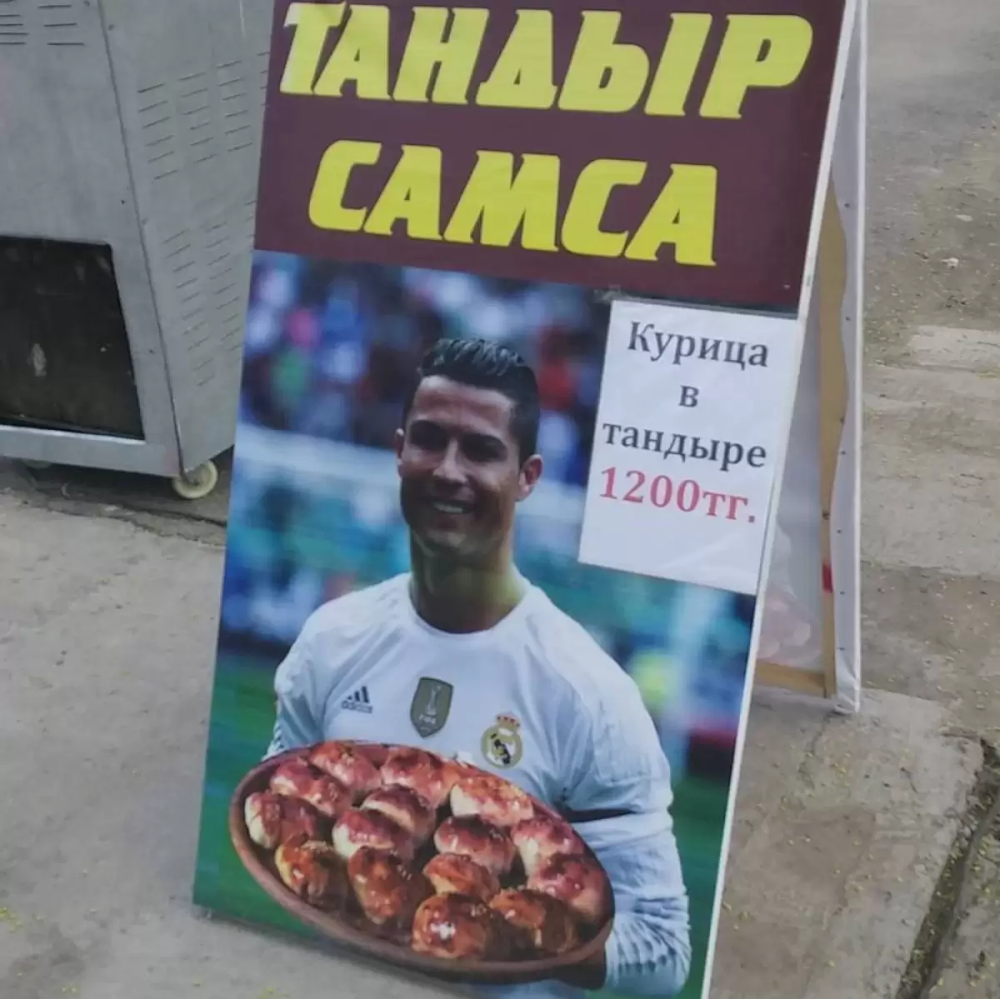

# ronaldo-samsa

Репозиторий с конспектами, лабораторными работами и учебными проектами **okunai-george** и **Sanwerde**. Здесь фиксируется весь путь обучения — от разбора базовых команд до практических лабораторных работ и пет-проектов.

Ветка `main` служит точкой входа (MOC) — здесь только навигация и описание, вся рабочая часть лежит в личных ветках контрибьюторов.

---

## Навигация по веткам
 
### 🧑‍💻 [okunai-george](https://github.com/okunai-george) → ветка [`george`](../../tree/george)
 
**Стек / направления:**
- Linux
**Темы:**
- Linux Fundamentals — User Management, Permissions, Package Management, Text-Fu
- Лабораторные работы на Fedora
<!-- по мере изучения новых направлений — добавляй новый ### подзаголовок ниже, в стиле "### Направление" -->
 
---
 
### 🧑‍💻 [Sanwerde](https://github.com/Sanwerde) → ветка [`craft`](../../tree/craft)
 
**Стек / направления:**
- Docker / контейнеризация
**Темы:**
- *(дополняется по ходу изучения)*
<!-- по мере изучения новых направлений — добавляй новый ### подзаголовок ниже, в стиле "### Направление" -->


## Структура репозитория
 
Каждый контрибьютор ведёт свою ветку самостоятельно — со своей структурой папок, форматом конспектов и темпом изучения. Общие материалы и описание всего репозитория — в `main`.

## Как со всем этим работать

```bash
git clone https://github.com/okunai-george/ronaldo-samsa.git
cd ronaldo-samsa
git switch <branch>
```
---


# Всем СУУУУУУУУ