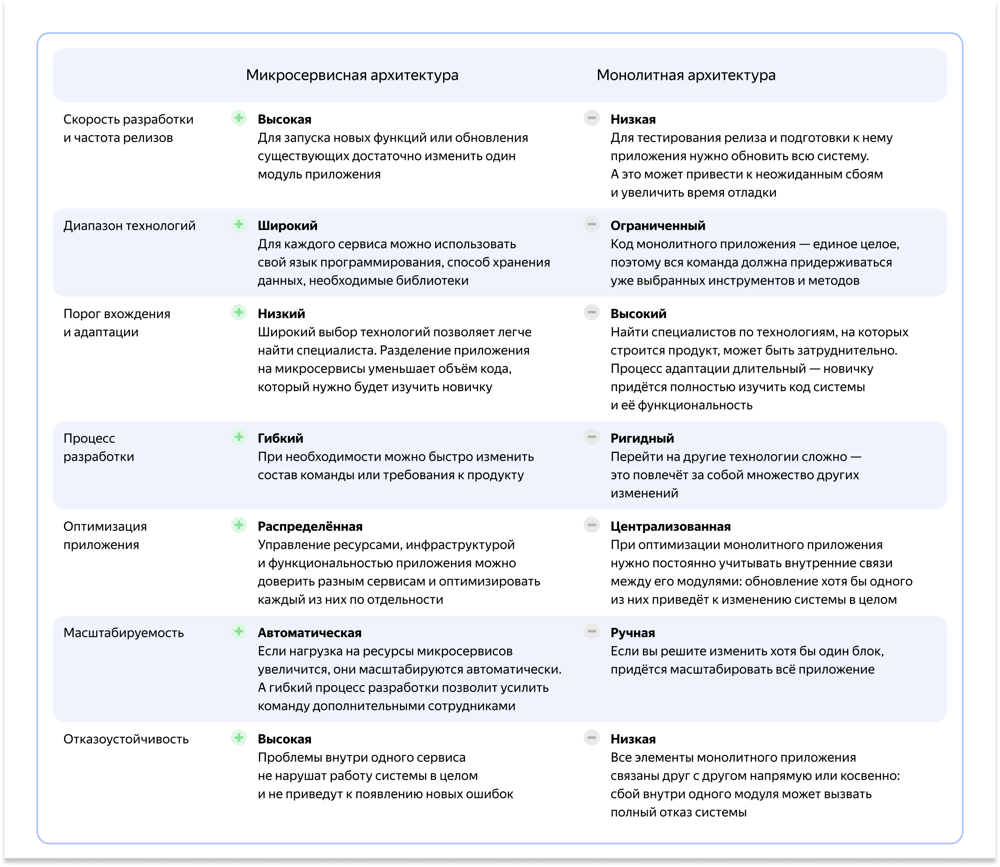

# Контейнеризация с Docker
Ссылка на курс https://practicum.yandex.ru/learn/yc-devops-container/

## Внедрение микросервисной архитектуры
Микросервисная архитектура &mdash; подход к разработке, при котором приложение состоит из множества отдельных сервисов, выполняющихся в собственном контейнере.

Монолитная архитектура &mdash; традиционный подход, при котором все сервисы находятся внутри одной кодовой базы.

Вертикальное масштабирование &mdash; увеличение возможностей физических машин.

Горизонтальное масштабирование &mdash; увеличение пропускной способности за счет добавления новых хостов.



## Методология The Twelve-Factor App


## Оркестрация контейнеров
Оркестрация контейнеров &mdash; процесс автоматизации объединения контейнеров и управления ими.
Преимущества оркестрации над ручным управлением:
- Автоматизация
- Масштабируемость 
- Устойчивость 
- Безопасность
- Мониторинг и логирование

## Docker Compose
Основным отличием является отсутствие поддержки кластерной изоляции, в которых контейнеры запускаются на множестве узлов кластера, в которых контейнеры запускаются на множестве узлов кластера, запуск связанных контейнеров происходит на локальной машине.

## Kubernetes
Позволяет автоматизировать развертывание, масштабирование и управление контейнеризированными приложениями в кластере.

Ключевые возможности k8s:
- Автоматическое развертываение и масштабирование приложений
- Управление ресурсами 
- Высокая доступность
- Безопасность
- Поддержка различных CNI (Container Network Interface) и CSI (Container Storage Interface)

## Манифест Docker Compose
- ```services``` описывает сервисы: приложения, СУБД, веб-серверы.
- ```networks``` описывает сети, к которым подключены сервисы.
- ```volumes``` тома для сохранения персистентных данных.
- ```configs``` конфигурационные файлы доступные только для чтения.
- ```secrets``` способ передачи чувствительных данных.
- ```name``` имя проекта.

## Практика Docker Compose
Приложение, запущенное с помощью Docker Compose будет состоять из:
- Фронтенд-сеть, или ```frontend-net```. Сеть связывает веб-сервер Nginx и бэкенд-сервис ```simple_python_app```.
- Бэкенд-сеть, или ```backend-net```. Сеть связывает бэкенд-сервис ```simple_python_app``` с базой данных PostgreSQL.
- Volume: ```dbdata```. Том хранит персистентные данные базы данных.

