# Lab 02 — Управление процессами

## Цель:

научиться находить, анализировать, контролировать и убивать процессы в Linux — от базового `ps` до сигналов, приоритетов, фоновых задач и зомби-процессов.

## Часть 1 — Наблюдение за процессами.

<mark>+</mark> Выведем в терминале снапшот всех процессов
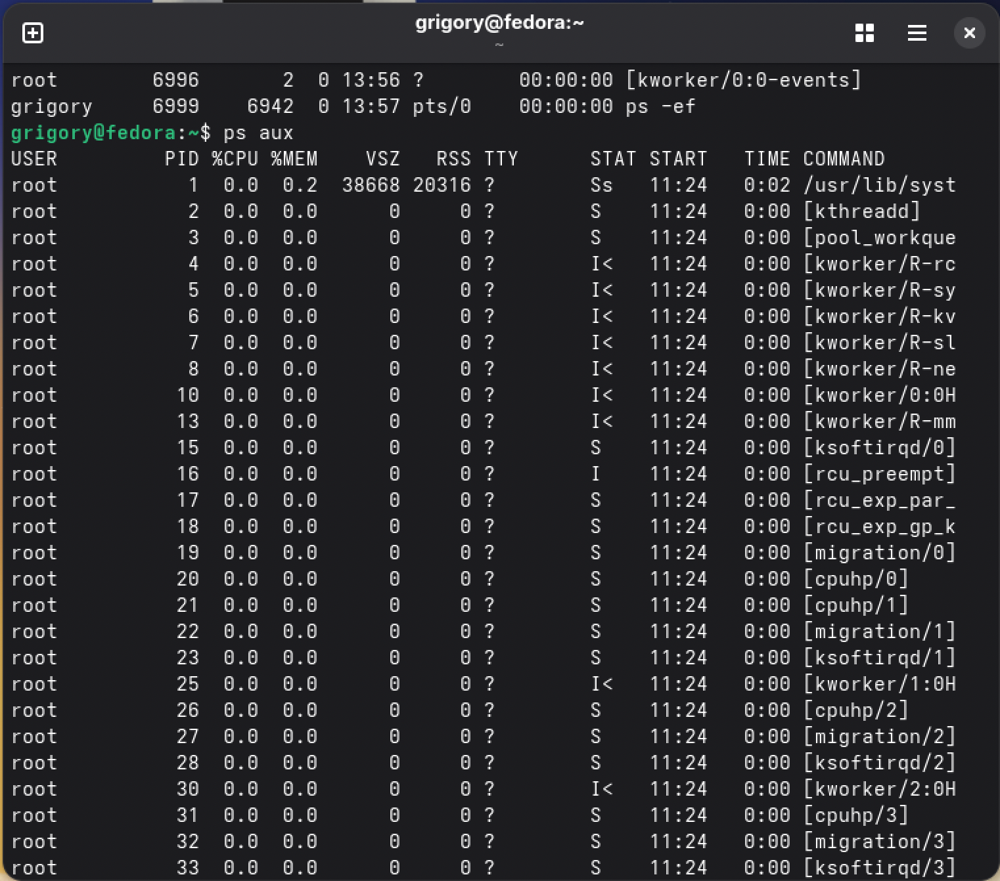
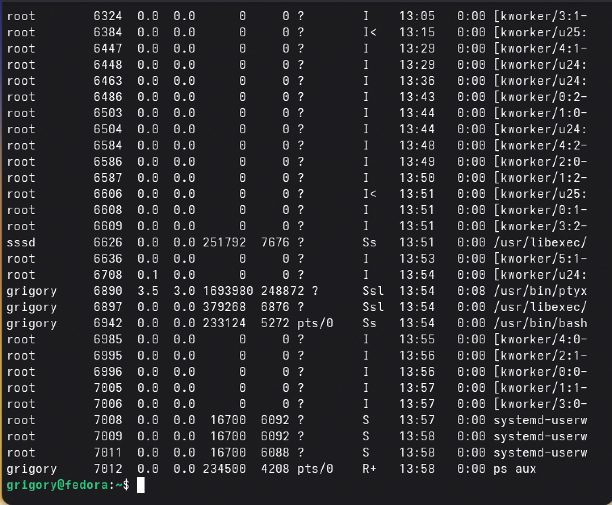

команда **ps** выводит снапшот процессов, запущенных в момент выполнения команды.
**Что выводит эта команда?**
На скриншотах видно несколько полей:

- USER — чьими правами обладает процесс
- PID _(process ID)_ — айди процесса
- %CPU — процент использования ЦПУ
- %MEM — процент использования оперативной памяти
- VSZ _(Virtual Memory Size)_ — сколько виртуальной памяти зарезервировал процесс
- RSS _(Resident Set Size)_ — фактический объем оперативной памяти, выделенной процессу
- TTY _(Teletypewriter)_ — Терминал, к которому привязан процесс
- STAT _(Status)_ — Статус процесса (R, S, D, Z, I -- +, s, l, <, N)
- START — Время запуска процесса
- TIME — Время, затраченное процессом на вычисления
- COMMAND — Имя программы/полный путь к файлу

Разберём флаги этой команды:

- a _(all)_ — показывает процессы, принадлежащие всем пользователям
- u _(user-oriented)_ — подробный формат вывода
- x — показывает процессы, у которых нет терминала (демоны, фоновые службы и т.д.)
- f _(forest)_ — отобразить в виде дерева
- -e (every process)
- -f _(full format)_

_Обратите внимание на_
_TTY: ? — это процессы без терминала (демоны, фоновые службы)_
_TTY: pts/tty — pts — псевдотерминал, эмулирующий терминал в окне_

<mark>+</mark> Попробуем найти родительский процесс текущей shell-сессии
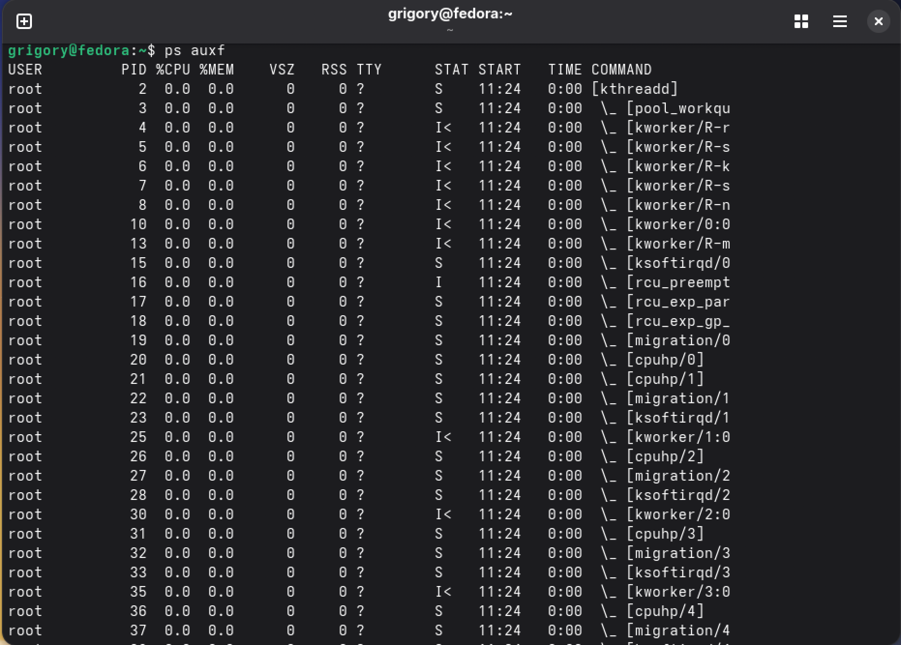
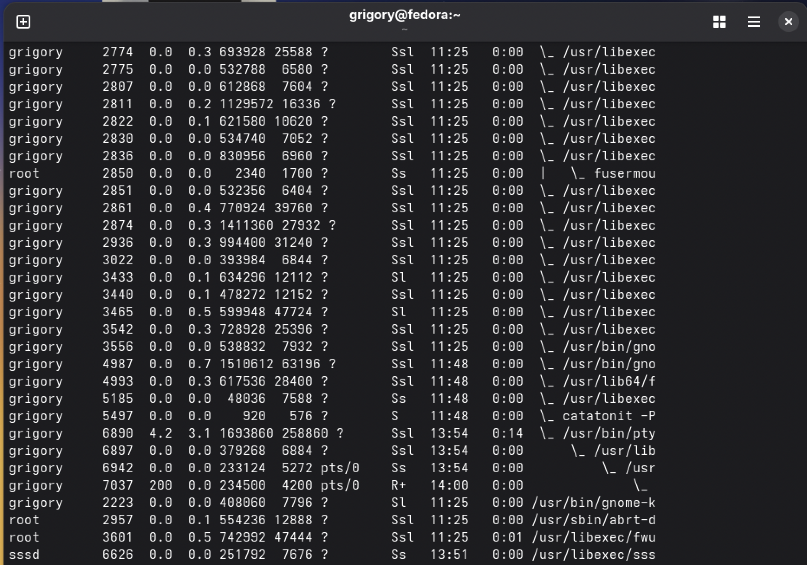

Заметим, что для процесса `7037` (ps auxf) родительским процессом является процесс `6942` (командная оболочка).

Также в выводе команды можно обнаружить:
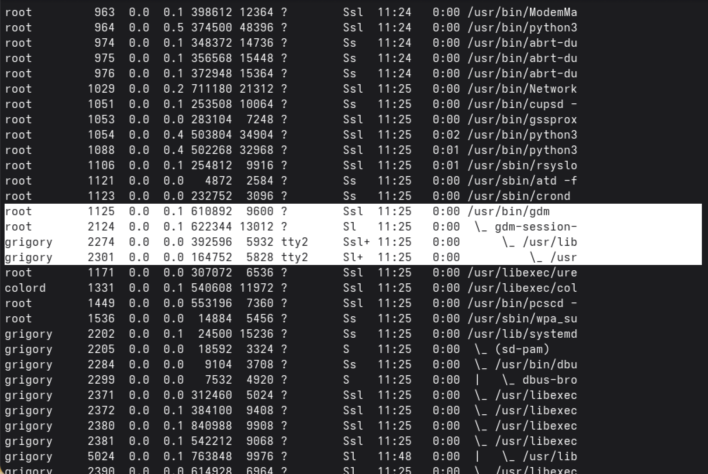
сессия терминала `tty2` с правами пользователя `grigory` является процессом-лидером на переднем плане. Что это? Корневым процессом является `/usr/bin/gdm` — _(GNOME Display Manager)_ системный экран входа (логин/пароль). После успешной авторизации процесс создаёт `gdm-session`, т.е. сессию для пользователя `grigory`. Итого `tty2` разворачивает графическую сессию пользователя `grigory`!

Помимо этого можно воспользоваться командой **pstree** для вывода дерева процессов системы:
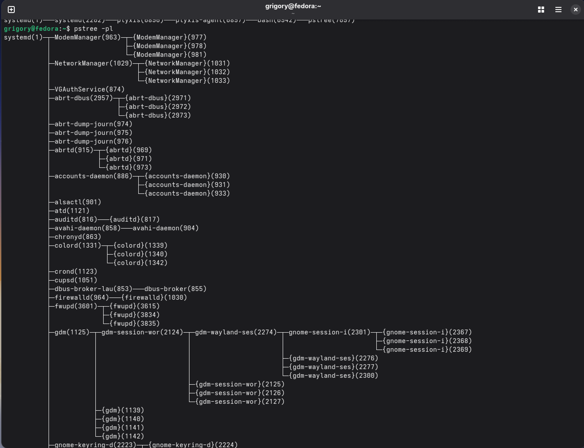
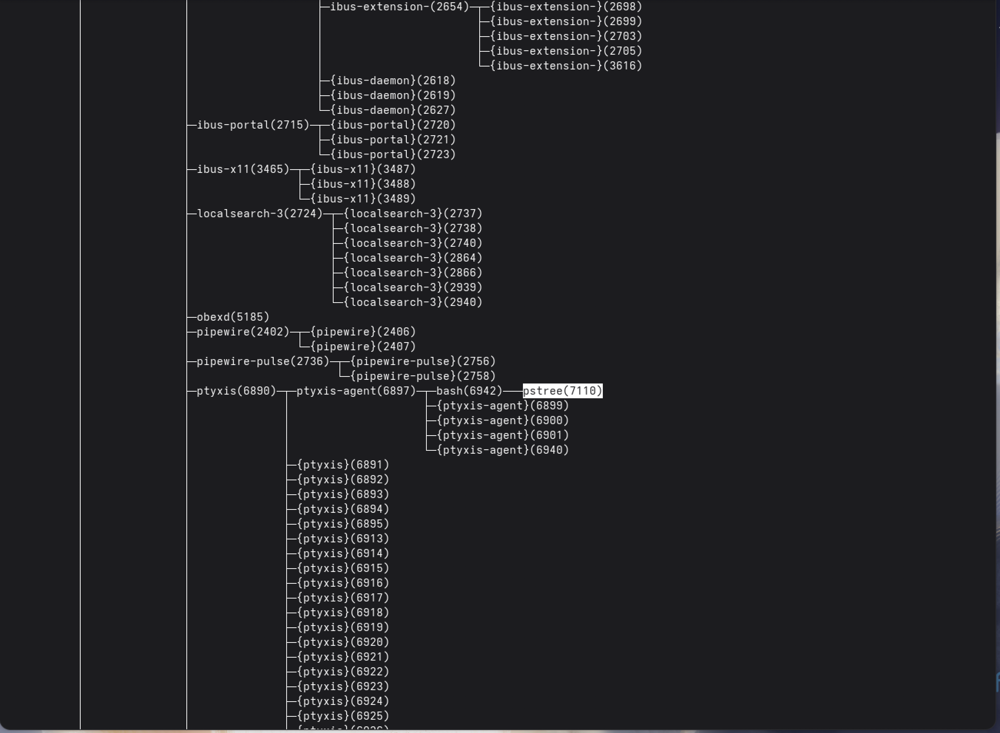

Чтобы найти себя в этом дереве, можно воспользоваться командой **pstree -ps \$$**
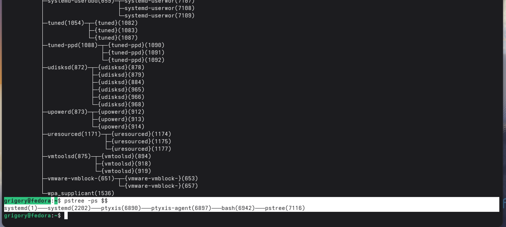
Разберём модификаторы команды:

- -p _(PID)_ — выводит айди процесса рядом с каждым процессом
- -l _(long)_ — перестанет сокращать длинные имена и PID
- -s _(show parents)_ — покажет не только потомков, но и родителей.

<mark>+</mark> Разберёмся, как наблюдать за процессами в реальном времени
Команда `top` позволяет открыть таблицу процессов, меняющуюся в реальном времени
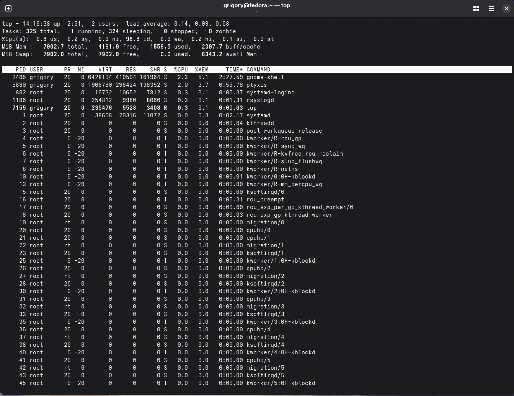

большинство колонок уже знакомы:

- PID
- USER
- PR _(priority)_ приоритет процесса **PR = 20 + NI**. Чем больше число, тем меньше приоритет. **rt** обозначает, что процесс работает в реальном времени _(real time)_, значит у него максимальный приоритет
- NI _(niceness)_ значение, влияющее на приоритет. \[-20, 19]
- VIRT _(virtual image)_ — VSZ из ps aux
- RES _(resident size)_ — RSS из ps aux
- SHR _(shared memory)_ — объём разделяемой памяти, которую использует процесс с другими процессами в системе
- S _(Status)_
- %CPU
- %MEM
- TIME+COMMAND
  Также сверху можно найти много полезной информации о системе.

Улучшенная версия `top` — `htop`:
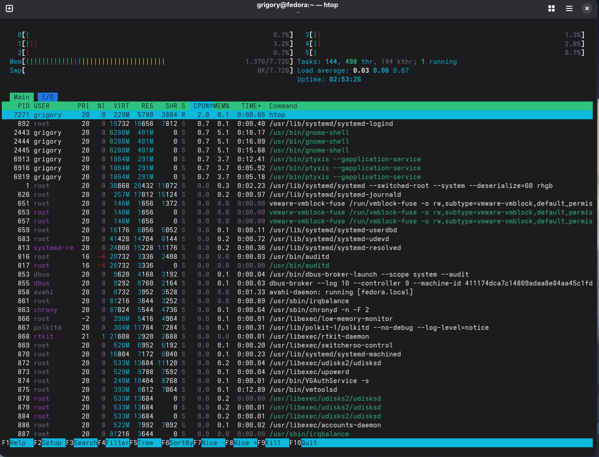

отличается от `top` графическими индикаторами, подсветкой, поддержкой мыши и удобными командами (завершение процесса, дерево процессов, поиск и фильтрация, массовые операции над процессами).

<mark>+</mark> Найдём все процессы по определённому имени
Воспользуемся специальной командой **pgrep** _(process grep)_:
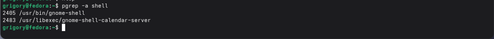

Попробуем отыскать "спящий" процесс. Для этого усыпим одну сессию терминала:
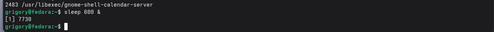
Затем в другом попробуем найти это:
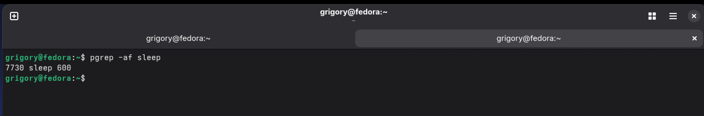
Найдено. Разберём пару модификаторов:

- -a _(all)_ — показывает полную команду
- -f _(full command line)_ — поиск по всей командной строке
- -u _(user)_ — фильтр по пользователю
- -c _(count)_ — число найденных процессов

<mark>+</mark> Посмотрим процессы в папке _/proc_
Каждый процесс представлен в виртуальной файловой системе. Папка _/proc_ — срез состояния внутри ядра в реальном времени. Через _/proc_ `top` и `htop` получают информацию о системе.
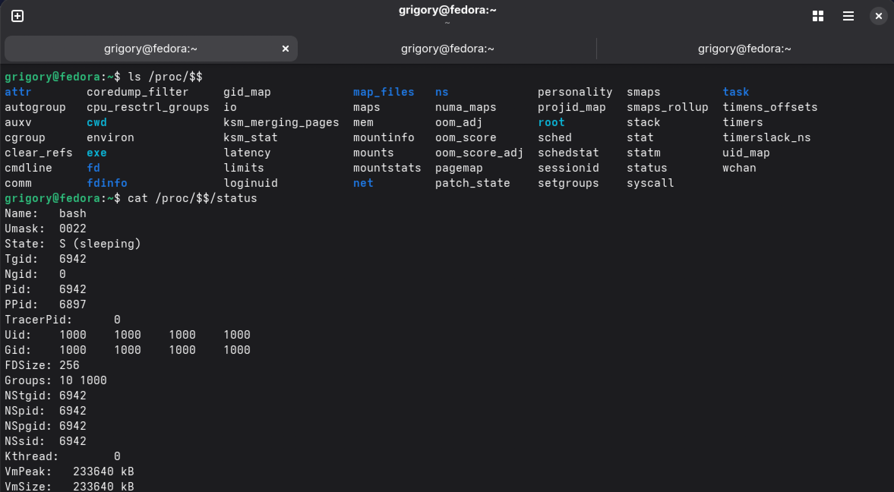
Например, в файле `status` мы можем обнаружить имя процесса, состояние, айди, айди родителя, uid/gid и т.д.

### Команды

- ps (auxf, -ef)— вывод процессов
- pstree (-pls) — вывод дерева процессов системы
- top — таблица процессов, обновляемая в реальном времени
- htop — улучшенная таблица процессов, обновляемая в реальном времени
- pgrep (-afuc) — вывод процессов по имени
- папка `/proc`

### Наблюдения / проблемы

Целый ряд утилит дублируют функционал друг друга, меняя флаги или названия какой-то информации. Пример: разные названия одних и тех же пунктов в `ps aux` и `top`.

## Часть 2 — Сигналы

<mark>+</mark> Завершим процесс сигналом `SIGTERM`
Создадим процесс, проверим, что он работает и удалим командой **kill**:
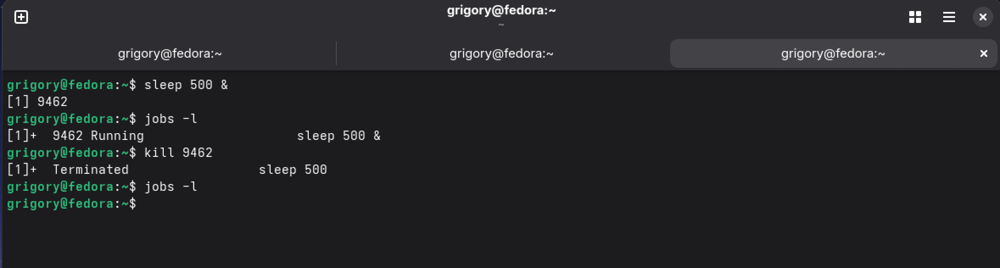
команда kill посылает сигнал процессу. По умолчанию это сигнал _-15_ или `SIGTERM`. Чтобы посмотреть все сигналы, доступные вашей системе, введите команду

```bash
kill -l # list
```

Разберём модификаторы:

- -KILL _(SIGKILL)_ — Принудительное завершение процесса (не перехватывается)
- -STOP _(SIGSTOP)_ — Остановка процесса (не перехватывается)
- -TERM _(SIGTERM)_ — Корректное завершение процесса
- -HUP _(SIGHUP)_ — Сигнал потери связи с терминалом
- -TSTP _(SIGTSTP)_ или _(Ctrl+Z)_ — корректная пауза
- -9 _(SIGKILL)_
- -15 _(SIGTERM)_
- -19 _(SIGSTOP)_
- -1 _(SIGHUP)_
- ...

<mark>+</mark> Остановим процесс и проверим, что он действительно остановлен
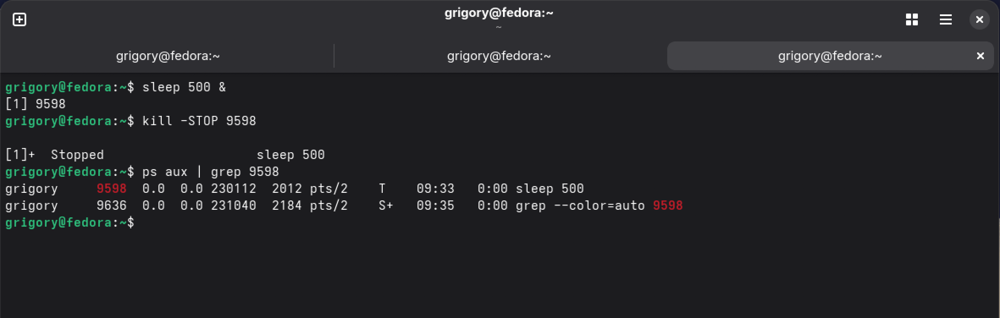
Статус `T` _(traced)_— процесс остановлен/заморожен. Проверка выполнена.

<mark>+</mark> Посмотрим на различие `SIGKILL` и `SIGTERM` на практике.
сигналы отличаются тем, что `SIGKILL` не игнорируется, в то время как `SIGTERM` может быть обработан или проигнорирован. Напишем (ну или ИИ пусть напишет) bash-скрипт, перехватывающий и игнорирующий (выводящий сообщение) сигнал вежливого завершения программы:
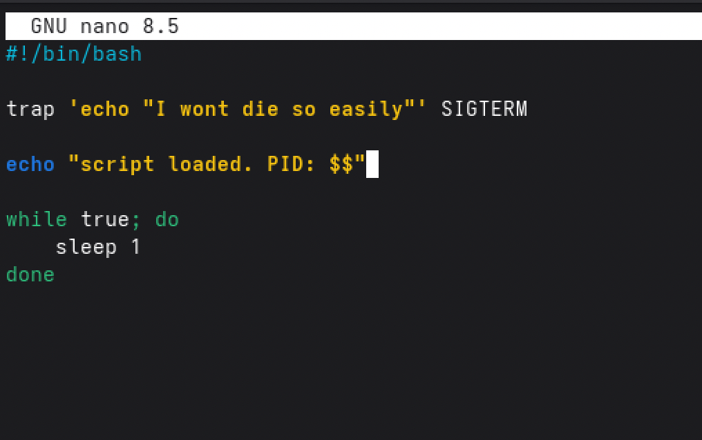
Посмотрим, как скрипт работает:
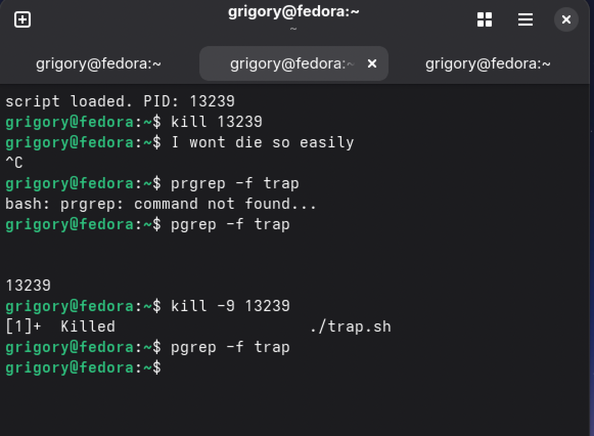

При попытке убить процесс

```bash
kill 13239
```

скрипт выводит сообщение. Проверяем, жив ли процесс командой `pgrep`, хоть и не без ошибки. Процесс жив.
Тогда принудительно убиваем процесс, введя численный модификатор **9**

<mark>+</mark> Убиваем несколько процессов сразу
Запустим firefox и посмотрим, сколько процессов запустилось вместе с ним:
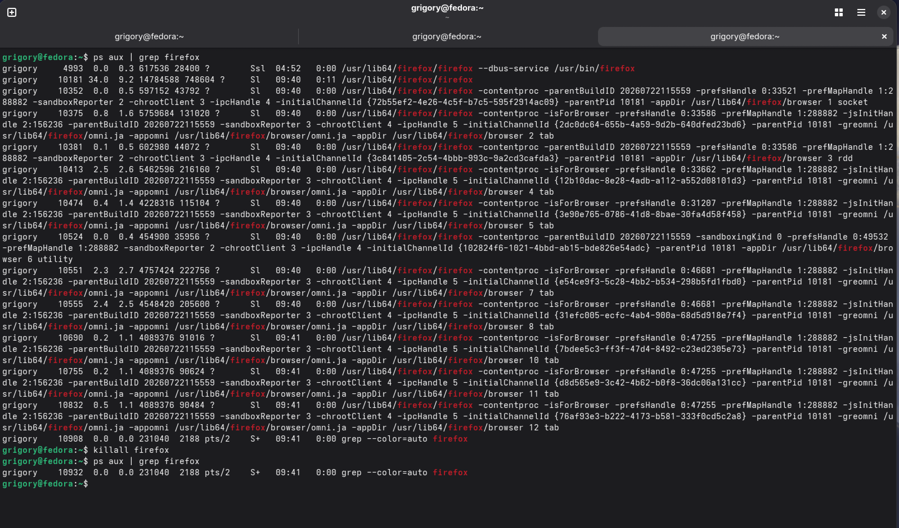
завершим все процессы командой **killall**. При выводе `ps aux` показывает лишь процесс подсветки слова "firefox" в псевдотерминале 2.

Помимо команды **killall** существует команда **pkill**, попробуем завершить процессы с её помощью:
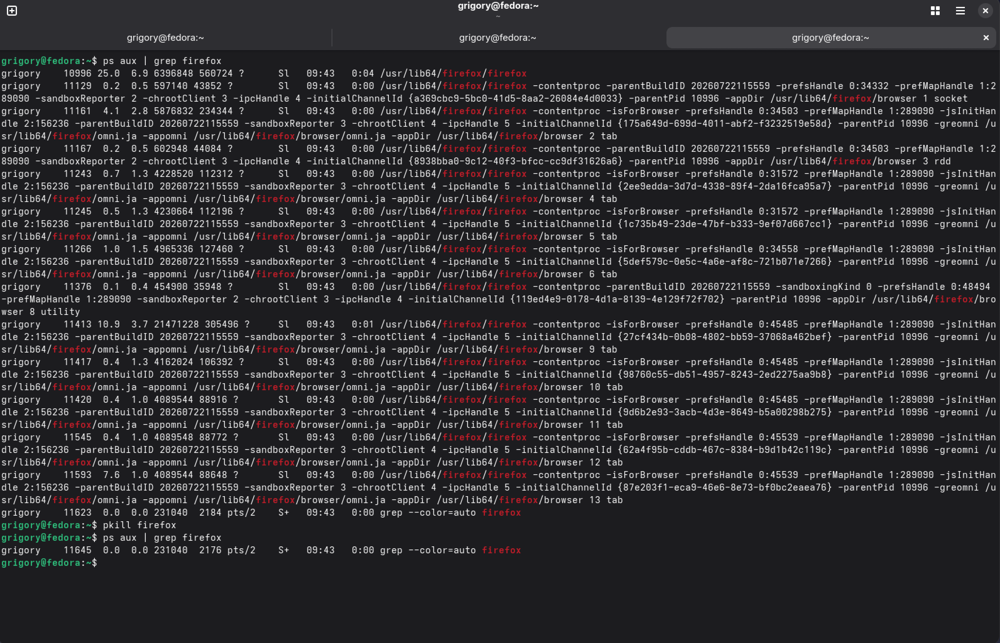
В чём разница?

| Критерий / Поле                                    | killall                                                   | pkill                                                             |
| -------------------------------------------------- | --------------------------------------------------------- | ----------------------------------------------------------------- |
| Принцип поиска процесса                            | Точное совпадение имени файла процесса.                   | Поиск по шаблону (подстрока или RegExp).                          |
| Пакет-поставщик                                    | psmisc                                                    | procps / procps-ng (совместно с pgrep)                            |
| Уровень риска                                      | 🟢 Низкий. Убьёт только то, что на 100% совпало по имени. | 🟡 Высокий. Можно случайно зацепить лишние процессы по подстроке. |
| Чувствительность к регистру                        | Да (по умолчанию).                                        | Да (по умолчанию).                                                |
| Игнорирование регистра                             | -I (или --ignore-case)                                    | -i                                                                |
| Поиск по полному командному строке (с аргументами) | ❌ Не умеет (ищет только по имени процесса).              | ✅ -f (ищет аргументы, например: pkill -f "python main.py").      |
| Фильтрация по пользователю                         | -u <user>                                                 | -u <user>                                                         |
| Фильтрация по возрасту процесса                    | -o (старше) / -y (моложе)                                 | -o (самый старый) / -n (самый новый PID)                          |
| Интерактивный режим (с подтверждением)             | ✅ -i (спрашивает y/n перед каждым PID).                  | ❌ Отсутствует.                                                   |
| Аналог для предварительной проверки                | Отсутствует                                               | pgrep (использует те же флаги поиска, но не убивает).             |

<mark>+</mark> Попробуем убить процесс только у одного пользователя
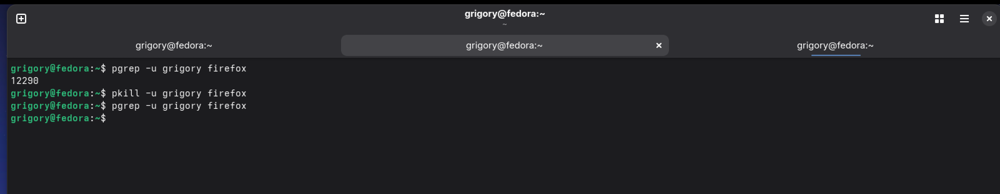
Получилось.

### Команды

- jobs — показывает запущенные процессы
- kill — посылает сигнал процессу
- killall — посылает сигнал нескольким процессам
- pkill — посылает сигнал нескольким процессам

### Часть 3 — Приоритеты процессов

<mark>+</mark> Попробуем запустить процесс с определённым приоритетом
Про приоритет была справка выше. Запустим процесс с изменённым параметром `nice` на старте:
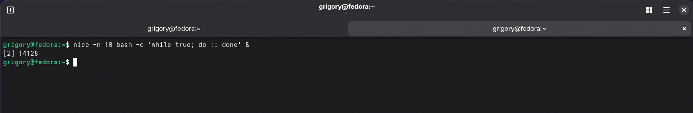
Проверим его в **htop**:
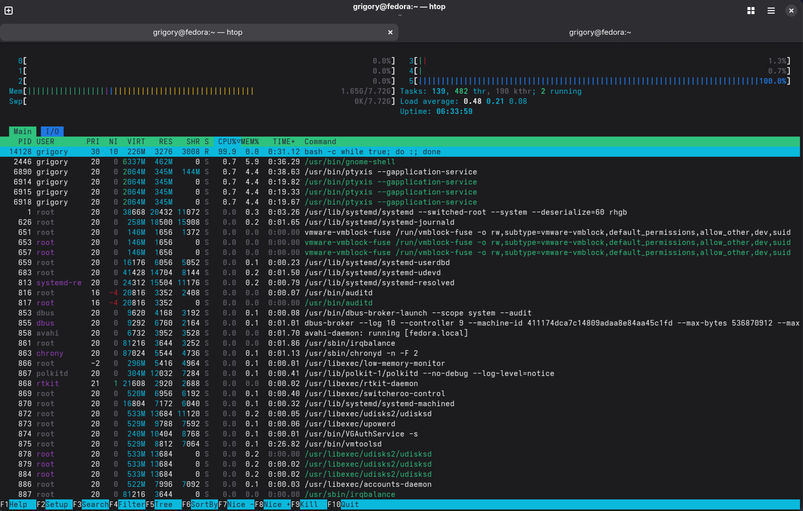

Заметим, что показатель `NI` процесса _14128_ — 10.
Изменим его показатель на 15:
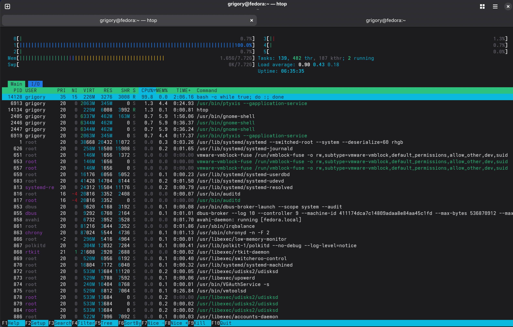
и на -19:
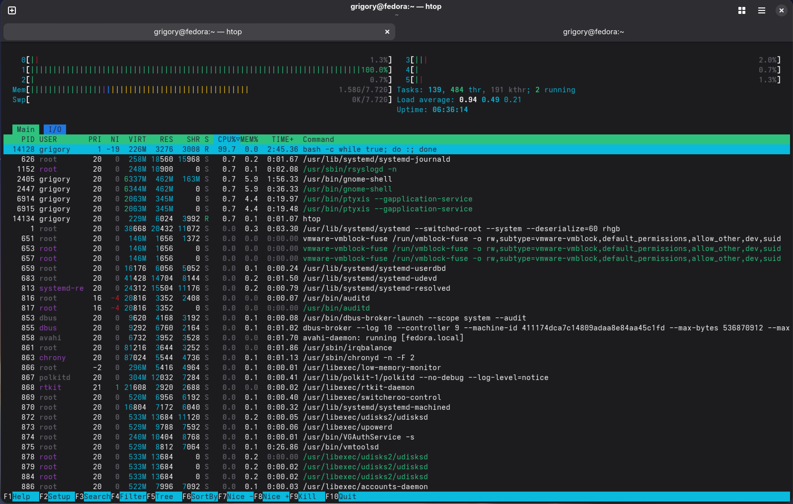

вот сессия терминала:
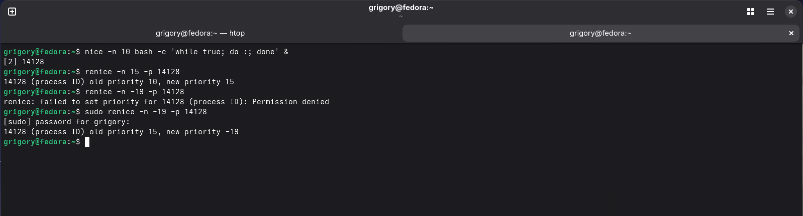
Можно заметить, что для повышения приоритета процесса **(уход в отрицательное значение)** необходимы права администратора, почему так? Это защитный механизм системы, не позволяющий всем пользователям ставить повышенный приоритет на свои процессы.

```bash
nice -n <num> <command>
renice (-n) <num> -p <num> # номер процесса
renice (-n) <num> -g <num> # номер группы
```

### Команды

- nice — поставить приоритет процессу при запуске
- renice — изменить приоритет процесса

### Часть 4 — Фоновые задачи и управление Job'ами

<mark>+</mark> Научимся выводить процессы на передний и задний план
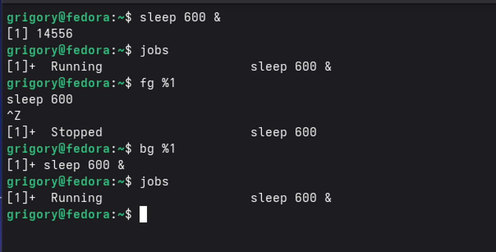
**&** — запускаем процесс в фоновом режиме
**fg** _(foreground)_ — на передний план
**bg** _(background)_ — на задний план
**`% <num>`** — номер процесса в списке `jobs`

<mark>+</mark> **`nohup` и `disown`**

команда `nohup` защищает процесс от `SIGHUP` при закрытии сессии и обычно перенаправляет вывод в `nohup.out`, поэтому если случится ошибка и терминал закроется, процесс будет существовать дальше.
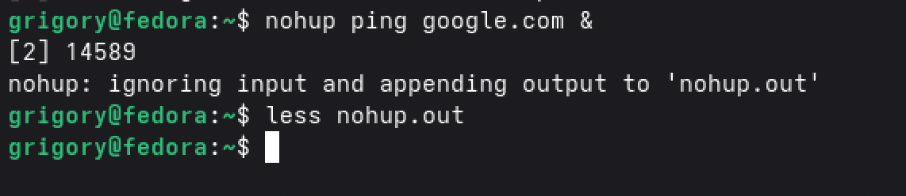

вывод команды автоматически переходит в _nohup.out_, проверим:
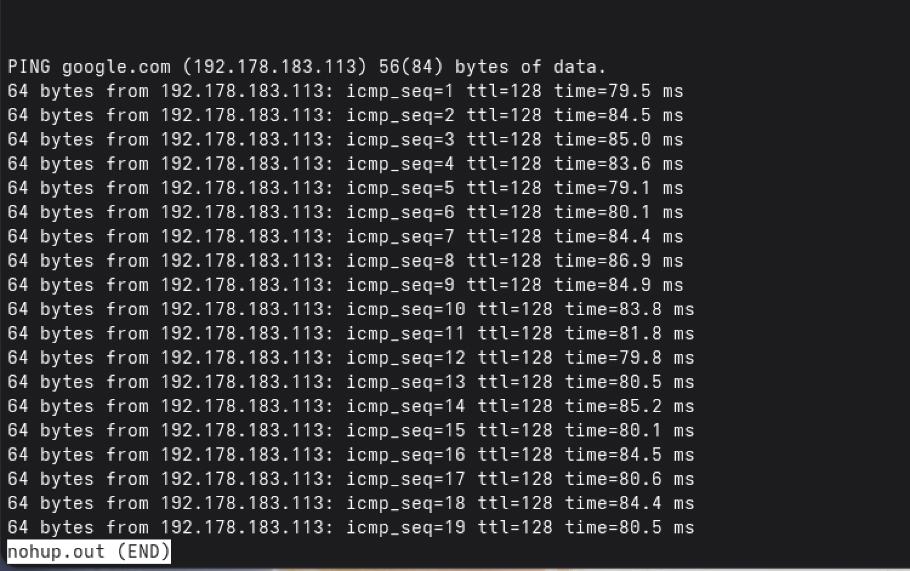

так и есть.

Если процесс уже запущен, но нужно выключить терминал, то спасает `disown`
команда вычёркивает процесс из таблицы jobs (`disown` убирает job из контроля shell).
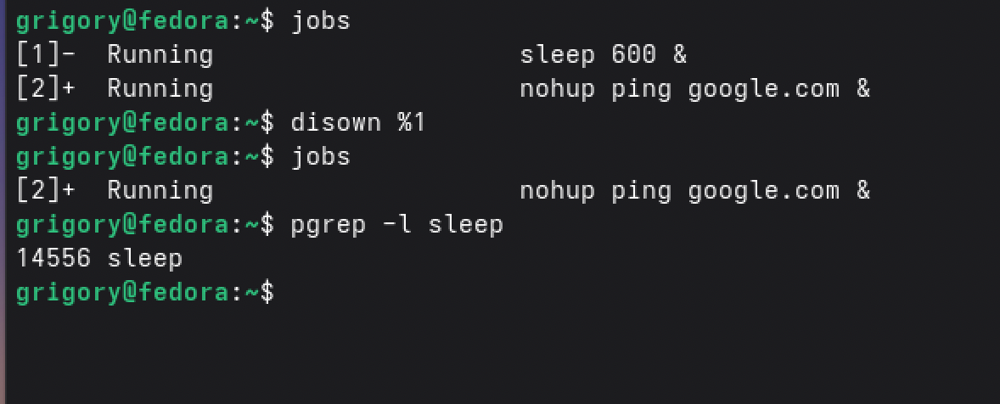

разница между `nohup` и `disown`:

| Критерий             | nohup                                                  | disown                                       |
| -------------------- | ------------------------------------------------------ | -------------------------------------------- |
| Когда применять      | При запуске новой команды                              | Для уже запущенной job                       |
| Что делает           | Игнорирует `SIGHUP` и обычно пишет вывод в `nohup.out` | Убирает job из таблицы `jobs` текущего shell |
| Нужен ли job control | Нет                                                    | Да (работа через `jobs/%n`)                  |
| Типичный сценарий    | `nohup long_task &`                                    | `Ctrl+Z` → `bg` → `disown`                   |

### Команды

- & — запуск задачи сразу в фоне
- jobs — список job текущего shell
- fg %N — вернуть задачу `N` на передний план
- bg %N — продолжить задачу `N` в фоне
- ` nohup <cmd> &` — запуск с игнорированием `SIGHUP`
- disown %N — убрать задачу из job-таблицы shell

### Часть 5 — Зомби и осиротевшие процессы

<mark>+</mark> Посмотрим на поведение зомби процесса
Напишем скрипт, который создаёт зомби процесс.
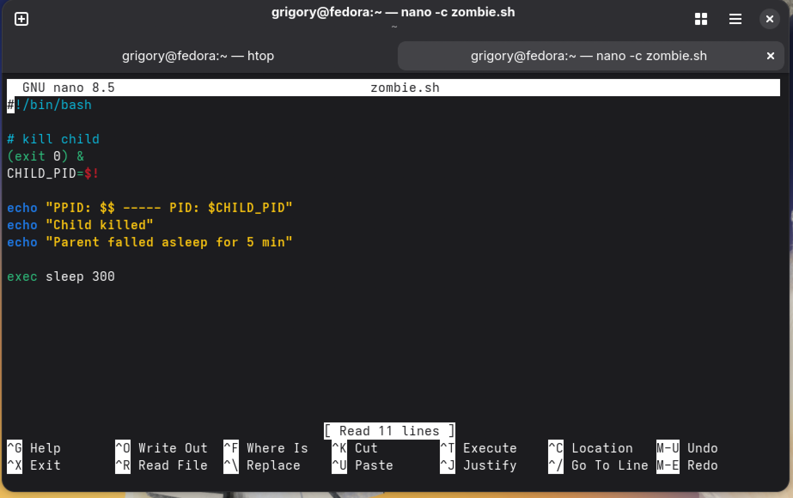
Создаём и сразу завершаем дочерний процесс. Останавливаем родительский процесс, чтобы он не проверял дочерний.
Запустим
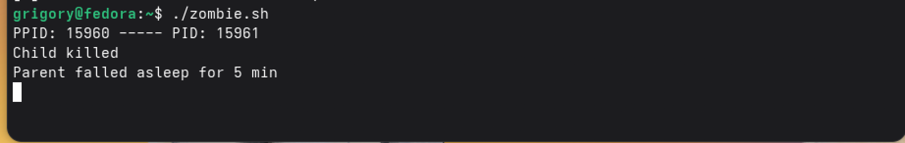
Проверим `htop`
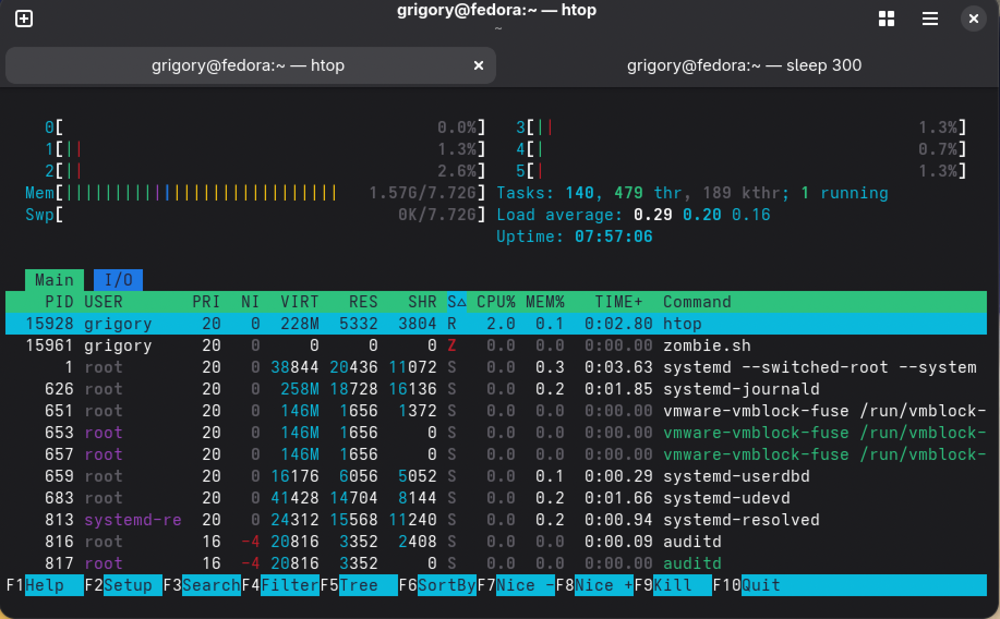
У процесса 15961 отображается `Z` _(zombie)_ в статусе. Попробуем убить его.
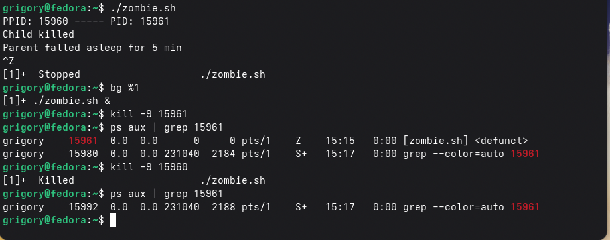

Из листинга видно, что после отправки `SIGKILL` процесс остаётся в таблице, в чём дело? Зомби-процесс уже мёртв (он не занимает ресурсы, только отображается) он завершил выполнение. Чтобы запись исчезла родительский процесс должен забрать статус завершения потомка через вызов `wait()`. Так как в нашем случае родительский процесс спит, можно убить его, тогда процесс усыновит жнец, который автоматически отчистит запись, что и видно из вывода терминала.

<mark>+</mark> Посмотрим на поведение процесса-сироты
Напишем скрипт на создание сироты:
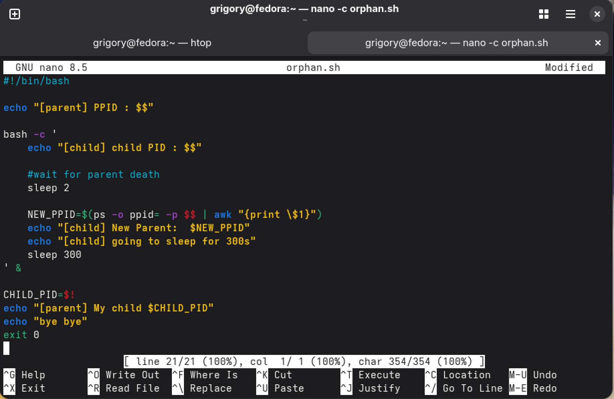
Посмотрим вывод:
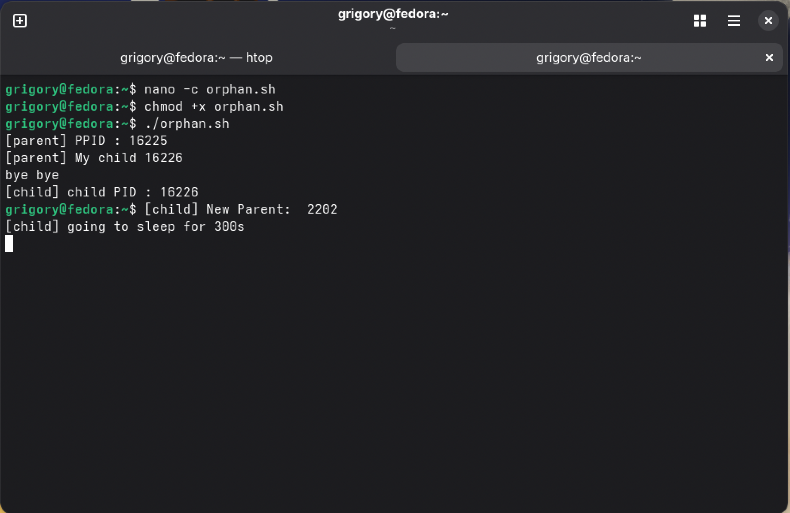

`Процесс-сироту в операционных системах семейства UNIX/Linux «усыновляет» главный системный процесс init (или его современный аналог, например systemd), который получает идентификатор PID 1`

Так написано в интернете, но что мы видим? Наш процесс-сироту приютил процесс **2202**
Проверим через `ps | aux`:
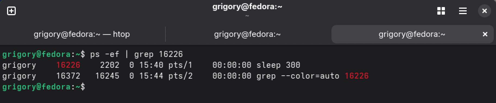

Посмотрим, что за процесс 2202:
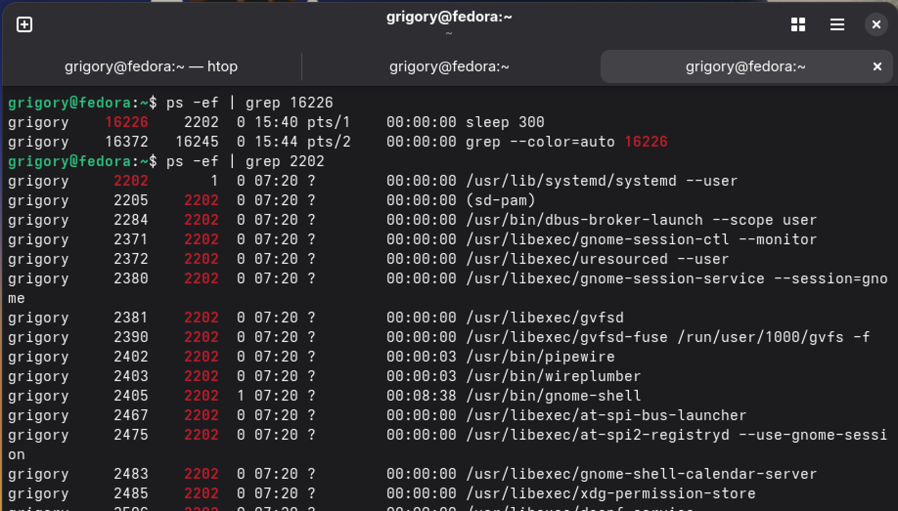

`systemd` управляет запуском всех процессов. При входе в систему создаётся личный `systemd --user`, который делает 2 вещи:

1. Запускает оболочку, рабочий стол и фоновые приложения.
2. Объявляет себя «процессом-жнецом» для твоей сессии.
   Процесс-жнец — процесс, принимающий осиротевших процессов, проверяющий их и удаляющий (как родительский процесс).

### Что понял лучше всего

Наглядно понял, как работают процессы-зомби и сироты. Разобрался с приоритетом, статусами, фоновыми процессами.

### Что осталось непонятным / вернуться позже

Когда-нибудь стоит вернуться к сигналам и изучить их глубже.
