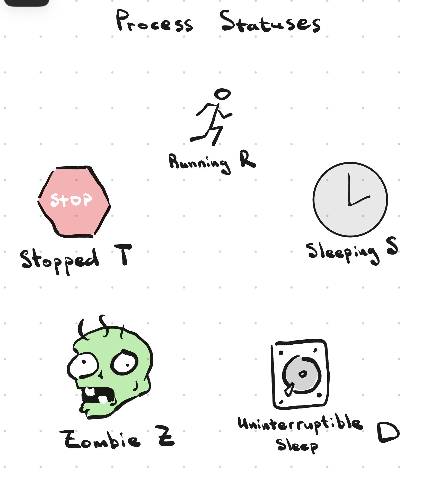
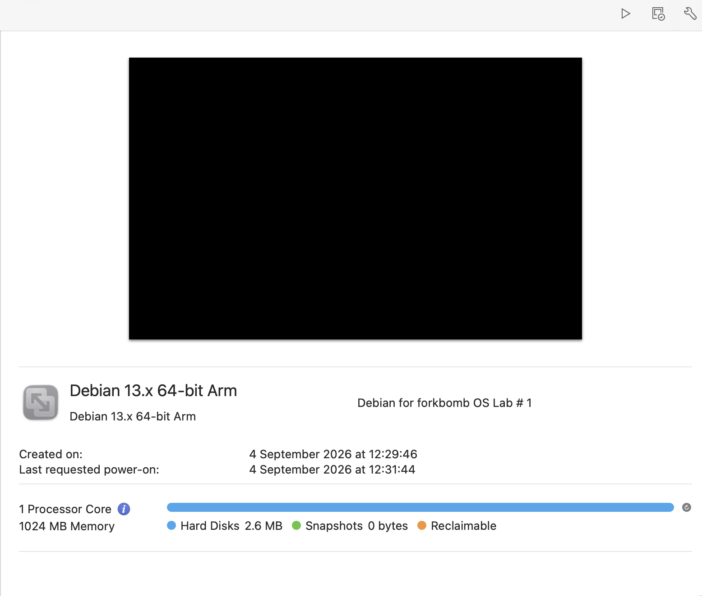
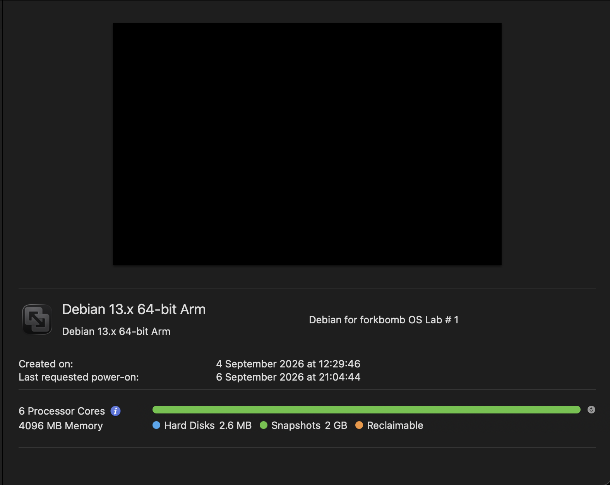
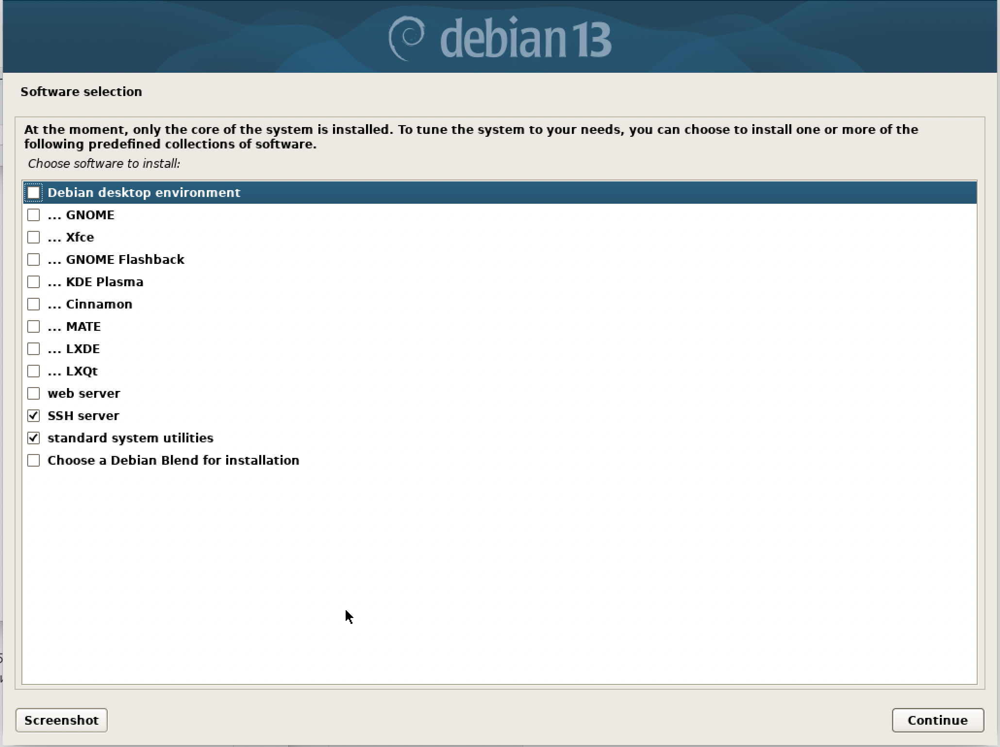

# Вводная часть

**Определения**
_Процесс_ — запущенный экземпляр программы, который выполняет определённые задачи и имеет собственный набор ресурсов в памяти.

_Поток_ — это легковесный процесс, который запускается в среде родительского процесса для параллельного выполнения отдельных участков кода. У потоков есть свои `TID` (Thread ID), набор ресурсов в памяти.

> [!Информация о процессе/процессах]
> На линуксе есть виртуальная файловая система **/proc**, генерируемая ядром в оперативную память при запросе. В этой файловой системе храниться информация о планировщике (schedstat), процессах в общем (stat) и о каждом отдельном процессе (папка нумеруется в соответствии с PID). В самой папке процесса содержится информация о нём (status, mem, cgroup и т.д)

**Как выполняются процессы (контекст процесса)**
ЦП "параллельно" выполняет несколько десятков процессов, как это работает? На процессоре существуют _регистры_ (внутренние ячейки памяти на чипе) из которых он берёт данные, проделывает с ними математическую операцию и записывает их обратно в регистр.
Количество регистров ограничено и в каждом регистре может храниться только один процесс.
Ядро линукса реализует **вытесняющую многозадачность** — модель поведения ядра, которая подразумевает постоянную последовательную обработку процессов по мизерному кванту времени (миллисекунда к примеру). По прошествие времени выполнение одного процесса прерывается и заменяется на выполнение другого.

_Контекст процесса_ — снапшот процесса в момент, когда процесс выполнялся

Контекст процесса позволяет бесшовно переходить с выполнения одного процесса на другой.
Контекст процесса сохраняется в оперативную память.

> [!Почему нельзя выполнять процессы без вытесняющей многозадачности?]
> Если убрать вытеснение может возникнуть несколько критических ошибок:
>
> 1. Зависание — система не сможет забрать ресурсы у зависшего приложения без вытеснения
> 2. Простой процессора при I/O
> 3. Невозможность параллельной работы (например при обработке большой задачи)

**Как создаются процессы (форк)**
_fork_ — создание независимой копии процесса(CoW).

1. Родительский процесс вызывает **fork()**, в этот момент ядро замораживает процесс и делает полную копию.
2. После размораживания форк возвращает родителю PID дочернего, а дочернему 0. Так система понимает связь между процессами.
3. Определив дочерний процесс, ядро очищает его старую память и начинает выполнение нового процесса

**Статусы процессов**



- **R (Running / Runnable)** — процесс выполняется процессором или ждет своей очереди в процессоре.
- **S (Sleeping)** — процесс спит и ждет завершения какого-либо события (например, ввода данных).
- **D (Uninterruptible sleep)** — глубокий сон, процесс ждет ответа от девайса (диска) (его нельзя прервать сигналом).
- **Z (Zombie)** — процесс завершил работу, но родительский процесс еще не забрал информацию о его завершении.
- **T (Stopped)** — процесс принудительно остановлен (например, сигналом с клавиатуры или отладчиком)

**Системные вызовы для создания процесса**

Разберём, как вышеописанные понятия выполняются ядром.
Программа посылает ядру _syscall_ — системный вызов, прочитав который ядро начинает выполнять конкретную команду. Разберём некоторые системные вызовы:

- fork() — создаёт копию текущего процесса
- exec() — заменяет содержимое текущего процесса
- wait() — родитель использует это, чтобы дождаться завершения потомка и забрать код возврата

> [!Zombie]
> Процессы становятся зомби, когда родитель ещё не вызвал wait(), чтобы забрать код возврата

**О принципе работы:**
_forkbomb_ — программа, которая бесконечно создаёт свои копии, чтобы исчерпать системные ресурсы.

программа форкбомбы создаёт копии самой себя, тем самым заполняя ресурсы компьютера. Главная цель такой программы — захват всех доступных идентификаторов процессов, процессорного времени и оперативной памяти, чтобы ОС не могла выполнять свою работу **(DoS)**.

**Подробнее про цели форкбомбы:**

1. **Исчерпание PID**
   У каждой ОС есть лимит на количество одновременно существующих процессов, определяемый параметром `pid_max`. Каждому процессу выделяется свой номер, таблица процессов переполняется, в следствие чего ядро больше не может выдать ни одного нового `PID`. При запуске любого процесса получиться ошибка (`bash: fork: retry: No child processes`)
   Теоретически возможный сценарий, но практически достичь этого тяжело за счет ограничения железа.
2. **Исчерпание CPU**
   Программа загружает `scheduler`, в следствие чего очередь в планировщик растет, система начинает тратить ресурсы на бесконечный запуск программ. Загрузка процессора возрастает.
3. **Исчерпание RAM**
   Данные процессов, хранимые в RAM будут раздуваться, в следствие чего заполнят всё пространство

## Как предположительно будет работать программа:

- Система с ограниченными ресурсами:
  Система начнёт тормозить и зависнет. (Исчерпание CPU)
- Система со слабо ограниченными ресурсами
  Система столкнётся с нехваткой памяти.
- Система со слабо ограниченными ресурсами и лимитом на процессы (ulimit -u)
  Форкбомба достигнет лимита, атака будет локализирована.

# Настройка ВМ

Запустим дистрибутив _Debian_ версии 13 **(Arm)** на ВМ. Вся последующая настройка и работа выполнена на этой версии машины.

Для первого теста используется ВМ с 1 ядром и 1 Гб оперативной памяти:


Для второго и третьего теста используется ту же ВМ с 6 ядрами и 4 Гб оперативной памяти:


Начальное ПО ВМ:


# Запуск форкбомбы

```bash
:(){ :|:& };:
```

**как это работает:**

- :() — объявление функции с именем `:`
- { :|:& } — функция запускает себя `:`, передаёт по конвейеру себя же в фоновом режиме
- ; — конец описания функции
- : — первый вызов функции

**Логирование процессов:**

```bash
#!/bin/bash
LOG_FILE="$HOME/fork_bomb.log"
echo "Start logging" > "$LOG_FILE"
while true; do
    set -- /proc/[0-9]*
    COUNT=$#

    while read -r key val rest; do
        case "$key" in
            procs_running) RUNNING=$val ;;
        esac
    done < /proc/stat

    echo "$(date '+%H:%M:%S') -- process count: $COUNT -- running: $RUNNING" >> "$LOG_FILE"
    sync
    sleep 0.5
done
```

Параметры:

- date — время выполнения
- process count: общее количество процессов в системе
- running — running процессы (выполняемые или в очереди регистров)

**Ошибки, преследовавшие на протяжение всех тестов:**


# Графики форкбомбы

> [!Примечание]
> Тут и далее в графиках малого временного промежутка:
> **ряд 1** — общее кол-во процессов в системе
> **ряд 2** — кол-во процессов в статусе running (выполняющеися или ожидающие регистра)
>
> **Также** для более точного анализа данных рекомендуется смотреть по картинкам т.к отображаемые графики уступают в точности (особенно те, что на большом промежутке времени)
>
> Графики сгенерированы _Gemini_

1.  <span style="background-color: #ff5555; color: white; padding: 1px 6px; border-radius: 4px; font-weight: bold;">1 Core 1 Gb Ram</span>


[Ссылка на картинку](pics/01_5.png)


[Ссылка на картинку](pics/01_6.png)

2. <span style="background-color: #ff5555; color: white; padding: 1px 6px; border-radius: 4px; font-weight: bold;">6 Core 4 Gb Ram w/o limit</span>
   
   [Ссылка на картинку](pics/01_7.png)


[Ссылка на картинку](pics/Pasted%20image%2020260907132612.png)

3. <span style="background-color: #ff5555; color: white; padding: 1px 6px; border-radius: 4px; font-weight: bold;">6 Core 4 Gb Ram w limit 2000</span>


[Ссылка на картинку](pics/01_9.png)


[Ссылка на картинку](pics/01_10.png)

# Анализ графиков

1. **1 Core 1 Gb Ram**
   Рассмотрим **детальный график** кол-ва процессов в системе. Из него можно выбрать несколько этапов: - Инициализация логирования — в системе работает ~200 процессов - Экспоненциальное размножение — запущенная программа вызывает 2 свои копии, порождая рост графика процессов. - Предел — программа дошла до своего предела, общее число процессов держится в районе 2500.

Из **обзорного графика** можно подчеркнуть: - Во время всего теста кол-во процессов было на одном уровне - Скачкообразное поведение числа процессов в статусе `Running`

**Вывод:** ОС упирается в нехватку ресурсов. Об этом говорит низкий потолок общего кол-ва процессов системы. Кол-во `running` процессов постоянно скачет, это говорит о том, что система находится в непрерывном рабочем цикле. На пиках оранжевого графика видно, в какой момент `scheduler` активирует выполнение процессов, а в какой простаивает. Система "задохнулась" в процессах и перестала отвечать

_О тесте_: система не могла принять никаких действий со стороны пользователя (смена tty, ввод логина/пароля, reboot, poweroff). Выключена принудительно

2. **6 Core 4 Gb Ram w/o limit**
   Во всех **детальных графиках** будут сохраняться этапы из 1 примера, но будет изменяться масштаб.

Из **обзорного графика** можно подчеркнуть: - "Пила" из оранжевого графика - Плато графика общих процессов

**Вывод:** Система не справляется с данными процессами, плато показывает кол-во процессов в состоянии ожидания. Планировщик не справляется с задачей. Всё как в первом примере, но с увеличенными ресурсами.

_О тесте:_ система всё также не могла принять никаких действий со стороны пользователя.

3. **6 Core 4 Gb Ram w limit 2000**
   **Детальный график** всё также показывает экспоненциальный рост, но в этот раз потолок достигается на отметке ~2200 процессов.
   **Обзорный график:** - Потолок фиксируется без аномальных всплесков, всё ровно - график `running` процессов снижается и колеблется на уровне близком к 100

**Вывод:** я не понимаю, почему так происходит. (Процессы пытаются форкнуться, но из-за лимита получают отказ. Между попытками они уходят в спящее состояние (S), не занимая CPU. После нескольких безуспешных попыток процесс завершается — и его место занимает другой процесс, находившийся до этого в ожидании. Именно поэтому общий count остаётся стабильным, а running постепенно падает — активных retry-циклов становится всё меньше.)
**Gemini:** Короче говоря: железо может выдержать и больше, но **логика софта или жесткий лимит конфигурации** заставили систему замереть на 2200 процессах, переведя их в режим ожидания, из-за чего активная работа (`Running`) прекратилась.

_О тесте:_ Система прекрасно отзывалась на ввод пользователя.

# Как противодействовать

- **ulimit**
  _(User limit)_ — встроенная команда, устанавливающая лимит процессов на текущую сессию терминала. Существуют жёсткие и мягкие лимиты.
  Лимиты > Мягкий лимит — текущее ограничение, действует на процессы прямо сейчас. Пользователь: **любой пользователь** > Жёсткий лимит — абсолютный максимум, выше которого мягкий лимит подняться не может. Пользователь: **root**

- **limits.conf**
  файл `/etc/security/limits.conf` — инструмент для управления системными ресурсами на уровне пользователь и групп. Любые изменения сохраняются навсегда.
  Синтаксис файла:
  `<домен>    <тип_лимита>    <ресурс>    <значение>`

1. Домен — кто попадает под ограничение
2. Тип лимита — мягкий/жёсткий
3. Ресурс — что конкретно ограничить
4. Значение — числовое выражение. Зависит от типа ресурсов

- **TasksMax**
  Параметр в **systemd**, который контролирует максимальное количество процессов и потоков, которое может создать конкретная служба, пользователь или вся система.

# Вывод

В ходе экспериментов было изучено поведение ОС Linux при атаке форкбомбой в трёх конфигурациях.

В системе с 1 ядром без ограничений форкбомба достигла динамического равновесия на ~2500 процессах — планировщик захлебнулся и не мог давать новым `fork()` достаточно CPU-квантов для продолжения роста. Система перестала отвечать на ввод пользователя и была выключена принудительно.

На 6 ядрах без ограничений параллелизм ускорил рост — система достигла лимита systemd `TasksMax` (~10 000 процессов) вместо динамического равновесия. Природа потолка изменилась: не перегрузка планировщика, а жёсткий системный лимит. Результат для пользователя — тот же: система не отвечала.

На 6 ядрах с `ulimit -u` форкбомба была локализована: рост остановился на пороге лимита, процессы постепенно завершились без возможности размножиться, система оставалась отзывчивой на протяжении всего теста.

Практический вывод: исчерпание таблицы процессов (`pid_max`) в реальных условиях недостижимо — система упирается раньше в CPU-планировщик или системные лимиты. Эффективная защита — `ulimit -u`, `/etc/security/limits.conf` и `TasksMax` в systemd.

# Сырые логи:

- [**1 Core 1 Gb Ram**](forkbomb1.log)
- [**6 Core 4 Gb Ram w/o limit**](forkbomb2.log)
- [**6 Core 4 Gb Ram w limit 2000**](forkbomb3.log)
