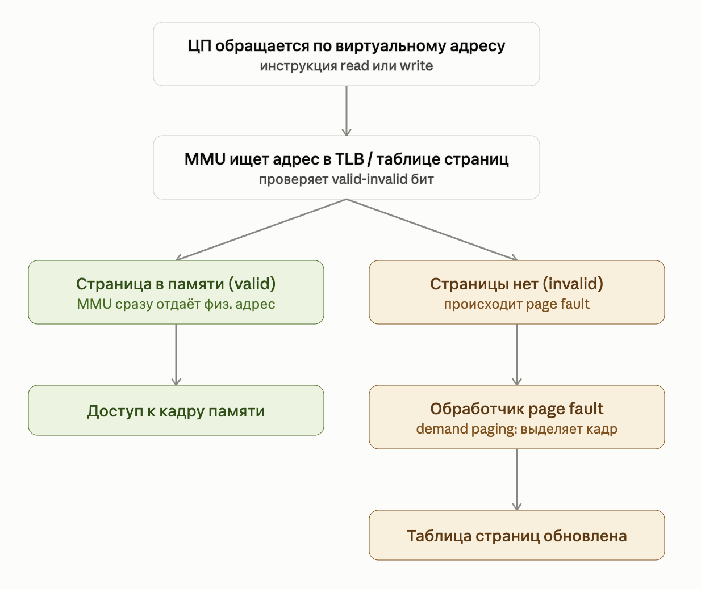
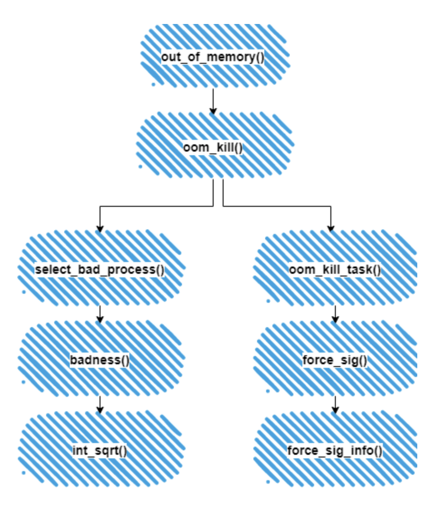
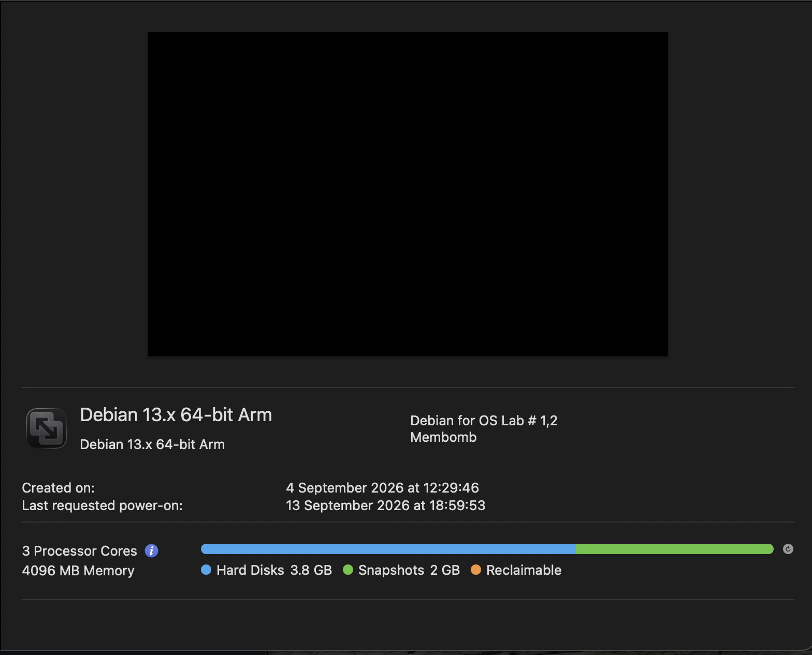
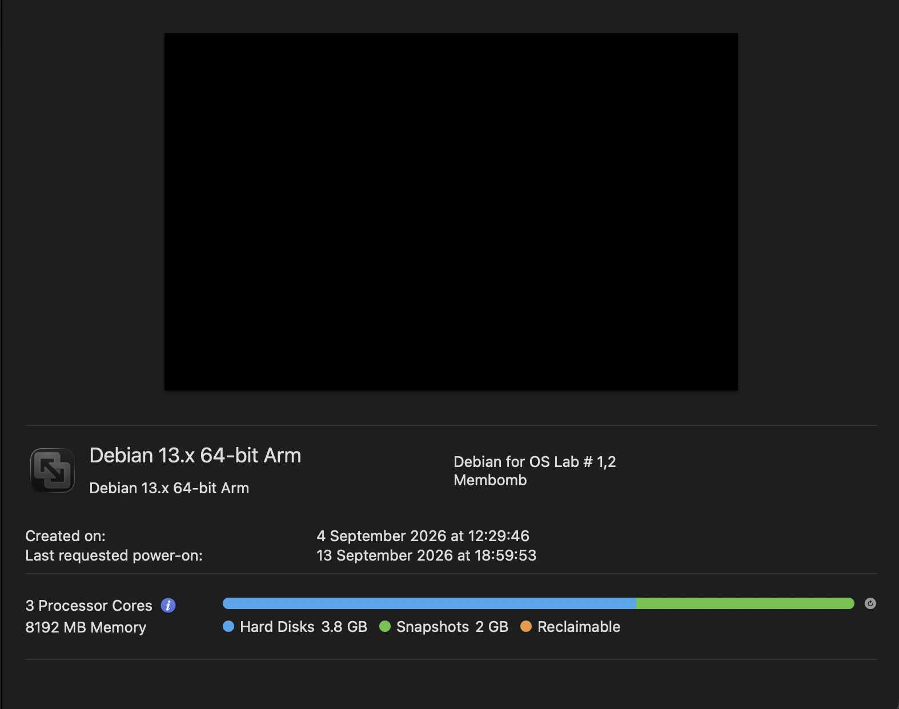
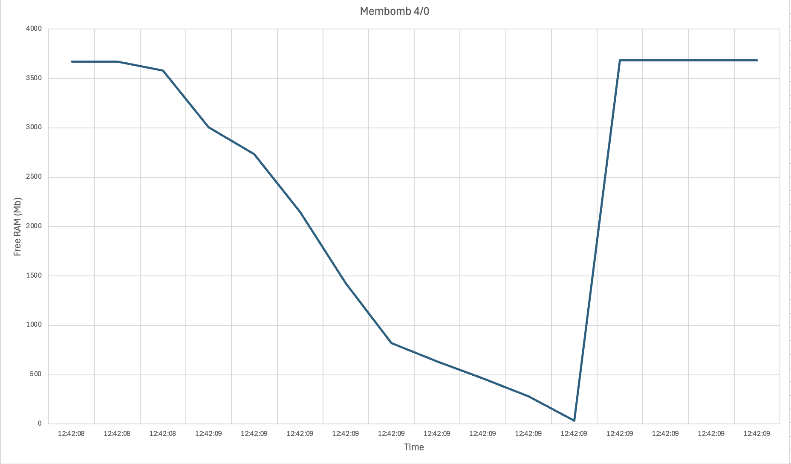
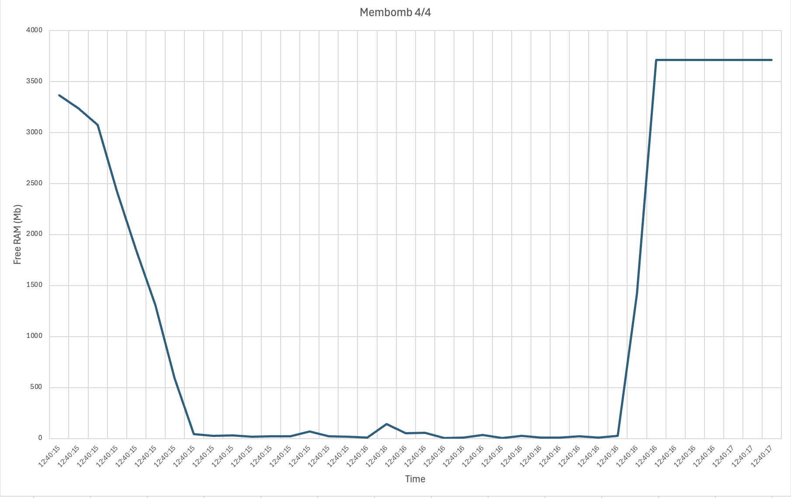
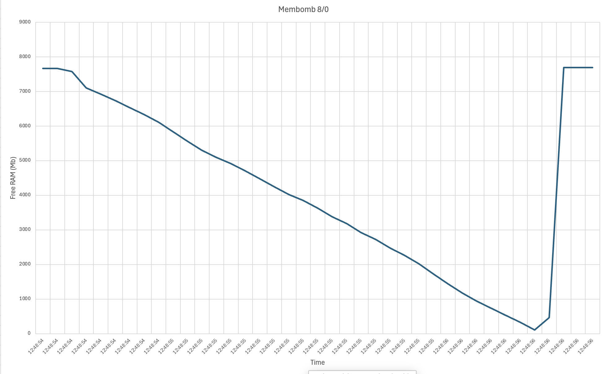
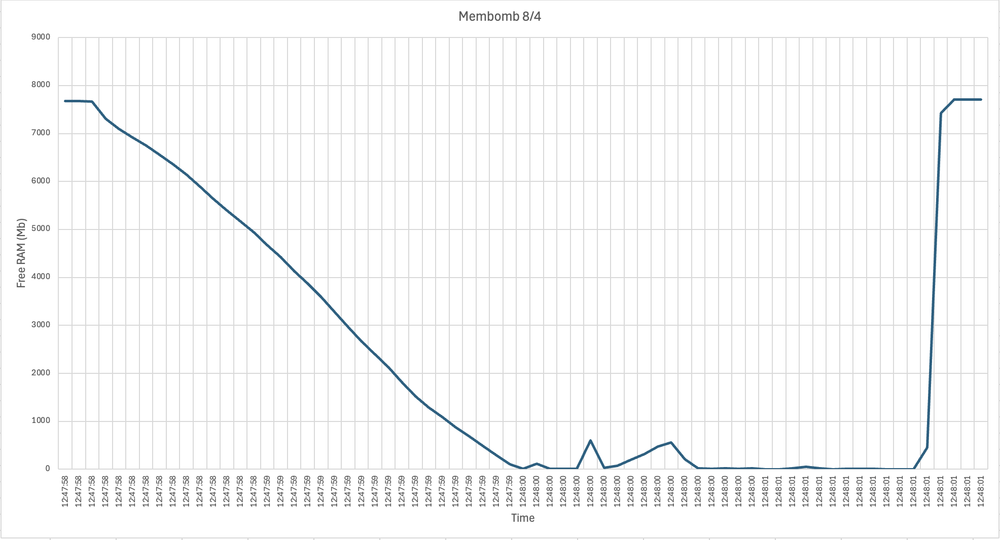
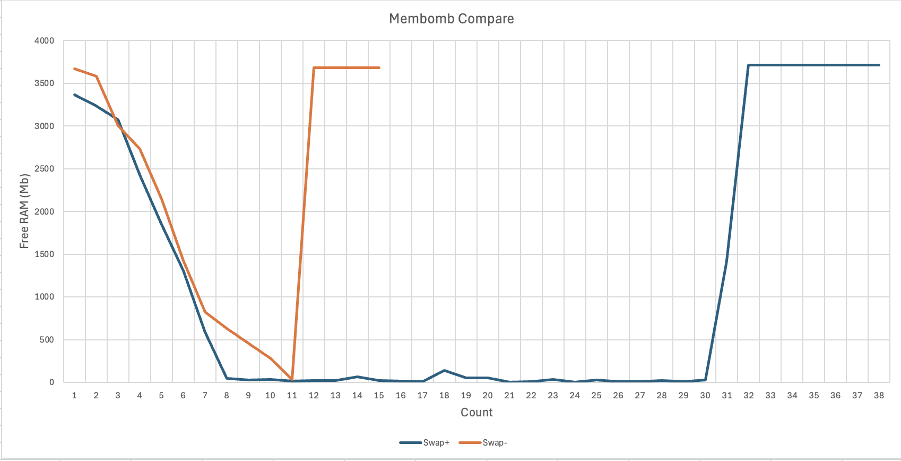
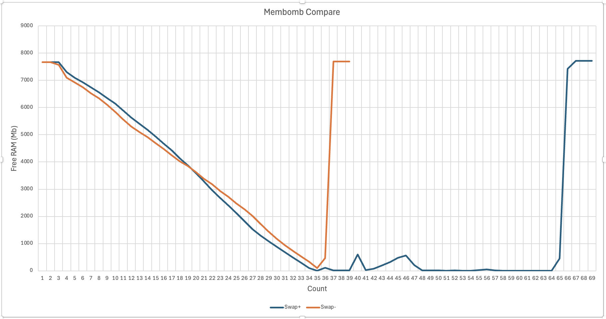

Источники: https://habr.com/ru/articles/981844/

# Вводная часть

## Память
Оперативная память _(ОП, RAM)_ - это большой массив байтов, размер которого варьируется от сотен тысяч до миллиардов. Каждый байт имеет собственный адрес. Для выполнения программы необходимо сопоставить (map) ее с абсолютными адресами и загрузить в память.
После загрузки процесс (активное выполнение программы) обращается к инструкциям программы, считывает данные из неё и записывает данные в память, используя эти абсолютные адреса. Аналогичным образом, для обработки данных с диска. ЦП эти данные должны быть сначала переданы в ОП, потом, с помощью инициируемых ЦП операций ввода-вывода, данные передаются на диск.

## Страничная организация памяти (Paging)
Чтобы избежать _фрагментации программы_, выгруженной в ОП (программа не может поместиться в ОП, хотя памяти хватает) создана стратегия страничной организации памяти. Что это такое?
Пейджинг делит ОП на блоки фиксированного размера, которые называются кадрами _(frames)_. Вместо выделения под программу непрерывного блока памяти, ОС выделяет несколько кадров, которые могут быть разбросаны по всей системе 

==рисунок==
## Виртуальная память
Виртуальная память — абстракция, используемая ОС для управления памятью процессов. Процессы могут отображаться только к виртуальной памяти. Задача ОС состоит в том, чтобы отобразить виртуальную память на физическую (mapping). Виртуальная память разделена на страницы, которые имеют такой же размер, как и кадры физической памяти.
Процесс может получить доступ к к 18,4 миллионам ТБ в 64-битной архитектуре или до 4 ГБ на 32-битной архитектуре, даже если фактической физической памяти значительно меньше, например, 512 МБ.

>[!Как запускаются большие программы?]
>Когда запускается тяжелая программа, ОС создает для нее огромную карту виртуальной памяти, но физически в ОП (в кадры) загружается только самый необходимый минимум. Остальные данные продолжают лежать на диске (SSD/HDD).
> Дальше в дело вступает подкачка по требованию:
> - Если данных нет в физической памяти программа обращается к виртуальному адресу, где должна лежать нужная часть.
> - Процессор видит, что этого куска данных в физической ОП нет. Происходит аппаратное прерывание, которое называется **Page Fault (ошибка страницы)**.
> - Процессор ставит программу «на паузу», операционная система быстро находит нужный блок на SSD, копирует его в свободный кадр ОП, обновляет таблицу страниц и снимает программу с паузы. 
> - Если ОП заполняется, ОС берет старые данные и просто выкидывает их из ОП (или записывает обратно на диск в swap-файл), освобождая место для новых.
>

## Роль MMU и ленивое выделение (demand paging)
__MMU__ (Memory management unit)_ — аппаратный блок, встроенный в процессор, который на лету проходит по таблице страниц процесса и заменяет номер виртуальной страницы на номер физического кадра.



__Demand Paging__
Если при обращении к таблице страниц MMU не находит соответствия (адрес на физической памяти зарезервирован, а по факту информация есть только в виртуальной памяти), то инициализируется __page fault__ — ошибка страницы. MMU не может завершить трансляцию в физическую память, поэтому вызывает подгрузку соответствия, после чего выполняется заново, но уже успешно. Этот процесс называется ленивым выделением или — __demand paging__

## Swap (файл подкачки) и Трешинг (Trashing)
__Swap__ — механизм ОС, позволяющий временно вытеснять содержимое страниц физической памяти на вторичное устройство (диск), чтобы освободить RAM под другие данные, и подгружать их обратно при повторном обращении.

_Зачем нужен своп?_
- Overcommit — ядро позволяет процессам резервировать больше виртуальной памяти, чем физически есть в системе. Своп выступает подстраховкой на случай, если расчёт не оправдался
- _Расширение эффективноего объёма памяти_ — позволяет запускать больше процессов ценой снижение производительности
- _Вытеснение неактивных данных_ — вытесняет страницы памяти, к которым давно не обращались

__Trashing__ — состояние системы, при котором она тратит почти всё процессорное и дисковое время на непрерывную перекачку страниц между RAM и свопом, потому что суммарный рабочий набор активных процессов превышает объём физической памяти.

## Два типа страниц
- __File-backed__ — страницы, за которыми стоит файл на диске. Если ядру нужно освободить такую страницу, можно либо дописать, либо выбросить из памяти не дописывая.
- __Anonymous__ — страницы без файла (куча, стек...). У таких файлов нет места на диске, поэтому единственный способ вытеснить их — записать в swap.

## OOM killer
__OOM killer _(Out-Of-Memory killer)___ — встроенный механизм ядра Linux, который принудительно завершает самый "тяжёлый" или наименее важный процесс при полном исчерпании RAM и Swap, спасая ОС от зависания.

__Схема работы:__
1. При отсутствии swap и ram вызывается __out_of_memory()__
2. OOM нужно определить самый "плохой" процесс для того, чтобы остановить его
3. Выбор происходит функцией  **select_bad_process** на основе __oom_score__ (чем выше оценка, тем больше вероятность уничтожения)
4. __oom_score__ вычисляется функцией **int_sqrt**. Параметры, влияющие на выбор:
	- Объем памяти, используемый процессом.
	- Размер памяти любого дочернего процесса (не включая поток ядра).
	- Оценка процесса увеличивается для хороших процессов и уменьшается для длительных процессов.
	- У процессов с возможностями `CAP_SYS_ADMIN` и `CAP_SYS_RAWIO` снижены оценки.
5. После выбора процесса OOM killer завершает его и выводит информацию об этом




## О программе:
__MemBomb__ _(memory bomb)_ — программа, которая намеренно и неограниченно запрашивает виртуальную память, реально используя её (заполняя нулями), пока система не заполнится физическая и система не начнёт вести себя нестандартно.

Программа впадает в бесконечный цикл запроса памяти. Она пытается занять всю Ram. В попытках освободить новую память на Ram ОС начинает перекидывать данные (не мембомбы)  на своп, как бы создавая пространство для манёвра. При отсутствии свопа мембомб займёт Ram и система перестанет отвечать.
Цель такой программы — добиться отказа в обслуживании ОС __(DoS)__

__Гипотеза:__
- __(4 gb Ram 0 Swap)__: Membomb захватит всю память и OOM killer завершит процесс
- __(4 gb Ram 4 gb Swap)__: После захвата памяти начнётся trashing
- __(8 gb Ram 0 Swap)__: Масштабирование 1 опыта
- __(8 gb Ram 4 gb Swap)__: Масштабирование 2 опыта

# Настройка ВМ
Используем 2 системы, проводим 4 теста
Для первого и второго теста используется ВМ с 3 ядрами ЦП и 4 Гб Оперативной памяти.


Для третьего и четвёртого тестов используется ВМ с 3 ядрами ЦП и 8 Гб оперативной памяти.



# Запуск Membomb

__Код бомбы:__
```C
#include <sys/mman.h>
#include <unistd.h>

int main(){
	long page_size = sysconf(_SC_PAGESIZE);
	size_t chunk_size = 1024 * 1024 * 128;
	
	while (1){
		char *ptr = mmap(NULL, chunk_size, PROT_READ | PROT_WRITE, MAP_PRIVATE | MAP_ANONYMOUS, -1, 0);
		
		if (ptr != MAP_FAILED){
			for (size_t i = 0; i < chunk_size; i += page_size){
				ptr[i] = 0;
			}
		}
	}
	return 0;
}
```

__Логирование:__
```bash
#!/bin/bash

LOG_FILE="membomb_log.log"

echo "Logging started"
echo "Logging started" > "$LOG_FILE"

while true; do
	MEM_MB=$(awk '/MemAvailable:/ {print "%2.f", $2 / 1024}' /proc/meminfo)
	TIMESTAMP=$(date '+%H:%M:%S')
	
	echo "$TIMESTAMP FREE_RAM: ${MEM_MB}" >> "$LOG_FILE"
	
	sleep 0.05
done
```
# Графики

1. <span style="background-color: #ff5555; color: white; padding: 1px 6px; border-radius: 4px; font-weight: bold;">4 Gb Ram 0 Gb Swap</span>



2.  <span style="background-color: #ff5555; color: white; padding: 1px 6px; border-radius: 4px; font-weight: bold;">4 Gb Ram 4 Gb Swap</span>



3.  <span style="background-color: #ff5555; color: white; padding: 1px 6px; border-radius: 4px; font-weight: bold;">8 Gb Ram 0 Gb Swap</span>



4.  <span style="background-color: #ff5555; color: white; padding: 1px 6px; border-radius: 4px; font-weight: bold;">8 Gb Ram 4 Gb Swap</span>



## Сравнение графиков w/wo swap

1.<span style="background-color: #ff5555; color: white; padding: 1px 6px; border-radius: 4px; font-weight: bold;">4 Gb Ram 4/0 Gb Swap</span>



2. <span style="background-color: #ff5555; color: white; padding: 1px 6px; border-radius: 4px; font-weight: bold;">8 Gb Ram 4/0 Gb Swap</span>



# Анализ графиков

На графиках видно, как кривая свободной памяти плавно идёт вниз. На графиках без свопа можно заметить, что кривая сразу отскакивает до начальных значений. OOM killer срабатывает мгновенно.

На графиках со свопом видно, как кривая тянется по пороговым нижним значениям. Это _trashing_ — система перебрасывает данные со свопа на ram и наоборот. Когда swap заканчивается, срабатывает OOM killer и значения приходят в норму.

# Вывод
