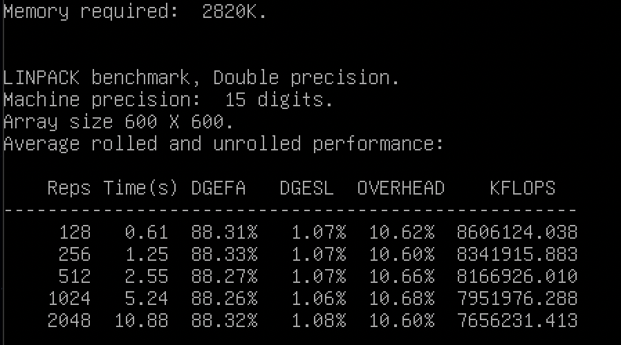
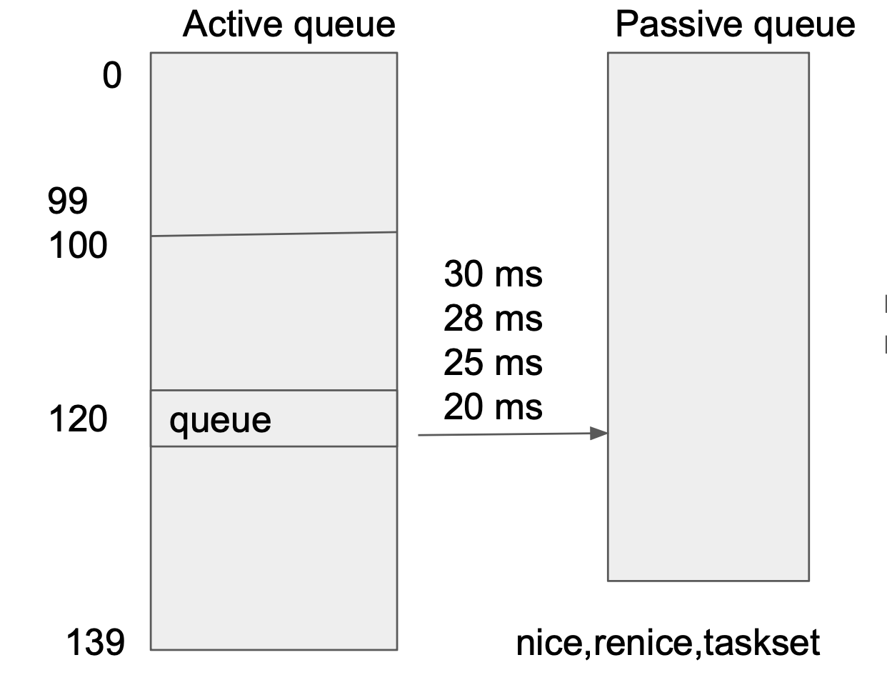
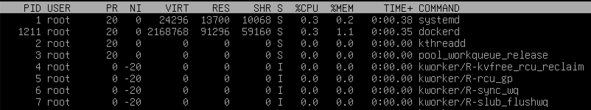
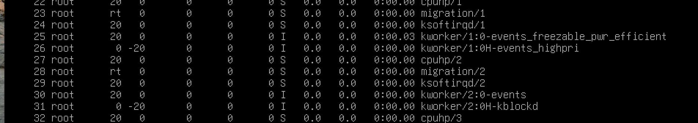
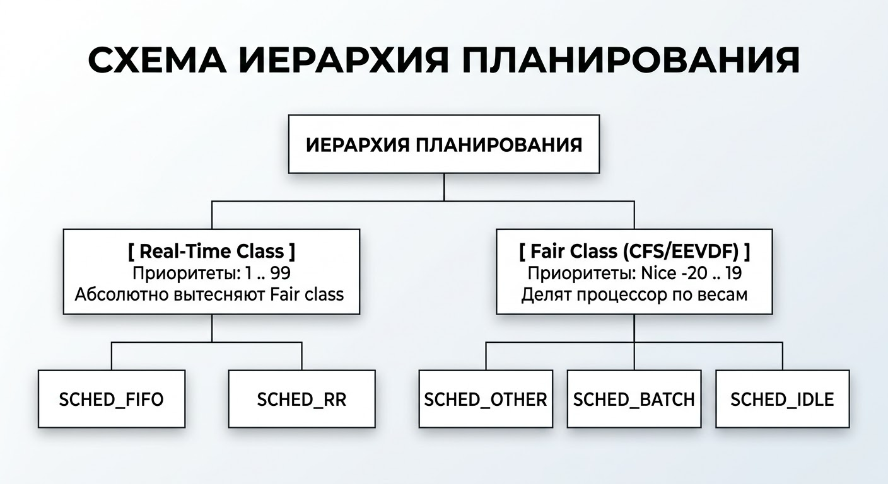
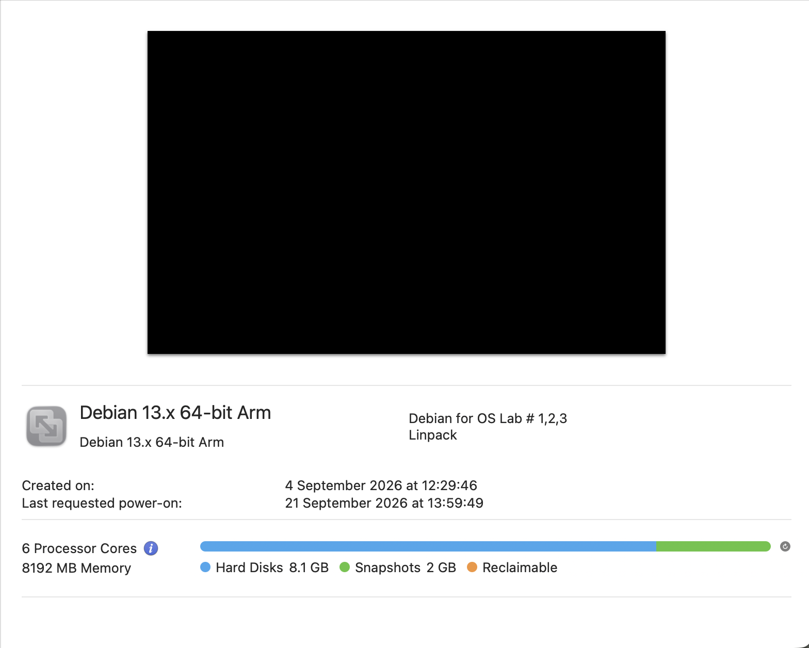
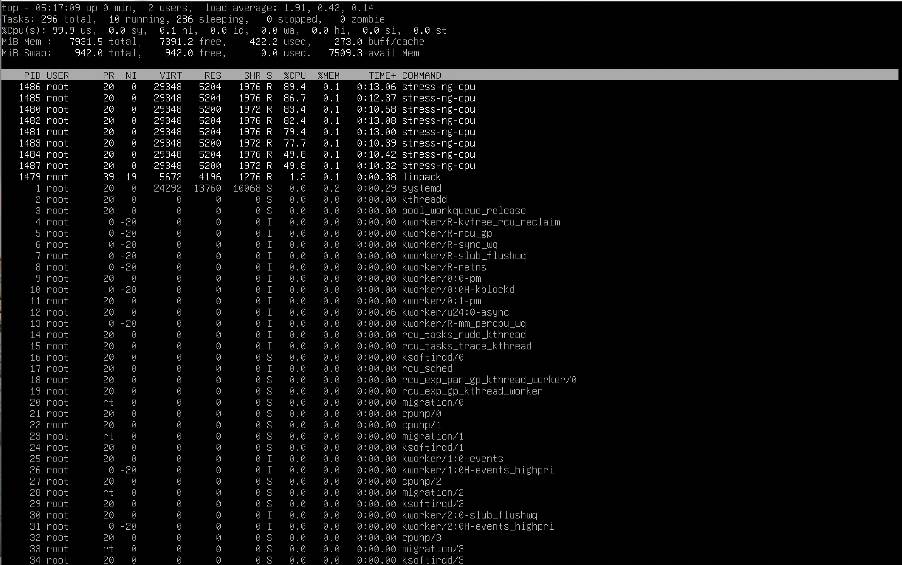

# Вводная часть

__Цель работы:__
Найти и скомпилировать программу linpack для оценки производительности компьютера (Flops) и протестировать ее при различных режимах работы ОС.
## О программе
__Linpack__ — это программная библиотека и созданный на её основе бенчмарк для оценки вычислительной мощности компьютеров при решении задач линейной алгебры (СЛАУ).

В лабораторной работе использовался репозиторий: https://github.com/ereyes01/linpack

### Как работает Linpack
Linpack решает квадратные системы линейных уравнений методом LU-разложений*, задействуя векторные операции процессора и интенсивный обмен данными с памятью. Программа решает систему несколько раз, чтобы сгладить результат и рассчитать производительность в FLOPS.

[\*подробнее про LU-разложение](https://stepanzh.github.io/computational_thermodynamics/syslinear/lu.html)

В выводе __linpack__ есть несколько значений, разберём каждое из них:

- __Memory required__ — объём оперативной памяти, требуемой для работы алгоритма с текущими настройками массива.
- __Machine precision__ — машинная точность. Показывает точность округления при выполнении арифметических операций на конкретном процессоре.
- __Array size__ — отвечает за размер квадратной матрицы, создаваемой в RAM для решения уравнений. 
- ___Reps___ — кол-во раз, которое тест повторно решает СЛАУ для одного и того же размера массива. (Для усреднения результата)
- ___Time___ — время, затраченное процессором на полное решение всех итераций матрицы.
- ___DGEFA___ — процент от общего времени, ушедшего на LU-разложение матрицы (основной вычислительный шаг)* 
- ___DGESL___ — процент от общего времени, ушедший на прямой или обратный ход (решение).
- ___OVERHEAD___ — процент времени, ушедший на накладные расходы (заполнение матрицы случайными числами, передача аргументов, замеры времени...)
- ___KFLOPS___ — показатель, сколько тысяч операций в секунду выполняла программа — основной итоговый показатель производительности

>[!Note]
> _Reps_ в тесте зависит от скорости, с которой выполняется один прогон: программа удваивает reps, пока суммарное время прогона не достигнет 10 секунд.
> Чем медленнее идёт счёт (например из-за конкуренции за ресурсы CPU), тем на меньшем reps программа остановится!

## Влияние приоритетов (nice)
Приоритеты Linux определяют, какой процесс, в каком порядке и на какое время получает доступ к ядрам процессора.

### Двухуровневая шкала приоритетов
В ядре Linux существует единая шкала приоритетов, состоящая из 140 уровней (0...139). Чем меньше число, тем выше приоритет задачи.

 0-99:  Активная очередь (приоритеты реального времени) — предназначены для задач, критичных к задержкам (драйверы).
 100-139: Пассивная очередь (пользовательские приоритеты) — предназначены для стандартных процессов пользователей.

У всех процессов есть свой класс планирования, отвечающий за то, как быстро CPU обслужит процесс. Разберём каждый класс:
- __Stop__ — используется только ядром для критических инструкций (остановка ядра)
- __Deadline__ — класс с абсолютным приоритетом для задач с жёсткими временными рамками. Ядро гарантирует выделение ресурсов.
- __Real-Time__ — задачи реального времени, использующие шкалу RT-приоритетов (та самая активная очередь, работает без квантования времени)
- __SCHED_OTHER___ — класс планировщика (for ex: fair), стремящийся справедливо распределить ресурсы процессора между задачами 
- __Idle__ — класс фоновых процессов.

>[!Note]
>Пока есть хоть одна готовая к выполнению задача в более высоком классе, процессы из более низких классов не получат CPU.

### Математика приоритета обычных процессов


В SCHED_OTHER приоритет задаётся занчением `nice` (-20-19). Связь с внутренним приориетом ядра:
`Kernel Priority = 120 + nice`
Так например:

| nice | kernel priority  | Доля CPU (при 2 процессах) |
| ---- | ---------------- | -------------------------- |
| -20  | 80               | 98.8%                      |
| -5    | 95 | 75.3% |
| 19 | 139 | 1.4% |
### Что за значение в `top`?
Для удобства отображения в утилитах на подобие `top` в колонке _PR_ показывается:

`PR = Kernel Priority - 100` или `PR = 20 + NI`, где NI — показатель nice
Таким образом, в колонке _PR_ значение варьируется от 0 до 39.


Помимо этого, в `top` может отображаться __rt__, что обозначает _real time_.

## Как привязать процесс к процессору и зачем (affinity)
__CPU affinity__ — правило для планировщика ОС, обязывающее выполнить конк
ретный процесс только на заданных логических ядрах, полностью запрещая его миграцию на другие ядра.

### Смысл
Обычный планировщик (CFS) балансирует нагрузку между ядрами, перебрасывая потоки. Есть некоторые проблемы, когда мы начинаем говорить о сложных задачах:
- Сохранение кэша: при переходе на новое логическое ядро процессору нужно заново подтянуть кэш процесса. (медленный процесс, т.к будет идти из RAM)
- Учёт архитектуры(CCD/CCX/ARM): в некоторых системах ядра разбиты на блоки. Обращение ядра из одного блока памяти к другому сопровождается задержками.
- Задержка планирования: планировщик тратит определённое кол-во времени, для выделения ресурсов процессора под определённые задачи. В это время процессор простаивает без полезной нагрузки.
- Соседи: фоновые процессы будут работать вместе с важным и тяжёлым, что понизит эффективность решения важной задачи.
Все эти проблемы решает CPU affinity.

При привязке Linpack к конкретному ядру мы гарантируем сохранение кэша, нулевую задержку планирования и изоляцию от процессов-шумов.
### Как сделать привязку максимально эффективной
Чтобы жесткая привязка процессов к ядрам (CPU Affinity) давала максимальный прирост производительности и минимальную вариативность результатов, необходимо соблюдать следующие правила:
- 1 поток = 1 ядро (сохранение кэша + нулевая задержка планировщика)
- Взаимная изоляция ресурсов (изолировать процесс на ядре + ограничить ядро от других процессов)


## Настройка стандартного планировщика
Планировщик Linux выбирает задачи из очереди на выполнение, опрашивая классы. (было разобрано ранее)

### Параметры
| Параметр          | Стандартное значение | Смысл                                                                                                                                                                                                            |
| ----------------- | -------------------- | ---------------------------------------------------------------------------------------------------------------------------------------------------------------------------------------------------------------- |
| base_slice_ns     | 2100000 (2.1)        | Базовый квант времени (slice). Минимальный интервал ЦП, который планировщик гарантирует задаче (nice = 0) за один заход. Уменьшение = увеличение смены контекста. Увеличение = улучшение пропускной способности. |
| latency_warn_ms   | 100                  | Порог задержки планирования (в мс). Если готовая задача ожидает квант ЦП дольше этого времени, ядро генерирует предупреждение в dmesg. Значение 0 отключает отслеживание.                                        |
| latency_warn_once | 1                    | Флаг однократного логирования. Значение 1 ограничивает вывод предупреждения в dmesg одним разом за сессию, 0 — логирует каждое превышение порога latency_warn_ms.                                                |
| nr_migrate        | 32                   | Максимальное кол-во задач, которе планировщик может перенести с одного ядра на другое.                                                                                                                           |
| migration_cost_ns | 500000 (0.5мс)       | Порог времени с момента последнего выполнения задачи на ядре, в течение которого кэш L1/L2 считается "горячим".                                                                                                  |
и другие ...

В данной лабораторной будут изменятся только 2 параметра.

## Политики планирования процессов


### SCHED_FIFO (First In, First Out)
Планировщик, предназначенный для задач реального времени, критичных к задержкам.
Приоритет: (0, 99) RT
У задач нет квантов времени, если задача переходит в состояние _RUNNABLE_, она немедленно вытесняет задачу из fair_sched_class или задачу с низким приоритетом. Затем работает на ЦП монопольно до тех пор, пока её не вытеснять/не заблокируется/не выполнится.


>[!Warn]
>Если процесс в SCHED_FIFO войдёт в бесконечный цикл, он полностью заблокирует ядро процессора.


### SCHED_RR (Round Robin)
Модификация SCHED_FIFO для циклического распределения времени между несколькими RT-задачами одинакового приоритета.
Приоритет: (0, 99) RT
Механика работы аналогична SCHED_FIFO за исключением того, что добавлены фиксированные кванты времени, по истечению которых процесс отправляется в конец очереди задач с таким же приоритетом.

### SCHED_BATCH (Batch Processing)
Планировщик Linux, предназначенный для задач, работающих в фоновом режиме.
Приоритет: (-20, 19)
Работает так же, как и SCHED_OTHER, но выделяет более длительные кванты времени. Цель в том, чтобы кол-во переключений контекста было как можно меньше (всё для сберегания того самого кэша).

### SCHED_IDLE (Idle Priority)
Планировщик Linux, предназначенный для фоновых задач низкого приоритета.
Приоритет: присваивает задаче максимально низкий приоритет
Задача будет выполнятся только тогда, когда на CPU больше ничего не будет выполнятся.

# Настройка ВМ + linpack
Настройки ВМ:


aarch архитектура. 6 ядер, 8 Гб оперативной памяти.

Загрузка Linpack:
```bash
git clone https://github.com/ereyes01/linpack.git
cd linpack 
sudo docker build -t linpack ./ 
sudo docker run --rm -it linpack
```


# Ход работы

## Параметры Linpack
Для частоты эксперимента поставим размер массива _linpack_ 600 
`sudo docker run -it --rm -e LINPACK_ARRAY_SIZE=600 elreyes/linpack`

__Stress-ng__ — утилита для искусственной нагрузки системы (stress-testing tool), созданная для бенчмарков и тестов отказоустойчивости. Программа порождает заданное число рабочих процессов, каждый из которых гоняет вычисления, чтобы максимально загрузить процессор(/память/диск/сеть).

## Форматы запуска

### 00 Default
Тест без стресса с дефолтными значениями.

| Параметр           | Значение |
| ------------------ | -------- |
| Linpack array size | 600      |
| Iterations         | 5        |
| Test per iteration | 1        |
| Total tests        | 5        |

### 01 Nice
Выбираем крайние значения `nice`, чтобы нагляднее увидеть разницу


| Параметр           | Значение |
| ------------------ | -------- |
| Linpack array size | 600      |
| Stress procs | 8 |
| Iterations         | 5        |
| Test per iteration | 2        |
| Left Nice | -20 |
| Right Nice | 19 |
| Total tests        | 10        |

### 02 CPU Affinity
Linpack запускает 1 поток, следовательно, для лучшей производительности следует привязать тест к 1 логическому ядру.
Проведём три теста:
1. Обычный Linpack + stress
2. Affinity linpack, stress в свободном плаванье
3. Affinity linpack (на 5 ядре), стресс потоки на всех ядрах, кроме 5

| Параметр           | Значение                                              |
| ------------------ | ----------------------------------------------------- |
| Linpack array size | 600                                                   |
| Stress procs       | 8                                                     |
| Iterations         | 5                                                     |
| Test per iteration | 3                                                     |
| 1 test             | no affinity                                           |
| 2 test             | affinity linpack only (core 5)                        |
| 3 test             | affinity linpack (core 5) + isolation core (core 0-4) |
| Total tests        | 15                                                    |

### 03 Смена планировщика
Поочерёдно будем запускать разные политики планировщика, чтобы выяснить, какая эффективнее всего справляется с задачей.

| Параметр           | Значение    |
| ------------------ | ----------- |
| Linpack array size | 600         |
| Stress procs       | 8           |
| Iterations         | 5           |
| Test per iteration | 5           |
| 1 test             | SCHED_OTHER |
| 2 test             | SCHED_FIFO  |
| 3 test             | SCHED_RR    |
| 4 test             | SCHED_BATCH |
| 5 test             | SCHED_IDLE  |
| Total tests        | 25          |

### 04 Тюнинг текущего планировщика
В данной лабораторной работе будут изменены параметры `base_slice_ns` и `migration_cost_ns`. Замерим текущие значения этих параметров:


между тестами установлены перерывы, чтобы система успела чуток охладиться.

| Параметр           | Значение                          |
| ------------------ | --------------------------------- |
| Linpack array size | 600                               |
| Stress procs       | 8                                 |
| Iterations         | 5                                 |
| Test per iteration | 5                                 |
| 1 test             | default (w stress-ng)             |
| 2 test             | base_slice_ns LOW (100000)        |
| 3 test             | base_slice_ns HIGH (1000000000)   |
| 4 test             | migration_cost_ns LOW (0)         |
| 5 test             | migration_cost_ns HIGH (60000000) |
| Total tests        | 25                                |


## Результаты

Все данные были сгруппированы, проверены по правилу 3 сигм. Для проверки брались последние прогоны теста linpack для точности замера (самый долгий прогон).  Ниже представлены данные в читаемом виде — каждый тест отдельно.

### 00 default

| Reps | Time(s) | DGEFA  | DGESL | OVERHEAD | KFLOPS      | Overall Time (s) |
| ---- | ------- | ------ | ----- | -------- | ----------- | ---------------- |
| 4096 | 14,7    | 86,98% | 0,91% | 12,11%   | 11525586,27 | 29               |
| 4096 | 14,95   | 87,09% | 0,93% | 11,98%   | 11316039,93 | 30               |
| 4096 | 15      | 87,11% | 0,93% | 11,97%   | 11278118,04 | 31               |
| 4096 | 15,04   | 87,05% | 0,93% | 12,02%   | 11255448,21 | 30               |
| 4096 | 15,29   | 86,95% | 0,95% | 12,10%   | 11079977,15 | 30               |

### 01 nice
   
| priority | Reps | Time(s) | DGEFA  | DGESL | OVERHEAD | KFLOPS      | Overall Time (s) |
| -------- | ---- | ------- | ------ | ----- | -------- | ----------- | ---------------- |
| 19       | 2048 | 12,61   | 85,83% | 3,98% | 10,19%   | 6577143,424 | 1803             |
|          | 2048 | 12,54   | 86,79% | 3,09% | 10,12%   | 6604976,105 | 4169             |
|          | 2048 | 12,6    | 86,14% | 3,70% | 10,17%   | 6577224,174 | 2564             |
|          | 2048 | 12,71   | 85,80% | 3,94% | 10,25%   | 6526680,494 | 2140             |
|          | 2048 | 12,64   | 85,95% | 3,82% | 10,24%   | 6565216,027 | 2074             |


| priority | Reps | Time(s) | DGEFA  | DGESL | OVERHEAD | KFLOPS     | Overall Time (s) |
| -------- | ---- | ------- | ------ | ----- | -------- | ---------- | ---------------- |
| -20      | 2048 | 13,07   | 88,42% | 1,03% | 10,55%   | 6370905,15 | 27               |
|          | 2048 | 11,35   | 88,40% | 1,06% | 10,54%   | 7335913,43 | 23               |
|          | 2048 | 13,78   | 88,31% | 1,18% | 10,51%   | 6039975,38 | 26               |
|          | 2048 | 13,14   | 88,33% | 1,02% | 10,65%   | 6343882,55 | 26               |
|          | 2048 | 13,02   | 88,42% | 1,03% | 10,54%   | 6392130,7  | 27               |


### 02 cpu affinity

|Affinity|Reps|Time(s)|DGEFA|DGESL|OVERHEAD|KFLOPS|Overall Time (s)|
|---|---|---|---|---|---|---|---|
|No|2048|9,98|88,34%|1,13%|10,53%|8335805,02|55|
||2048|11,01|88,39%|1,09%|10,52%|7555790,01|30|
||2048|11,11|88,25%|1,16%|10,59%|7493506,29|36|
||2048|11,11|88,37%|1,10%|10,53%|7491842,41|50|
||2048|11,28|88,29%|1,11%|10,60%|7386482,55|39|

   
|Affinity|Reps|Time(s)|DGEFA|DGESL|OVERHEAD|KFLOPS|Overall Time (s)|
|---|---|---|---|---|---|---|---|
|linpack only|2048|10,64|88,19%|1,23%|10,58%|7824229,37|39|
||2048|11,14|88,29%|1,24%|10,47%|7466537,57|41|
||2048|11,13|88,27%|1,10%|10,63%|7485118,28|32|
||2048|11,35|88,30%|1,22%|10,48%|7331744,41|40|
||2048|11,47|88,36%|1,19%|10,45%|7250915,7|41|

   
|Affinity|Reps|Time(s)|DGEFA|DGESL|OVERHEAD|KFLOPS|Overall Time (s)|
|---|---|---|---|---|---|---|---|
|linpack + isolated core|2048|10,91|88,37%|1,05%|10,58%|7630510,29|21|
||2048|11,23|88,38%|1,06%|10,56%|7415188,45|23|
||2048|11,38|88,46%|1,13%|10,41%|7301759,66|23|
||2048|11,41|88,42%|1,05%|10,53%|7292167,4|23|
||2048|11,78|88,31%|1,03%|10,65%|7076744,06|23|

### 03 sched change

| SHCED | Reps | Time(s) | DGEFA  | DGESL | OVERHEAD | KFLOPS     | Overall Time (s) |
| ----- | ---- | ------- | ------ | ----- | -------- | ---------- | ---------------- |
| OTHER | 4096 | 21,59   | 88,31% | 1,36% | 10,33%   | 7694345,56 | 65               |
|       | 2048 | 10,96   | 88,28% | 1,23% | 10,48%   | 7590663,31 | 27               |
|       | 2048 | 11,01   | 88,20% | 1,21% | 10,59%   | 7564105,21 | 30               |
|       | 2048 | 11,23   | 88,11% | 1,44% | 10,45%   | 7402141,8  | 36               |
|       | 2048 | 11,22   | 88,08% | 1,44% | 10,48%   | 7412160,78 | 38               |
|       |      |         |        |       |          |            |                  |

|SHCED|Reps|Time(s)|DGEFA|DGESL|OVERHEAD|KFLOPS|Overall Time (s)|
|---|---|---|---|---|---|---|---|
|FIFO|4096|20,76|88,30%|1,07%|10,63%|8027219,03|40|
||2048|10,76|88,22%|1,21%|10,58%|7735744,27|21|
||2048|10,77|88,18%|1,17%|10,64%|7734251,43|21|
||2048|10,73|88,24%|1,15%|10,61%|7765954,93|21|
||2048|10,93|88,33%|1,16%|10,51%|7609922,16|22|
   
|SHCED|Reps|Time(s)|DGEFA|DGESL|OVERHEAD|KFLOPS|Overall Time (s)|
|---|---|---|---|---|---|---|---|
|RR|2048|10,77|88,48%|1,23%|10,28%|7704197,19|21|
||2048|10,59|88,31%|1,14%|10,55%|7862200,99|21|
||2048|10,61|88,13%|1,19%|10,69%|7857549,33|21|
||2048|11,1|88,26%|1,27%|10,47%|7494120,16|22|
||2048|10,86|88,28%|1,15%|10,57%|7666593,74|21|
   
| SHCED | Reps | Time(s) | DGEFA  | DGESL | OVERHEAD | KFLOPS     | Overall Time (s) |
| ----- | ---- | ------- | ------ | ----- | -------- | ---------- | ---------------- |
| BATCH | 2048 | 10,64   | 87,97% | 1,53% | 10,49%   | 7818068,41 | 41               |
|       | 2048 | 10,68   | 87,83% | 1,56% | 10,61%   | 7799282,53 | 35               |
|       | 2048 | 11,12   | 88,14% | 1,31% | 10,55%   | 7483546,11 | 38               |
|       | 2048 | 10,94   | 88,06% | 1,41% | 10,53%   | 7607594,47 | 40               |
|       | 2048 | 10,82   | 88,22% | 1,18% | 10,60%   | 7700945,68 | 28               |

|SHCED|Reps|Time(s)|DGEFA|DGESL|OVERHEAD|KFLOPS|Overall Time (s)|
|---|---|---|---|---|---|---|---|
|IDLE|0|0|0,00%|0,00%|0,00%|0|600|
||0|0|0,00%|0,00%|0,00%|0|600|
||0|0|0,00%|0,00%|0,00%|0|600|
||0|0|0,00%|0,00%|0,00%|0|600|
||0|0|0,00%|0,00%|0,00%|0|601|

\*Было проведено несколько тестов, по результатам которых было принято решение поставить таймер выполнения linpack теста на 10 минут. (как и следовало ожидать политика планировщика не уложилась за это время и тест был завершён преждевременно)

### 04 sched tuning
   
|Mode|Reps|Time(s)|DGEFA|DGESL|OVERHEAD|KFLOPS|Overall Time (s)|
|---|---|---|---|---|---|---|---|
|default|4096|20,8|88,09%|1,30%|10,60%|8010220,43|65|
||2048|10,72|88,25%|1,30%|10,45%|7757462,62|31|
||2048|10,37|88,35%|1,12%|10,53%|8029166,91|25|
||2048|10,44|88,27%|1,16%|10,57%|7974250,33|28|
||2048|10,62|88,27%|1,16%|10,56%|7842853,26|26|

| Mode      | Reps | Time(s) | DGEFA  | DGESL | OVERHEAD | KFLOPS     | Overall Time (s) |
| --------- | ---- | ------- | ------ | ----- | -------- | ---------- | ---------------- |
| slice_LOW | 2048 | 10,19   | 88,38% | 1,09% | 10,54%   | 8164258,59 | 25               |
|           | 2048 | 10,6    | 88,09% | 1,37% | 10,53%   | 7853778,62 | 29               |
|           | 2048 | 10,34   | 88,04% | 1,36% | 10,60%   | 8057895    | 33               |
|           | 2048 | 10,61   | 88,28% | 1,23% | 10,49%   | 7842523,69 | 29               |
|           | 2048 | 10,51   | 88,19% | 1,20% | 10,61%   | 7926116,71 | 36               |
   
|Mode|Reps|Time(s)|DGEFA|DGESL|OVERHEAD|KFLOPS|Overall Time (s)|
|---|---|---|---|---|---|---|---|
|slice_HIGH|2048|10,39|88,22%|1,20%|10,58%|8012912,72|27|
||2048|10,65|88,32%|1,20%|10,48%|7813147,44|29|
||2048|10,56|88,33%|1,14%|10,53%|7884122,84|37|
||2048|10,35|88,07%|1,17%|10,76%|8061858,2|30|
||2048|10,55|88,35%|1,10%|10,55%|7893509|32|

|Mode|Reps|Time(s)|DGEFA|DGESL|OVERHEAD|KFLOPS|Overall Time (s)|
|---|---|---|---|---|---|---|---|
|cost_LOW|2048|10,52|88,33%|1,15%|10,52%|7909261,73|32|
||2048|10,41|88,19%|1,24%|10,57%|7999815,22|30|
||2048|10,45|88,33%|1,15%|10,52%|7966921,75|25|
||2048|10,74|88,18%|1,38%|10,44%|7740575,43|40|
||2048|10,51|88,16%|1,26%|10,58%|7925257,96|31|

|Mode|Reps|Time(s)|DGEFA|DGESL|OVERHEAD|KFLOPS|Overall Time (s)|
|---|---|---|---|---|---|---|---|
|cost_HIGH|2048|10,47|88,10%|1,28%|10,63%|7954647,84|28|
||2048|10,54|88,18%|1,36%|10,46%|7888425,78|39|
||2048|10,55|88,23%|1,24%|10,53%|7889839,13|28|
||2048|10,7|88,10%|1,41%|10,50%|7775699|40|
||2048|10,75|88,24%|1,20%|10,56%|7743509,4|32|

### Подробнее о результатах
Сырые логи вы можете посмотреть по [ссылке]()
Группировку данных вы можете посмотреть по [ссылке]()

## Анализ результатов

Составим таблицу всех средних и сделаем выводы

### Nice

| Feature              | Reps   | Time(s) | DGEFA  | DGESL | OVERHEAD | KFLOPS     | σ (kflops)  | Overall Time (s) | σ (Overall Time) |
| -------------------- | ------ | ------- | ------ | ----- | -------- | ---------- | ----------- | ---------------- | ---------------- |
| default (w/o stress) | 4096   | 14,996  | 87,04% | 0,93% | 12,04%   | 11291033,9 | 159388,0711 | 30               | 0,707            |
| default (w stress)   | 2457,6 | 13,202  | 88,20% | 1,34% | 10,47%   | 7532683,33 | 124549,655  | 39,2             | 15,089           |
| nice (19)            | 2048   | 12,62   | 86,10% | 3,71% | 10,19%   | 6570248,04 | 28397,638   | 2550             | 945,25           |
| nice (-20)           | 2048   | 12,872  | 88,38% | 1,06% | 10,56%   | 6496561,44 | 490659,943  | 25,8             | 1,643            |

Вывод: 
Заметим, что тут и далее будет прослеживаться тенденция — повторов прогона почти везде будет 2048, что связано с возрастанием нагрузки на ЦП.
Теперь обратим внимание на время выполнения теста. При значении `nice` = 19 linpack работает в среднем 2550 секунд! Колоссальное время, наглядно показывающее, что процесс был не в приоритете. С другой стороны -20 — тест выполнился всего за 25,8 секунд, что на 14% быстрее default (w/o stress)\* и на 34% быстрее default (w stress). Отдельно отметим, что `nice` -20 почти в __99__ раз быстрее теста с `nice` 19.
Рассмотрим KFLOPS: в тесте default (no stress) очевидно большие значения, ведь тесту ничего не мешает, гораздо интереснее посмотреть на другие случаи. В тесте с явными приоритетами видно, как значения kflops уступают default. Скорее всего это связано с борьбой за кэш процессора (со стрессовыми процессами) и его быстрым переключением, что снижает реальную эффективность.
Значения KFLOPS у тестов с минимальным и максимальным приоритетами почти не различаются, это наталкивает на вывод: приоритет процесса в планировщике влияет на доступ к CPU-времени, а не на скорость самих вычислений в те моменты, когда процесс реально выполняется.

\*При среднем значении Reps
### CPU affinity

| Feature                           | Reps   | Time(s) | DGEFA  | DGESL | OVERHEAD | KFLOPS     | σ (kflops)  | Overall Time (s) | σ (Overall Time) |
| --------------------------------- | ------ | ------- | ------ | ----- | -------- | ---------- | ----------- | ---------------- | ---------------- |
| default (w/o stress)              | 4096   | 14,996  | 87,04% | 0,93% | 12,04%   | 11291033,9 | 159388,0711 | 30               | 0,707            |
| default (w stress)                | 2457,6 | 13,202  | 88,20% | 1,34% | 10,47%   | 7532683,33 | 124549,655  | 39,2             | 15,089           |
| linpack affinity                  | 2048   | 11,146  | 88,28% | 1,20% | 10,52%   | 7471709,07 | 219554,625  | 38,6             | 3,781            |
| linpack affinity + isolating core | 2048   | 11,342  | 88,39% | 1,06% | 10,55%   | 7343273,97 | 201897,191  | 22,6             | 0,89             |

Вывод:
Проанализируем общее время выполнения: можем заметит, что привзяка процесса к ядру без управления стресс-процессами не даёт особого прироста производительности. Стресс-процессы всё также конкурируют с linpack за время процессора, что и не даёт заметить видимого отличия.
При изоляции stress-ng, время выполнения теста падает почти в 2 раза. Это связано с тем, что планировщик не прерывает выполнение linpack на изолированном ядре.
Значения KFLOPS во всех тестах со стресс-процессами примерно равно, что дополняет теорию из прошлого вывода: корректировка запуска задачи влияет на время ЦП, выделенное планировщиком на выполнение задачи, а не на сами ресурсы CPU.

### SCHED politics
   
| Feature              | Reps   | Time(s) | DGEFA  | DGESL | OVERHEAD | KFLOPS     | σ (kflops)  | Overall Time (s) | σ (Overall Time) |
| -------------------- | ------ | ------- | ------ | ----- | -------- | ---------- | ----------- | ---------------- | ---------------- |
| default (w/o stress) | 4096   | 14,996  | 87,04% | 0,93% | 12,04%   | 11291033,9 | 159388,0711 | 30               | 0,707            |
| default (w stress)   | 2457,6 | 13,202  | 88,20% | 1,34% | 10,47%   | 7532683,33 | 124549,655  | 39,2             | 15,089           |
| SCHED_FIFO           | 2457,6 | 12,79   | 88,25% | 1,15% | 10,59%   | 7774618,37 | 153417,466  | 25               | 8,39             |
| SCHED_RR             | 2048   | 10,786  | 88,29% | 1,20% | 10,51%   | 7716932,28 | 152657,744  | 21,2             | 0,447            |
| SCHED_BATCH          | 2048   | 10,84   | 88,04% | 1,40% | 10,56%   | 7681887,44 | 139237,934  | 36,4             | 5,224            |
| SCHED_IDLE           | 0      | 0       | 0,00%  | 0,00% | 0,00%    | 0          | 0           | 600,2            | 0                |

Вывод:
По аналогии с прошлыми выводами, сначала сравним время: видно, что в графе Overall Time у FIFO время чуть больше, чем у RR. Это связано с тем, что в среднем количество Reps у FIFO больше. При пересчете на одно повторение обе политики демонстрируют практически одинаковую эффективность (~0,0101 с/rep у FIFO и ~0,0103 с/rep у RR). Удельное время выполнения при политике RR на ~35% меньше, чем при обычном запуске со стрессом (default w stress), но все еще на ~41% больше, чем в эталонных условиях без стресса.
Значения KFLOPS у реал-тайм политик слегка превосходят дефолтный запуск под стрессом. Это означает, что жесткая привязка в очереди уменьшает количество переключений контекста, и процесс выполняется с большей программной эффективностью. Однако KFLOPS не возвращается к эталонным 11,2 млн, так как конкуренцию за аппаратные ресурсы со стороны стресс-тестов планировщик ОС отменить не может.
Политика фоновых процессов SCHED_BATCH предсказуемо показала плохой результат среди завершившихся тестов. Удельное время выполнения (~0,0177 с/rep) оказалось хуже обычного дефолтного запуска со стрессом. Планировщик ОС определяет эту задачу как низкоприоритетную фоновую работу и охотнее отдает процессорное время потокам стресс-теста.  
На тестирование политики SCHED_IDLE было наложено ограничение в 600 секунд. Как видно из таблицы, процесс был принудительно остановлен. Поскольку стресс-процессы непрерывно запрашивали ресурсы ЦП, задача с классом IDLE оказалась в состоянии полного голодания, так как этот класс выполняется исключительно при абсолютном простое системы.

### SCHED tuning

| Feature              | Reps   | Time(s) | DGEFA  | DGESL | OVERHEAD | KFLOPS     | σ (kflops)  | Overall Time (s) | σ (Overall Time) |
| -------------------- | ------ | ------- | ------ | ----- | -------- | ---------- | ----------- | ---------------- | ---------------- |
| default (w/o stress) | 4096   | 14,996  | 87,04% | 0,93% | 12,04%   | 11291033,9 | 159388,0711 | 30               | 0,707            |
| default (w stress)   | 2457,6 | 13,202  | 88,20% | 1,34% | 10,47%   | 7532683,33 | 124549,655  | 39,2             | 15,089           |
| slice_LOW            | 2048   | 10,45   | 88,20% | 1,25% | 10,55%   | 7968914,52 | 138869,903  | 30,4             | 4,219            |
| slice_HIGH           | 2048   | 10,5    | 88,26% | 1,16% | 10,58%   | 7933110,04 | 101616,397  | 31               | 3,807            |
| cost_LOW             | 2048   | 10,526  | 88,24% | 1,24% | 10,53%   | 7908366,42 | 100289,021  | 31,6             | 5,412            |
| cost_HIGH            | 2048   | 10,602  | 88,17% | 1,30% | 10,54%   | 7850424,23 | 87856,208   | 33,4             | 5,813            |

Вывод:
Все тюнингованные варианты EEVDF при нагрузке показали производительность KFLOPS выше (~7,85–7,97 млн), чем стандартный запуск под стрессом. Это говорит о том, что точная настройка параметров квантования и миграции позволяет эффективнее распределять процессорное время в условиях конкуренции.  
Влияние base_slice_ns:  
Уменьшение кванта времени до 100 мкс (slice_LOW) показало лучший результат среди всех тестов со нагрузкой: удельное время снизилось до ~0,0148 с/rep, а вычислительная мощность выросла до 7,97 млн KFLOPS. Короткие кванты позволяют планировщику чаще отдавать ЦП процессу Linpack, не заставляя его простаивать в ожидании завершения длинных квантов стресс-потоков. Увеличение кванта до 1 секунды (slice_HIGH) слегка ухудшило удельное время (~0,0151 с/rep), так как задержка планирования (scheduling latency) для Linpack увеличилась.  
Влияние migration_cost_ns:  
Установка нулевой стоимости миграции (cost_LOW) позволила планировщику свободно перемещать Linpack на менее загруженные ядра, обеспечивая удельное время ~0,0154 с/rep. Напротив, завышение стоимости миграции до 60 мс (cost_HIGH) показало худший временной результат среди всех модификаций (~0,0163 с/rep). Высокий порог миграции фактически "привязывает" Linpack к ядру, запрещая планировщику переносить его на соседние ядра, даже если они освободились, что приводит к вынужденным простоям в очереди со стресс-процессами.

### Общая таблица

| Feature                           | Reps   | Time(s) | DGEFA  | DGESL | OVERHEAD | KFLOPS     | Overall Time (s) |
| --------------------------------- | ------ | ------- | ------ | ----- | -------- | ---------- | ---------------- |
| default (w/o stress)              | 4096   | 14,996  | 87,04% | 0,93% | 12,04%   | 11291033,9 | 30               |
| default (w stress)                | 2457,6 | 13,202  | 88,20% | 1,34% | 10,47%   | 7532683,33 | 39,2             |
| nice (19)                         | 2048   | 12,62   | 86,10% | 3,71% | 10,19%   | 6570248,04 | 2550             |
| nice (-20)                        | 2048   | 12,872  | 88,38% | 1,06% | 10,56%   | 6496561,44 | 25,8             |
| linpack affinity                  | 2048   | 11,146  | 88,28% | 1,20% | 10,52%   | 7471709,07 | 38,6             |
| linpack affinity + isolating core | 2048   | 11,342  | 88,39% | 1,06% | 10,55%   | 7343273,97 | 22,6             |
| SCHED_FIFO                        | 2457,6 | 12,79   | 88,25% | 1,15% | 10,59%   | 7774618,37 | 25               |
| SCHED_RR                          | 2048   | 10,786  | 88,29% | 1,20% | 10,51%   | 7716932,28 | 21,2             |
| SCHED_BATCH                       | 2048   | 10,84   | 88,04% | 1,40% | 10,56%   | 7681887,44 | 36,4             |
| SCHED_IDLE                        | 0      | 0       | 0,00%  | 0,00% | 0,00%    | 0          | 600,2            |
| slice_LOW                         | 2048   | 10,45   | 88,20% | 1,25% | 10,55%   | 7968914,52 | 30,4             |
| slice_HIGH                        | 2048   | 10,5    | 88,26% | 1,16% | 10,58%   | 7933110,04 | 31               |
| cost_LOW                          | 2048   | 10,526  | 88,24% | 1,24% | 10,53%   | 7908366,42 | 31,6             |
| cost_HIGH                         | 2048   | 10,602  | 88,17% | 1,30% | 10,54%   | 7850424,23 | 33,4             |

Все проведенные тесты наглядно демонстрируют фундаментальную разницу между программным выделением процессорного времени и аппаратной конкуренцией за ресурсы. 
Проверка по правилу 3σ показала, что ни одно значение ни в одной из серий не вышло за границы. Ожидаемый результат для малой выборки.
Инструменты управления планировщиком (приоритеты `nice`, реал-тайм политики `SCHED`, тюнинг параметров EEVDF) и привязка к ядрам (`affinity`) позволяют эффективно управлять программными очередями. Давая процессу максимальный приоритет (`SCHED_FIFO`, `nice -20`) или изолируя ядро, мы минимизируем задержки планирования. Процесс не ждет своей очереди и выполняется максимально быстро с точки зрения затраченного времени.  
Однако ни один программный метод настройки ОС не способен вернуть вычислительную производительность (KFLOPS) к эталонному значению без стресса. При любой фоновой нагрузке показатель KFLOPS падает с ~11,2 млн до ~6,5–7,9 млн. Это доказывает главный тезис: в условиях многопоточной нагрузки главным "узким местом" становится не процессорное время, а архитектурные ограничения железа.

__При какой фиче тест выполнится быстрее всего?__
_Если мы говорим об идеальных условиях:_ Быстрее всего тест выполняется в эталонном default (w/o stress). Удельное время одного прогона (Overall Time / Reps) там составляет всего ~0,0073 с/rep.  
_Если мы ищем победителя в условиях стресс-нагрузки:_ Быстрее всего с задачей справляются реал-тайм политики планировщика — SCHED_FIFO (~0,0101 с/rep) и SCHED_RR (~0,0103 с/rep). Они дают максимальный приоритет задаче, практически полностью лишая стресс-процессы квантов времени на том же ядре. Третье место забирает аппаратный метод — изоляция ядра (isolating core) с результатом ~0,0110 с/rep.

__Где будет больше KFLOPS?__
_Абсолютный максимум:_ В тесте default (w/o stress) (~11,29 млн KFLOPS), так как процессор монопольно использует весь объем кэша L3 и шину памяти.  
_Максимум под стресс-нагрузкой:_ Больше всего KFLOPS выдает ручная настройка квантов времени — slice_LOW (~7,97 млн KFLOPS) и остальные параметры группы _SCHED tuning_.  
Почему тюнинг CFS/EEVDF дал больше KFLOPS, чем жесткий приоритет nice -20 или изоляция ядра?  
Высокий приоритет (`nice -20` или `SCHED_FIFO`) заставляет процесс долго и непрерывно "молотить" вычисления. Но из-за того, что соседние ядра забиты стресс-тестами, нашему процессу постоянно не хватает данных из оперативной памяти.  
А вот при slice_LOW (очень короткий квант времени в 100 мкс) процесс Linpack постоянно, но на крошечные доли секунды, уступает ядро. За эти микросекунды контроллер памяти успевает "подтянуть" нужные данные в кэш. Когда Linpack мгновенно возвращается к работе, нужные данные уже под рукой, и процессор не простаивает в ожидании ответа от RAM. Это обеспечивает самую высокую вычислительную плотность (KFLOPS) в условиях жесткой конкуренции.

# Вывод
При выполнении лабораторной работы была найдена и запущена пррограмма тестирования производительности системы linpack и проверена с различными настройками планировщика.

# Приложение (скрипты запуска)
А ссылка на это есть в отчёте ;)