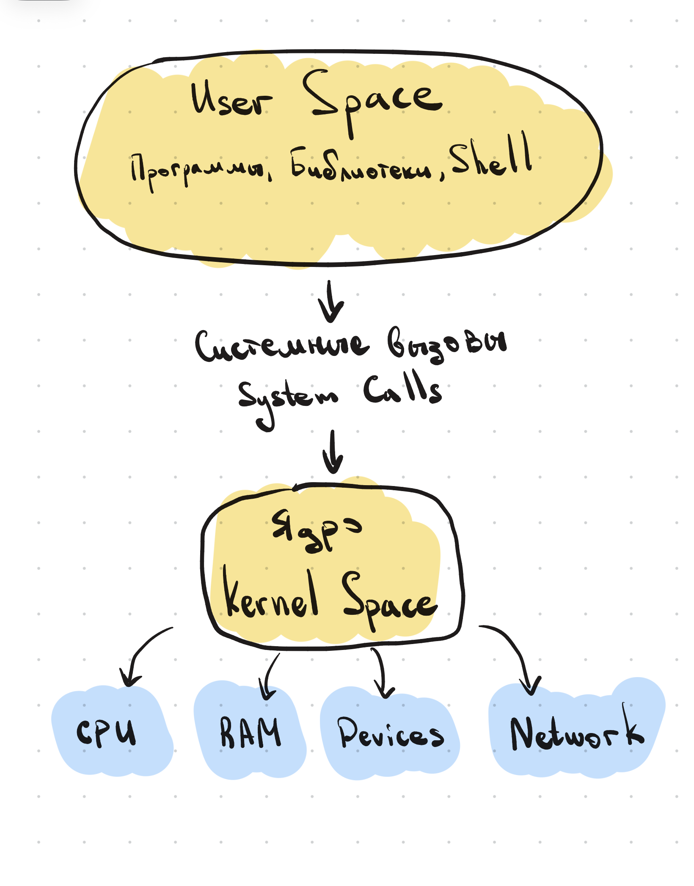

# 0. About Linux

Убежав за конспектами по инструментам линукса, я совсем забыл узнать о том, что такое линукс.

---

## Историческая справка

В бородатые времена Деннис Ритчи и Кен Томпсон начали разработку Unix — операционной системы, которая унаследовала от своего предшественника `Multics` важные концепты и философию: многопользовательский режим, разграничение прав, принцип «всё — файл» и т.д.

И вот однажды Ричард Столлман начал проект GNU (GNU's Not Unix) по разработке своей опенсорсной ОС. Он разработал окружение и всё то, что называется User Space (далее в конспектах), и ему не хватало только ядра. Тут и появился финский разработчик Линус Торвальдс, который как раз разработал ядро Linux — оно изначально было учебным (студенческим) проектом.

---

## User Space и Kernel Space

Что делает ядро и что делает оболочка?

**Ядро (Kernel)** — управляет процессами, памятью, файловыми системами, устройствами и сетью. Если проще: ядро решает, как и к каким ресурсам получает доступ та или иная программа.

**Окружение** — даёт всё то, чем пользуется юзер (терминал, программы, библиотеки).

> **[ИИ-дополнение]**
> Как Kernel Space и User Space взаимодействуют друг с другом?Через **системные вызовы** (system calls, syscalls) — строго определённый набор "функций", которые программы из User Space используют, чтобы попросить ядро сделать что-то от их имени (открыть файл, выделить память, отправить данные по сети). Напрямую обращаться к железу или памяти в обход ядра программам из User Space нельзя — в этом и заключается разделение на два уровня привилегий.

## 

## Зачем нужен линукс

Линукс важен, потому что на нём построена огромная часть современной инфраструктуры (серверы, сети и так далее).

> **[ИИ-дополнение]** Помимо серверов и сетевой инфраструктуры, Linux также лежит в основе:
>
> - **облачных платформ** (AWS, Google Cloud, Azure — в основе большинства облачных сервисов работает Linux)
> - **суперкомпьютеров** (подавляющее большинство мощнейших суперкомпьютеров мира работает на Linux)
> - **встраиваемых систем и IoT** (роутеры, смарт-ТВ, промышленное оборудование)
> - **мобильных устройств** (Android построен на ядре Linux)
> - разработки и DevOps-инструментов, где Linux — основная рабочая среда
>
> Отдельная причина важности — открытый исходный код: любой может изучать, менять и распространять систему, что породило вокруг Linux огромную экосистему бесплатного и специализированного ПО.

---

## Как скачать

Разные версии Линукса распространяются через дистрибутивы — модифицированные версии (сборки) систем на базе ядра Линукс.

Популярные дистрибутивы:

> **[ИИ-дополнение]**
>
> - **Ubuntu** и **Debian** — одни из самых популярных, хороший старт для новичков и частый выбор для серверов
> - **Fedora** и **RHEL / CentOS / Rocky Linux** — чаще встречаются в корпоративной среде
> - **Arch Linux** — минималистичный, ничего лишнего "из коробки", система собирается вручную под себя
> - **Linux Mint** — дружелюбный к новичкам, интерфейс ближе к привычному Windows

В дистрибутив входит: загрузчик, системные библиотеки, пакетный менеджер, средства безопасности, графическое окружение и т.д.

> **[ИИ-дополнение]** Строго говоря, в дистрибутив входит и само **ядро Linux** — дистрибутив как раз и есть готовая сборка "ядро + всё User Space окружение вокруг него" (GNU-утилиты, о которых шла речь в исторической справке, — тоже часть этого набора).

---
