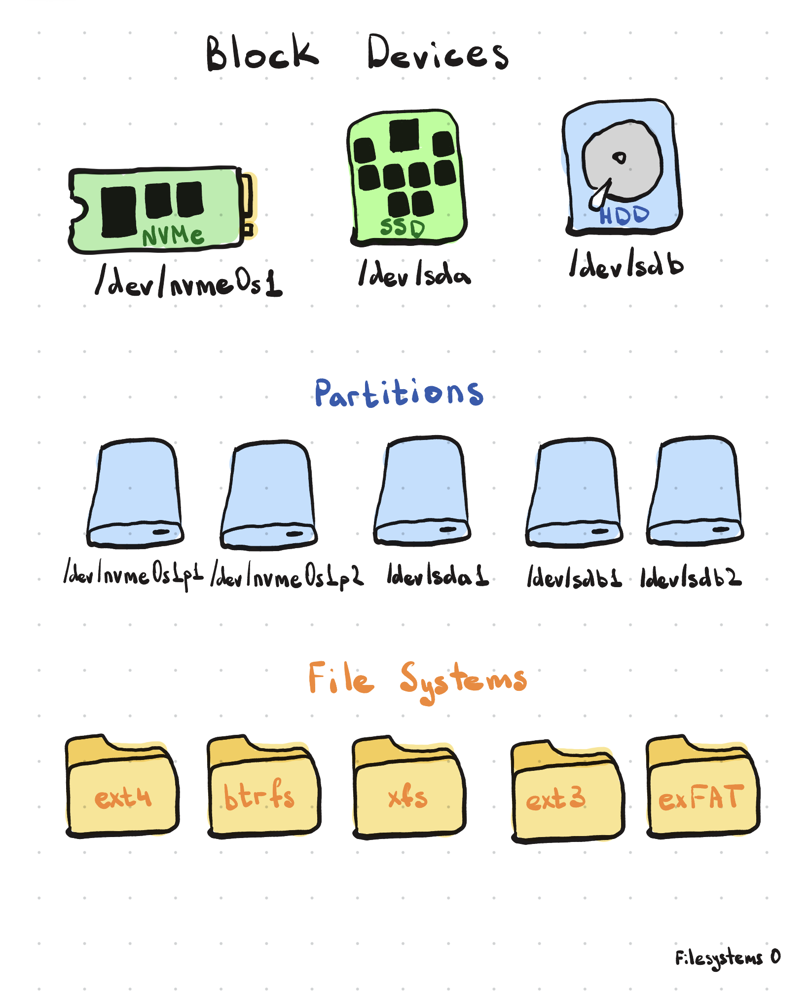

# Filesystem

Файловые системы, диски, разделы и всё, что с ними связано в Linux.

---

## 1. Filesystem Hierarchy — Иерархия файловой системы

В Linux всё начинается с одного корня `/` — единого дерева, в которое подключаются (монтируются) все диски и разделы. В отличие от Windows, здесь нет отдельных букв дисков (`C:`, `D:`) — есть только папки внутри общего дерева.

```bash
ls /

```

```
Вывод: bin boot dev etc home lib media mnt opt proc root run sbin srv sys tmp usr var

```

Ключевые папки (FHS — Filesystem Hierarchy Standard):

- `/bin`, `/sbin` — базовые исполняемые команды системы
- `/etc` — конфигурационные файлы
- `/home` — домашние папки пользователей
- `/var` — изменяемые данные (логи, кэш, очереди)
- `/tmp` — временные файлы, очищается при перезагрузке
- `/usr` — установленные программы и их файлы (основная масса ПО)
- `/dev`, `/proc`, `/sys` — виртуальные файловые системы (устройства, процессы, ядро)
- `/mnt`, `/media` — точки монтирования внешних дисков/флешек


---

## 2. Filesystem Types — Типы файловых систем

Файловая система — это способ организации данных на диске: как хранятся файлы, папки, права доступа, метаданные.

```bash
mount | column -t

```

```
Вывод: список смонтированных разделов с указанием их типа файловой системы

```

- **ext4** — стандарт для большинства Linux-дистрибутивов, стабильный, с журналированием
- **ext3 / ext2** — более старые версии (ext2 — без журналирования)
- **XFS**, **Btrfs** — журналируемые ФС, часто в серверных/enterprise-системах, Btrfs умеет снапшоты
- **NTFS** — родная для Windows, в Linux работает через драйвер (`ntfs-3g`)
- **FAT32 / exFAT** — совместимые практически со всем, обычно на флешках
- **swap** — не совсем файловая система, а специальный раздел для подкачки (см. пункт 8)

---

## 3. Anatomy of a Disk — Устройство диска

Физически (или логически, если это SSD/облако) диск состоит из адресуемых единиц, которые ОС использует для чтения и записи данных.

```bash
sudo fdisk -l /dev/sda

```

```
Вывод: геометрия диска, размер, разделы и их границы

```

- **Sector (сектор)** — минимальная единица чтения/записи диска, традиционно 512 байт (на новых дисках — 4096 байт, Advanced Format)
- **Track (дорожка)** — на механических HDD: концентрическая окружность на пластине
- **Cylinder (цилиндр)** — набор дорожек на одинаковом расстоянии от центра на всех пластинах
- На SSD/NVMe этих механических понятий физически нет, но интерфейс адресации (LBA — Logical Block Addressing) сохраняется для совместимости — ОС по-прежнему обращается "по секторам"

---

## 4. Disk Partitioning — Разбиение диска на разделы

Раздел (partition) — это логически выделенный кусок диска, который ОС видит как отдельное "устройство" (`/dev/sda1`, `/dev/sda2`...) и может отформатировать под свою файловую систему.

```bash
sudo fdisk /dev/sda # Интерактивная утилита для создания/удаления разделов (старый MBR)
sudo parted /dev/sda # Аналог с поддержкой GPT и больших дисков
lsblk

```

```
Вывод:
sda      8:0  disk
├─sda1   8:1  part /boot
└─sda2   8:2  part /

```

### Какие бывают разделы

По **таблице разделов** (два основных стандарта):

- **MBR (Master Boot Record)** — старый стандарт, максимум 4 **первичных** (primary) раздела. Если нужно больше — один из первичных превращают в **расширенный** (extended), внутри которого создают сколько угодно **логических** (logical) разделов. Диски до 2 ТБ.
- **GPT (GUID Partition Table)** — современный стандарт, до 128 разделов без всякого деления на первичные/расширенные/логические, диски практически без ограничения по размеру. Требуется для загрузки через UEFI.

По **назначению** (типичный набор разделов на Linux-системе):

- `/` (root) — корневой раздел, куда монтируется всё дерево системы, если нет отдельных разделов под остальное
- `/boot` — файлы загрузчика и ядра, нужен отдельно, если используется шифрование или сложная схема LVM
- `/boot/efi` (EFI System Partition, ESP) — обязателен при загрузке через UEFI, отформатирован в FAT32, хранит загрузчики (`.efi` файлы)
- `swap` — раздел подкачки (не файловая система в обычном смысле)
- `/home` — часто выносят отдельно, чтобы при переустановке системы не терять пользовательские данные
- `/var` — иногда выносят отдельно на серверах, чтобы логи/данные не переполнили корневой раздел

По **типу содержимого** также различают:

- **Data partition** — обычный раздел с файловой системой для хранения данных
- **Boot partition** — раздел, с которого стартует загрузчик (может совпадать с `/boot`)
- **Recovery partition** — служебный раздел восстановления системы (чаще у производителей ноутбуков, не специфично для Linux)

---

## 5. Creating Filesystems — Создание файловых систем

После разбиения диска на разделы каждый раздел нужно **отформатировать** — создать на нём файловую систему, прежде чем он станет пригоден для хранения файлов.

```bash
sudo mkfs.ext4 /dev/sda1

```

```
Вывод: раздел /dev/sda1 отформатирован в ext4, создана структура файловой системы

```

- `mkfs` (make filesystem) — общая утилита-обёртка, конкретный тип задаётся через `-t` или отдельной командой
- `mkfs.ext4`, `mkfs.xfs`, `mkfs.vfat` — форматирование в конкретный тип
- `mkswap /dev/sda2` — отдельная команда для инициализации swap-раздела (не совсем "файловая система", поэтому вынесена отдельно от `mkfs`)
- Форматирование уничтожает все данные на разделе — это необратимая операция

Схема:


---

## 6. mount и umount — Монтирование

Раздел с файловой системой становится доступен только после **монтирования** — подключения его к определённой точке (папке) в общем дереве `/`.

```bash
sudo mount /dev/sda1 /mnt/data

```

```
Вывод: содержимое /dev/sda1 теперь доступно внутри папки /mnt/data

```

```bash
mount # Показать все текущие точки монтирования
sudo umount /mnt/data # (unmount) Отключить раздел
sudo mount -o ro /dev/sda1 /mnt/data # Смонтировать только для чтения
sudo umount -l /mnt/data # (lazy) "Ленивое" отключение, если раздел занят процессом

```

- Точка монтирования — обычная папка; после монтирования её прежнее содержимое (если было) временно "скрывается" под содержимым раздела
- Пока раздел смонтирован, его нельзя безопасно извлечь физически (флешку, внешний диск) — сначала обязателен `umount`

---

## 7. /etc/fstab — Автоматическое монтирование при загрузке

Файл, где перечислено, какие разделы монтировать автоматически при старте системы и куда.

```bash
cat /etc/fstab

```

```
Вывод: UUID=xxxx-xxxx  /  ext4  defaults  0  1

```

Структура строки (6 полей):

```
устройство (UUID)  точка монтирования  тип ФС  опции  dump  fsck-порядок

```

- Использовать **UUID** вместо `/dev/sdaX` — надёжнее, потому что имя `sdaX` может измениться при переподключении дисков, а UUID уникален и постоянен
- `defaults` — стандартный набор опций (rw, чтение и запись и т.д.)
- Последняя цифра — порядок проверки при загрузке (`fsck`): `0` — не проверять, `1` — корневой раздел, `2` — остальные

---

## 8. Swap — Раздел подкачки

Область на диске, которую ядро использует как "продолжение" оперативной памяти, когда RAM заканчивается — туда выгружаются неактивные страницы памяти.

```bash
free -h

```

```
Вывод: Mem: 8.0Gi used ... / Swap: 2.0Gi used ...

```

```bash
sudo swapon /dev/sda2 # Включить swap-раздел
sudo swapoff /dev/sda2 # Выключить
swapon --show # Показать активные swap-области

```

- Swap может быть **отдельным разделом** (`/dev/sdaX`) или обычным **файлом** (`/swapfile`) — второй вариант гибче, его легко изменить в размере
- Работа со swap значительно медленнее RAM (особенно на HDD), поэтому это "аварийный резерв", а не замена оперативной памяти

---

## 9. Disk Usage — Использование диска

Команды, чтобы посмотреть, сколько места занято и свободно.

```bash
df -h

```

```
Вывод: Filesystem Size Used Avail Use% Mounted on
       /dev/sda1  50G  20G  28G  42%  /

```

```bash
du -sh folder/ # (summarize, human) Общий размер папки
du -h --max-depth=1 folder/ # Размер каждой вложенной папки на 1 уровень

```

- `df` (disk free) — показывает занятость **целых разделов/файловых систем**
- `du` (disk usage) — показывает размер **конкретных файлов и папок**
- Их показания могут не совпадать — например, если удалённый, но всё ещё открытый процессом файл продолжает занимать место, которое `du` уже не увидит, а `df` покажет

---

## 10. Filesystem Repair — Восстановление файловой системы

При сбоях питания или ошибках диска файловая система может повредиться — для проверки и починки используется `fsck`.

```bash
sudo fsck /dev/sda1

```

```
Вывод: проверка структуры ФС на ошибки, при необходимости — их исправление

```

- `fsck` (file system check) — универсальная обёртка, под капотом вызывает нужную утилиту (`fsck.ext4`, `fsck.xfs` и т.д.)
- **Важно**: нельзя проверять смонтированный (особенно на запись) раздел — рискует всё сломать ещё сильнее. Корневой раздел обычно проверяется при загрузке, до полного монтирования
- `-y` — автоматически отвечать "да" на все вопросы об исправлении ошибок
- `-f` — (force) форсировать проверку, даже если ФС считается "чистой"

---

## 11. Inodes — Инод

Инод (index node) — структура данных, которая хранит **метаданные** файла (права, владельца, размер, время изменения, указатели на блоки с данными) — но не само имя файла и не сами данные.

```bash
ls -i file.txt

```

```
Вывод: 123456 file.txt

```

```bash
df -i # Показать количество занятых/свободных инодов на разделе

```

- Имя файла — это просто запись в папке, которая **указывает на номер инода**; поэтому у одного файла может быть несколько имён (см. жёсткие ссылки)
- Число инодов на разделе **ограничено** и задаётся при создании ФС — если инoды закончились, новые файлы создать нельзя, даже если место на диске ещё есть
- `stat file.txt` — показывает полную информацию инода (время создания, изменения, доступа и т.д.)

---

## 12. Symlinks — Символические ссылки

Ссылка — это отдельный "ярлык"-файл, который указывает на путь к другому файлу. Есть два вида: символическая (symlink) и жёсткая (hard link).

```bash
ln -s /path/to/original.txt link.txt

```

```
Вывод: link.txt — символическая ссылка на original.txt

```

```bash
ln original.txt hardlink.txt # Создать жёсткую ссылку (без -s)
ls -l # Символьные ссылки показываются как original -> target

```

Разница:

- **Symlink (мягкая ссылка)** — отдельный файл со своим собственным инодом, который просто хранит **путь** к цели. Если оригинал удалить — ссылка "сломается" (broken symlink). Может указывать на файл на другом разделе или даже несуществующий путь
- **Hard link (жёсткая ссылка)** — это ещё одно имя, указывающее на **тот же самый инод**, что и оригинал. Файл физически удаляется, только когда исчезают все жёсткие ссылки на него. Не может пересекать границы разделов и не работает для папок