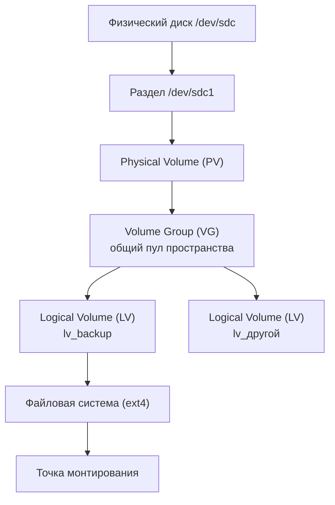

# LVM (Logical Volume Manager)

Гибкое управление дисковым пространством в Linux поверх обычных разделов.

---

## 1. Определение

**LVM** — это слой абстракции между физическими накопителями (дисками, разделами) и файловой системой. Вместо того чтобы работать напрямую с жёсткими границами разделов (`/dev/sda1`, `/dev/sda2`), LVM создаёт "виртуальные разделы" (логические тома), которые можно:

- объединять из нескольких физических дисков в один общий пул пространства
- увеличивать и уменьшать "на лету", без остановки системы и без пересоздания разметки
- переносить на другой физический диск прозрачно для файловой системы сверху
- мгновенно снимать снапшоты (снимки состояния на определённый момент)

Главная идея: файловая система (ext4, xfs...) больше не привязана к физическому разделу напрямую — между ними появляется управляемый программно слой.

---

## 2. Архитектура — слои LVM

LVM состоит из трёх уровней абстракции, которые надстраиваются друг над другом:



- **PV (Physical Volume)** — физический диск или раздел, "помеченный" как участник LVM. Сам по себе ещё ничего не даёт, просто становится доступным для объединения
- **VG (Volume Group)** — общий пул пространства, собранный из одного или нескольких PV. Именно здесь физические границы дисков перестают иметь значение — VG видит только суммарный объём свободного места
- **LV (Logical Volume)** — "кусок", выделенный из VG, который уже и есть тот самый виртуальный раздел. Именно LV форматируется в файловую систему и монтируется — для файловой системы он неотличим от обычного `/dev/sdX`

Ключевая идея слоистости: каждый уровень представляет собой **блочное устройство** для уровня выше. VG не знает, что PV на самом деле состоит из двух разных физических дисков — он просто видит место. Файловая система не знает, что LV — не реальный раздел, а виртуальный — она просто видит блочное устройство.

---

## 3. Плюсы и минусы производительности

### Улучшение

Когда VG собран из **нескольких физических дисков**, LV можно создать в режиме **striping** (чередование) — данные пишутся одновременно небольшими блоками на разные диски по очереди. Так как несколько дисков читают/пишут параллельно, суммарная скорость чтения/записи растёт почти пропорционально числу дисков — похоже на RAID0 (см. пункт 6).

### Ухудшение

LVM — это дополнительный **слой косвенности** (indirection) между файловой системой и физическим диском. Каждая операция чтения/записи проходит через таблицу отображения LV → физические блоки, что даёт небольшой, но не нулевой оверхед по сравнению с прямой работой с разделом.

Особенно заметно это становится при:

- активных **снапшотах** — каждая запись в оригинальный том требует дополнительной работы по copy-on-write (см. пункт 5), прежде чем изменение реально попадёт на диск
- **thin-томах** — при первой записи в ранее не занятый блок LVM должен на лету выделить этот блок из общего пула, что медленнее записи в уже выделенное место (см. пункт 7)

Итого: без снапшотов и thin-provisioning оверхед LVM минимален и почти не заметен. Он становится ощутимым именно при использовании "продвинутых" возможностей поверх базового слоя.

### 3.1 Linux вообще построен на этом принципе

LVM — не единственная надстройка над блочными устройствами в Linux. Он работает поверх общего механизма ядра под названием **device mapper** — универсального фреймворка, который умеет "подменять" одно блочное устройство другим по заданным правилам. LVM — лишь одно из его применений; на том же самом device mapper строятся, например, программное шифрование дисков и программный RAID уровня ядра. Каждый такой слой снова выглядит для системы как обычное блочное устройство, поэтому их можно свободно комбинировать (класть один слой поверх другого) — в этом и есть общая философия Linux: собирать сложное поведение из простых, взаимозаменяемых блочных "кирпичиков".

---

## 4. Настройка — базовые шаги

Коротко, без деталей (это отдельная тема для гайда, не для конспекта):

```bash
pvcreate /dev/sdc1 # 1. Пометить раздел как физический том (PV)
vgcreate vg_backup /dev/sdc1 # 2. Создать группу томов из PV
lvcreate -L 750G -n lv_backup vg_backup # 3. Выделить логический том нужного размера
mkfs.ext4 /dev/vg_backup/lv_backup # 4. Отформатировать LV в файловую систему
mount /dev/vg_backup/lv_backup /mnt/backup # 5. Смонтировать

```

- Расширить том потом можно командой `lvextend` (+ `resize2fs`/`xfs_growfs` для файловой системы сверху) — без остановки работы, если файловая система это поддерживает
- Посмотреть текущее состояние: `pvs`, `vgs`, `lvs` (короткие сводки по каждому уровню)

---

## 5. Copy-on-Write (CoW)

Механизм, на котором строятся **снапшоты** LVM — мгновенные снимки состояния тома на определённый момент времени, без немедленного копирования всех данных.

**Как это работает:** в момент создания снапшота реальное копирование данных не происходит — это было бы слишком долго. Вместо этого LVM просто запоминает состояние тома "как есть" на этот момент. Дальше:

- пока данные в оригинальном томе **не изменяются** — снапшот и оригинал буквально ссылаются на одни и те же физические блоки на диске, копий нет вообще
- как только в оригинальный том приходит **запись**, изменяющая какой-то блок — прежде чем этот блок будет перезаписан, его старое содержимое **копируется** в отдельную область, зарезервированную под снапшот. Только после этого запись в оригинал происходит по-настоящему

Так снапшот всегда может "восстановить" исходное состояние блока: для неизменённых блоков он смотрит прямо в оригинал, а для изменённых — в сохранённую копию "старой версии".

Из этого вытекают два практических следствия:

- снапшот создаётся почти мгновенно, независимо от размера тома (не нужно копировать весь том целиком)
- но снапшот **не бесплатен во времени работы**: каждая запись в оригинал теперь требует дополнительного шага (сначала скопировать старый блок, потом писать новый) — отсюда и часть "ухудшения производительности" из пункта 3

Классический (не thin) снапшот LVM требует заранее выделить фиксированный объём места под эти "старые копии" — если он переполнится (слишком много изменений в оригинале при живом снапшоте), снапшот становится нерабочим ("invalid").

---

## 6. RAID

RAID (Redundant Array of Independent Disks) — объединение нескольких физических дисков в один логический массив ради скорости, надёжности или того и другого сразу. LVM умеет создавать LV, работающие по принципам разных уровней RAID, без отдельного аппаратного контроллера.

Основные уровни:

- **RAID 0 (striping)** — данные "нарезаются" и распределяются по всем дискам одновременно. Максимальная скорость чтения/записи, но **без резервирования**: выход из строя любого одного диска = потеря всех данных массива. Полезное пространство = сумма всех дисков
- **RAID 1 (mirroring)** — данные полностью дублируются на два (или более) диска. Надёжно — любой из дисков может выйти из строя без потери данных, но полезное пространство — как у одного диска (остальные — просто копии)
- **RAID 5** — данные и контрольная сумма чётности (parity) распределены по всем дискам; при отказе **одного** диска данные можно восстановить по оставшимся. Полезное место = сумма дисков минус один
- **RAID 6** — как RAID 5, но чётность считается дважды и хранится с избытком, поэтому массив переживает отказ **двух** дисков одновременно. Полезное место = сумма дисков минус два
- **RAID 10 (1+0)** — сначала диски объединяются в зеркальные пары (RAID 1), затем эти пары объединяются в striping (RAID 0). Сочетает скорость и надёжность, но требует минимум 4 диска и "съедает" половину суммарного объёма

LVM реализует RAID-уровни поверх того же device mapper (пункт 3.1) — с точки зрения VG это просто ещё один способ создать LV, только теперь физически он размазан или продублирован по нескольким PV одновременно.

---

## 7. Thin Logical Volumes — Тонкие тома

Обычный LV сразу занимает весь заявленный объём в VG — если создать LV на 500 ГБ, эти 500 ГБ сразу "вычитаются" из свободного места группы, даже если реальных данных там ещё нет.

**Thin LV** работает иначе — по принципу оверкоммита (как это делают гипервизоры с оперативной памятью виртуальных машин):

- сначала создаётся общий **thin pool** — резерв пространства внутри VG
- из этого пула можно нарезать несколько thin-томов, **суммарный заявленный размер которых может превышать реальный размер пула** — например, пять томов по 200 ГБ каждый (итого 1 ТБ "на бумаге") из пула всего в 500 ГБ реального места
- физическое место у каждого тома выделяется **только по факту реальной записи данных**, блок за блоком — пока данные не записаны, место не расходуется, как в разреженном (sparse) файле

Из этого следует главный риск: если сумма реально записанных данных во всех thin-томах превысит физический размер пула — новые записи начнут проваливаться с ошибкой, поэтому за заполнением пула нужно следить отдельно (в отличие от обычного LV, где переполнение просто невозможно физически).

Второе важное следствие — **снапшоты становятся значительно дешевле**. Thin-снапшот — это не полноценная копия и не отдельный зарезервированный CoW-буфер (как в пункте 5 для обычных снапшотов), а просто ещё один thin-том, который изначально ссылается на те же самые блоки, что и оригинал, в общем пуле. Разойтись они начинают только тогда, когда один из них (оригинал или снапшот) реально меняется — тогда пишется новый блок, а старый остаётся доступен другому тому. Это позволяет держать множество снапшотов одновременно почти без лишних затрат места.