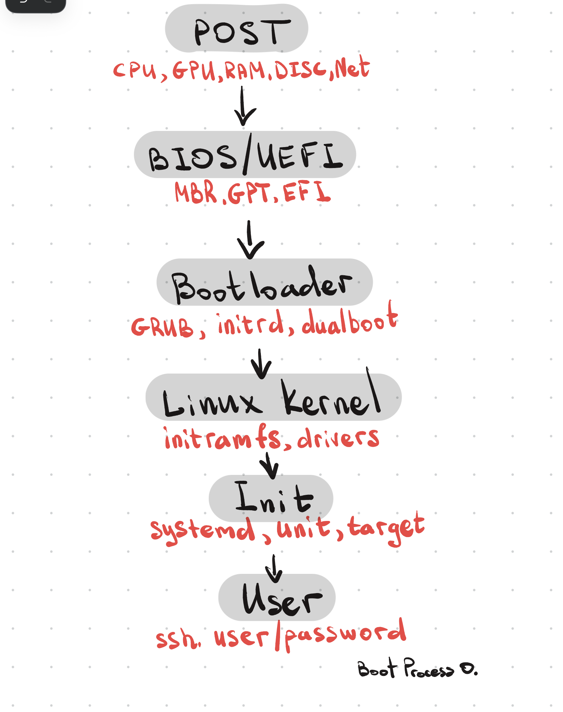

# Boot Process Overview

Объяснив несколько тем из базовых компонентов линукса, стоит понять, как эти компоненты ведут себя при запуске системы в целом. От нажатия на кнопку включения вашего ПК до загрузки окна ввода логина и пароля!

### Общая схема загрузки и инициализации

| Этап                         | Что происходит                             |
| ---------------------------- | ------------------------------------------ |
| **POST**                     | Инициализация железа, проверка целостности |
| **BIOS/UEFI**                | Поиск загрузочного устройства              |
| **Bootloader**               | Выбор ядра                                 |
| **Ядро Linux**               | Инициализация системы                      |
| **init**                     | Запуск сервисов по таргетам                |
| **Пользовательский уровень** | Вход в систему                             |
|                              |                                            |

> **[ИИ-дополнение]** Коротко о каждом этапе одной фразой — что происходит и зачем:
>
> - **POST** — прошивка убеждается, что железо в принципе живо, прежде чем доверять ему что-либо дальше
> - **BIOS/UEFI** — прошивка передаёт эстафету дальше: находит, откуда грузиться, и запускает загрузчик
> - **Bootloader** — посредник между прошивкой и ядром: выбирает, какое ядро и с какими параметрами запустить
> - **Ядро Linux** — получает управление, поднимает драйверы, находит и монтирует настоящий корневой раздел
> - **init** — первый процесс пользовательского пространства, поднимает все остальные сервисы системы
> - **Пользовательский уровень** — система полностью готова, ждёт человека

---

## 0. POST

**POST** (Power On Self Test) — самотестирование системы при её запуске. Микросхема на материнской плате проверяет, все ли компоненты на месте и исправно работают (ЦП, оперативная память, диск, материнская плата, а также GPU и устройства ввода).

---

## 1. BIOS/UEFI

После успешной проверки POST прошивка начинает искать устройство, с которого можно загрузиться.

- **Старый BIOS** (Basic I/O System) — читает первые сектора дисков (MBR) и передаёт управление нужному
- **Новый UEFI** (Unified Extensible Firmware Interface) — читает таблицу разделов, обращается к EFI-разделу и запускает загрузчик, который лежит в нём

Попасть в меню BIOS/UEFI можно с помощью нажатия специальной клавиши сразу после включения компьютера. Клавиша указана в документации материнской платы. В меню BIOS/UEFI можно посмотреть системное время, поменять загрузочное устройство, инициализацию дисков, поставить режимы ПК (энергосбережение/производительность), настроить частоту процессора (оверклокинг), частоту вентиляторов и так далее.

UEFI по сравнению с BIOS:

- быстрее
- **Secure Boot** — UEFI умеет проверять цифровую подпись загрузчика и не даст стартовать неподписанному/подменённому коду
- работает с современной таблицей разделов **GPT** (BIOS завязан на старую **MBR**, отсюда и ограничение по размеру диска в 2 ТБ)
- есть графический интерфейс с поддержкой мыши, а не только текстовое меню на клавиатуре, как у классического BIOS

---

## 2. Бутлоадер / Загрузчик

Как и говорилось выше, BIOS/UEFI передают контроль лоадеру — что он делает?

**Bootloader** — маленькая программа, которая выгружает ядро выбранной операционной системы в память и исполняет его.

Роль:

- можно выбрать систему, если у вас дуалбут
- можно выбрать версию ядра для тестирования или траблшутинга
- настройка параметров ядра

Наиболее распространённый загрузчик — **GRUB** (GRand Unified Bootloader).

Параметры, которые можно изменить в GRUB:

- `initrd` — путь к образу временной файловой систем ы (initramfs), которую GRUB загружает в RAM вместе с ядром
- `BOOT_IMAGE` — путь к ядру
- `ro` — read only на root filesystem
- `quiet` — приглушённый вывод при загрузке (сообщения ядра не выводятся построчно на экран)
- `splash` — графический интерфейс во время загрузки

---

## 3. Ядро и initramfs

Когда выбрано ядро, оно начинает распаковывать себя. Но! Ядру нужны драйверы, чтобы получить доступ к hardware, а сами драйверы лежат как раз на диске, к которому этот доступ и нужен — замкнутый круг. Что делать?

**initramfs** — механизм выгрузки и распаковки драйверов во временную файловую систему на RAM. initramfs содержит только самые нужные ядру модули. При помощи этих драйверов ядро обнаруживает диски и монтирует основную ФС.

> **[ИИ-дополнение]** Как это выглядит по шагам, если разложить дальше:
>
> 1. GRUB загружает в RAM и ядро, и образ initramfs
> 2. Ядро распаковывает initramfs — получается маленькая временная файловая система, живущая целиком в оперативной памяти
> 3. Внутри неё запускается скрипт-инициализатор (обычно `/init`), который подгружает нужные драйверы (например, для диска или RAID/LVM, если они используются) — теперь ядро "видит" настоящий диск
> 4. Скрипт находит настоящий корневой раздел (по UUID или метке, которые передал загрузчик) и монтирует его
> 5. Происходит `switch_root`/`pivot_root` — управление передаётся с временной RAM-файловой системы на реальную корневую ФС, а initramfs выгружается из памяти за ненадобностью
> 6. С этого момента на реальной корневой ФС запускается настоящий первый процесс — тот самый init (см. следующий пункт)

---

## 4. init

Как только ядро смонтировало основную ФС, оно запускает первый процесс — systemd. Ему присваивается PID 1. Помимо инициализации пространства, systemd занимается управлением сетью, планированием задач, синхронизацией времени и ведением журналов.

Весь процесс загрузки дальше — это запуск юнитов systemd.

> **[ИИ-дополнение — очень кратко]** systemd смотрит, какой **target** назначен целевым (обычно `graphical.target` или `multi-user.target`), и по графу зависимостей между юнитами запускает всё необходимое для его достижения — параллельно там, где это возможно, а не строго по очереди.

Подробнее о systemd будет в конспекте по [init](init).

---

## 5. Пользовательский ввод

На этом этапе юзер вводит пароль и логин / подключается по SSH — система готова к работе.

---
