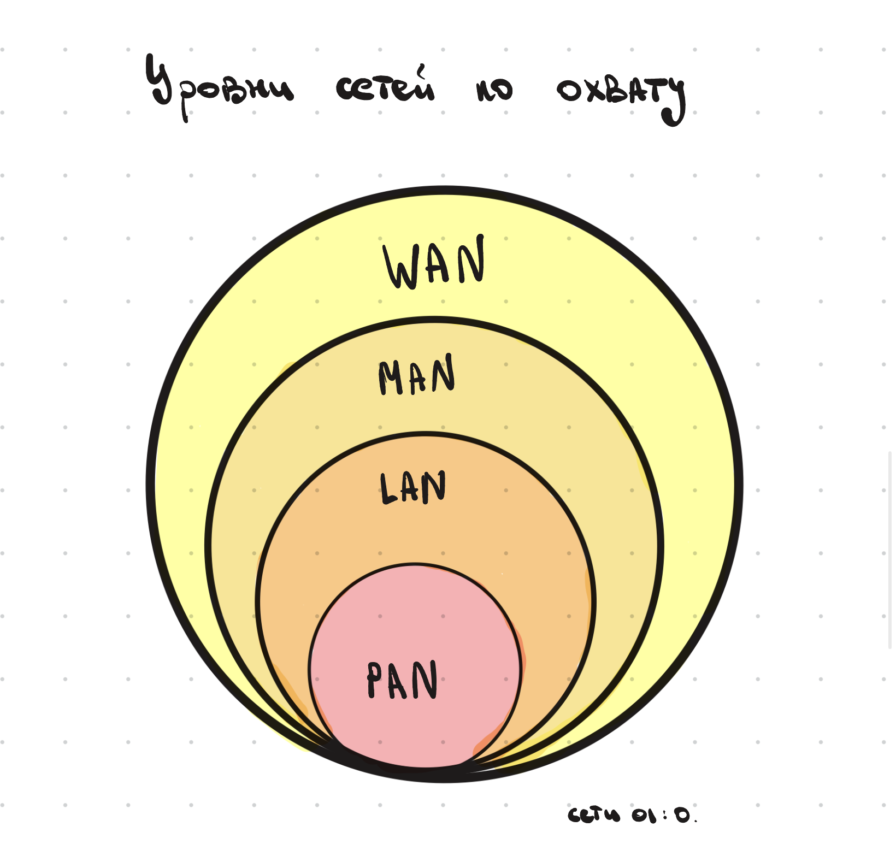

## Что такое сеть

**Сеть** — два или более устройства, объединённые линиями связи, которые обмениваются данными и совместно используют ресурсы по общим, заранее согласованным правилам (**протоколам**).

__Зачем нужна сеть?__
Ответов на этот вопрос много, но можно перечислить самые популярные:
- Приложения (отправляем данные между устройствами)
- Сетевые ресурсы (камеры, принтеры, серверы — всё то, чем пользуются находясь в удалённой местности)
- Облачные диски/сервисы (использование облачных сервисов)
- VoIP (телефония, работающая по IP)

## Линия связи

**Линия связи** — физическая среда вместе с оборудованием, по которым сигнал доходит от отправителя до получателя.

Виды линий связи:

- **Проводная** — волоконно-оптические кабели, витая пара
- **Беспроводная** — Wi-Fi, Bluetooth и др.

## Сетевые устройства

**Сетевое устройство** — любой компонент сети, выполняющий свою роль в её построении, работе или обслуживании.

Классифицируются по двум признакам:

**По роли в передаче данных:**

- **Конечное устройство** — точка, где данные создаются или потребляются (ПК, телефон, сервер)
- **Промежуточное устройство** — связывает конечные узлы между собой и обеспечивает саму передачу данных, следя за качеством этой передачи (коммутатор, маршрутизатор)

**По типу оборудования:**

- **Активное оборудование** — питается от электросети, содержит электронику и само обрабатывает сигнал (усиливает, преобразует)
- **Пассивное оборудование** — часть кабельной инфраструктуры, которая сигнал никак не обрабатывает и электропитания не требует

>[!ИИ-дополнение] 
>Пример пассивного оборудования — патч-панели, кабельные
>разъёмы, оптические кроссы: они физически передают сигнал,
>ничего с ним не делая.
>

## Основные компоненты сетевого оборудования

### Коммутатор (switch)

Промежуточное устройство, которое анализирует проходящий трафик и доставляет его нужному адресату.

Бывают:

1. **Неуправляемый** — просто объединяет устройства в одну сеть, без настройки
2. **Управляемый** — то же самое, но со встроенным микропроцессором, который позволяет вручную настраивать работу устройства

### Маршрутизатор (router)

Промежуточное устройство, которое отвечает за передачу данных между разными локальными сетями (то есть за пределы одной LAN).

### Другие устройства

Межсетевые экраны, прокси-серверы, резолверы, балансировщики нагрузки, SFP-модули, оптические усилители и т.д.

## Классификация сетей по охвату

|Тип|Расшифровка|Охват|
|---|---|---|
|**PAN**|Personal Area Network|Персональная сеть в радиусе нескольких метров (Bluetooth)|
|**LAN**|Local Area Network|Локальная сеть в пределах ограниченной территории (квартира, дом)|
|**MAN**|Metropolitan Area Network|Городская сеть, объединяющая несколько LAN в масштабе города|
|—|Магистральная сеть|Высокоскоростная линия, связывающая отдельные сегменты сетей в единую структуру|
|**WAN**|Wide Area Network|Глобальная сеть в масштабе стран и континентов — интернет|

>[!ИИ-дополнение] 
Эти уровни обычно вложены друг в друга по возрастанию масштаба: PAN → LAN → MAN → WAN, а магистральные сети — это то, что физически связывает MAN/WAN между собой (например, магистральные оптоволоконные линии между городами и странами).