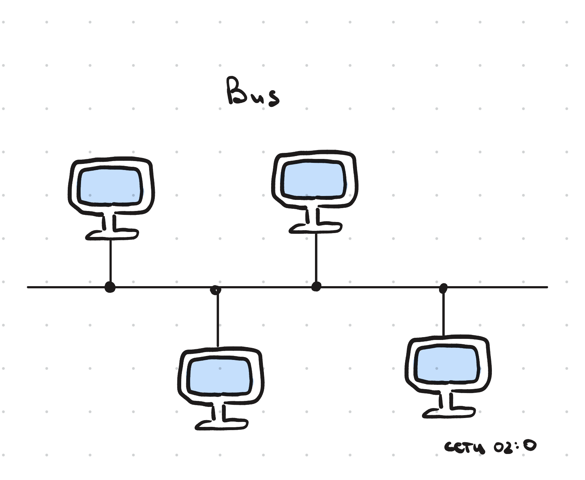
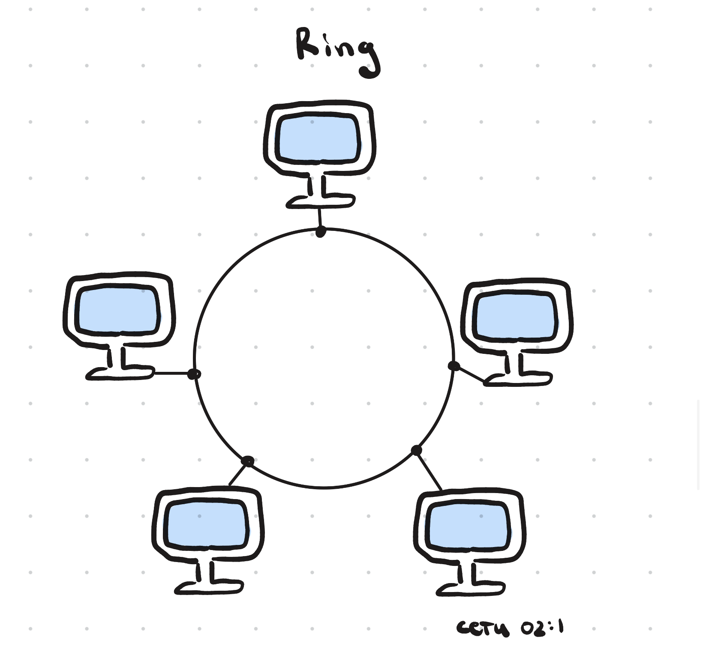
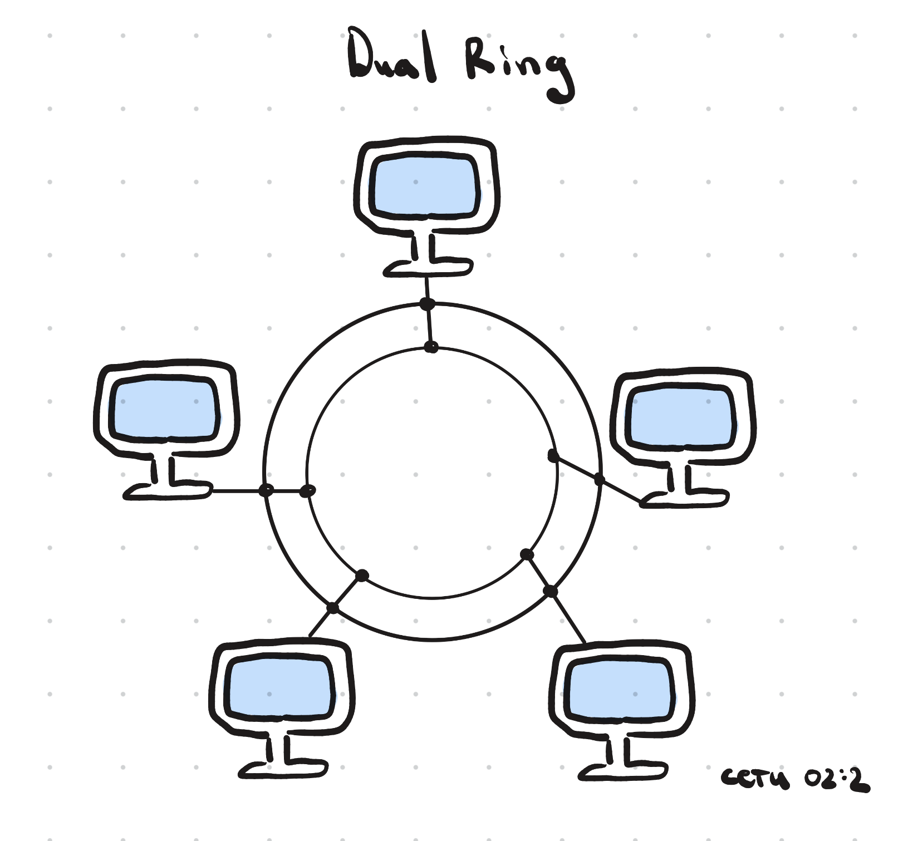
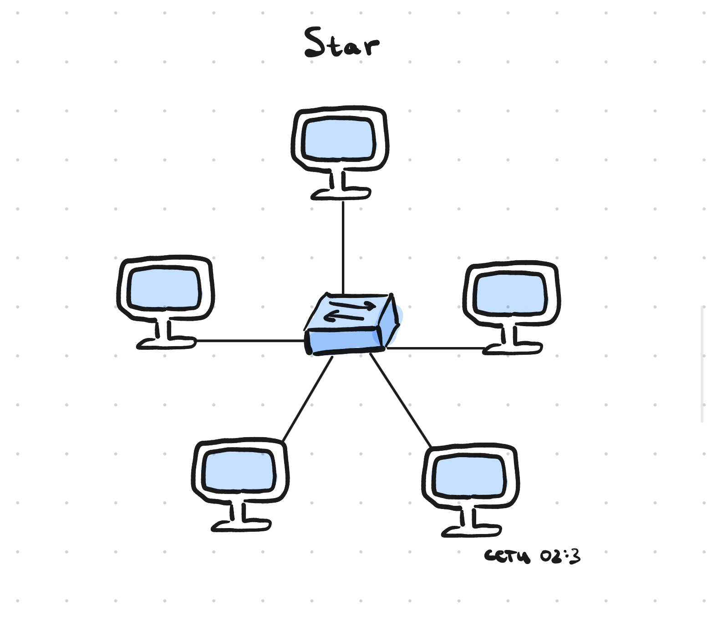
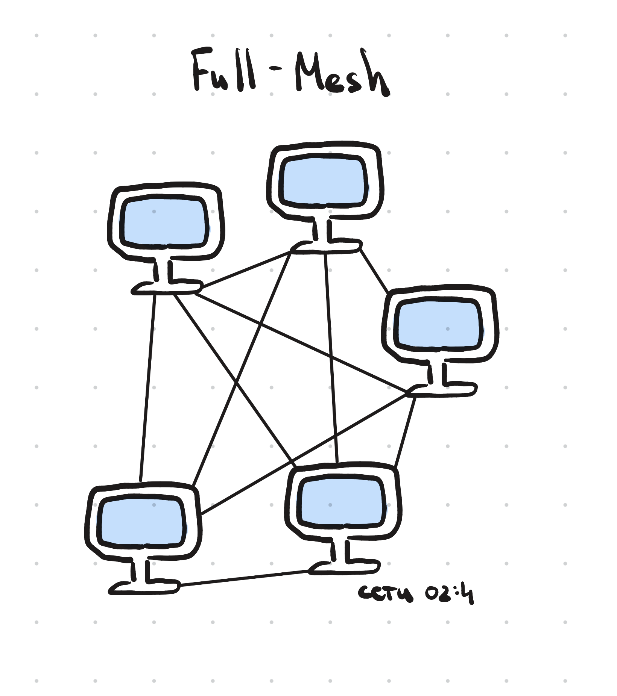
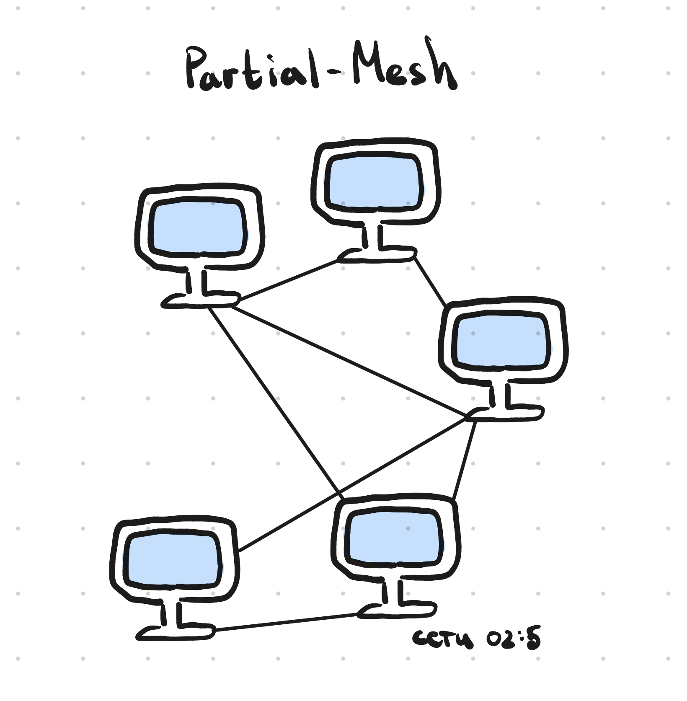
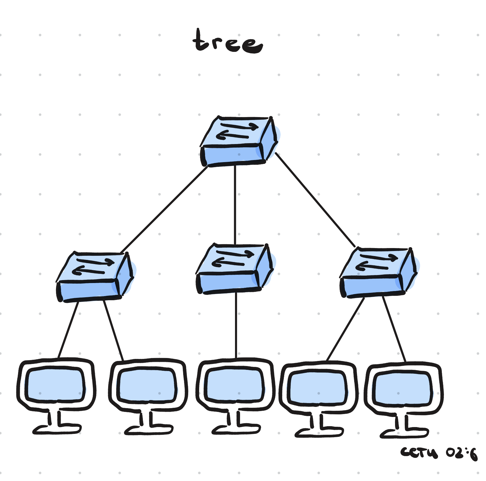
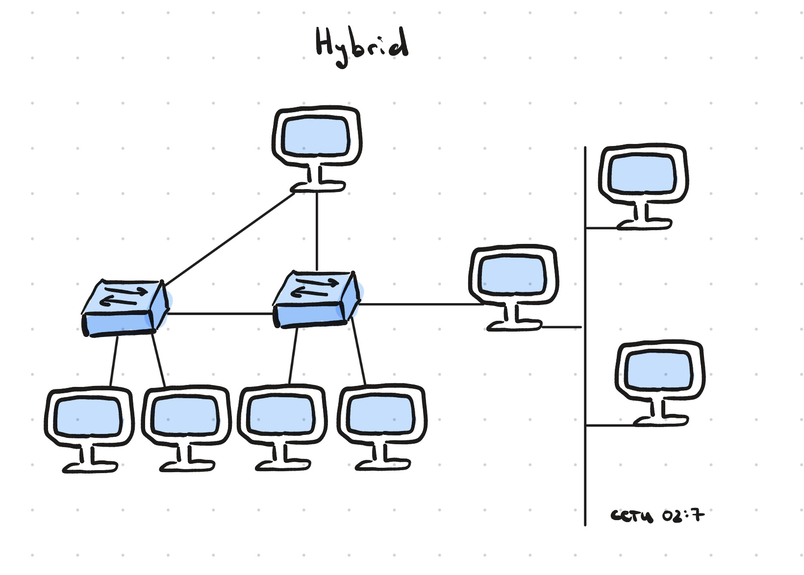

# Топологии сети
Топология сети — это способ соединения конечных сетевых и промежуточных устройств в компьютерной сети, который определяет их схему и порядок передачи данных.

Карта топологии сети — схема, отображающая физическое/логическое расположение сетевых устройств и связи между ними

# Рассмотрим разные топологии с их картами
## Топология шины (bus)
Одна из первых физических топологий. На концах кабеля требовались терминаторы (устройства, поглощающие элекрический сигнал, чтобы он не отразился назад в кабель). Используется только в малых локальных сетях. 

__Достоинства:__
1. Простое моделирование
2. Дешевизна конструкции
3. Поломка одного/нескольких конечных устройств, не влияет на работоспособность сети

__Недостатки:__
1. Неполадка на любом участке сети — конец работы всей системы
2. Низкая производительность
3. Сложность расширения

## Кольцевая топология (ring)
В данной топологии каждое устройство подключается к двум соседним, создавая кольцо. _С одного конца компьютер только принимает, с другой стороны только отправляет._ Каждый компьютер играет роль ретранслятора сигнала. 

__Достоинства:__
1. Простота компоновки
2. Возможность построение длинных сетей
3. Не возникает необходимости в доп. устройствах

__Недостатки:__
1. Каждое конечное устройство должно быть в рабочем состоянии
2. На время присоединения нового прибора сеть размыкается
3. Сложная настройка
4. Сложный поиск неисправностей

## Двойная кольцевая топология (dual ring)
Расширение кольцевой топологии, в котором используется два замкнутых кольца. Оба контура могут либо быть активны и работать в разных направлениях, либо чтобы работал один контур, второй —запасной.

__Достоинства:__
1. Низкий риск коллизий пакетов
2. Отказоустойчивость
3. Скорость
4. Низкая стоимость установки

__Недостатки:__
1. Сложность масштабирования
2. Чем больше устройств, тем хуже связь

## Топология звезда (star)
Все устройства подключаются к центральному узлу, который уже является ретранслятором. Именно на такой топологии построены домашние и офисные сети.

__Достоинства:__
1. Возможность управлять всей сетью из одного места
2. Высокий уровень защиты от сбоев
3. Можно добавлять новые устройства
4. Простота настройки и установки

__Недостатки:__
1. Выход из строя центрального коммутатора оставит вас без всей сети
2. Дорогая установка
3. Производительность зависит от центрального узла

## Полносвязная топология (full-mesh)
Все устройства связаны напрямую друг с другом. Самая отказоустойчивая модель.

__Достоинства:__
1. Надёжность и устойчивость к сбоям
2. Защита от взлома
3. Быстродействие

__Недостатки:__
1. Долгая настройка
2. Трудность построения
3. Стоимость

## Неполносвязная топология (partial-mesh)
Схожа на полносвязную, но построено не с каждого устройство на каждое, а через дополнительные узлы.

__Достоинства:__
1. Баланс надёжности и стоимости
2. Удобство масштабирования
3. Эффективное распределение трафика

__Недостатки:__
1. Сложность проектирования
2. Неравномерная надёжность сети

## Топология дерева (tree)
Иерархическая структура, в которой сеть организована в виде уровней, где от центрального отходят ветви с подчинёнными сегментами.

__Достоинства:__
1. Позволяет расширить топологию шины и звезды
2. Хорошо подходит для поиска ошибок

__Недостатки:__
1. Выход из строя корневого узла влечёт за собой сбой всей системы

## Смешанная топология (hybrid)
Самая популярная топология, которая объединяет в себе все топологии выше. Наследует преимущества разных подходов. Позволяет строить гибкие и масштабные инфраструктуры.

__Достоинства:__
1. Гибкость
2. Масштабируемость
3. Подходит для больших сетей

__Недостатки:__
1. Дорогая настройка
2. Сложность настройки и установки