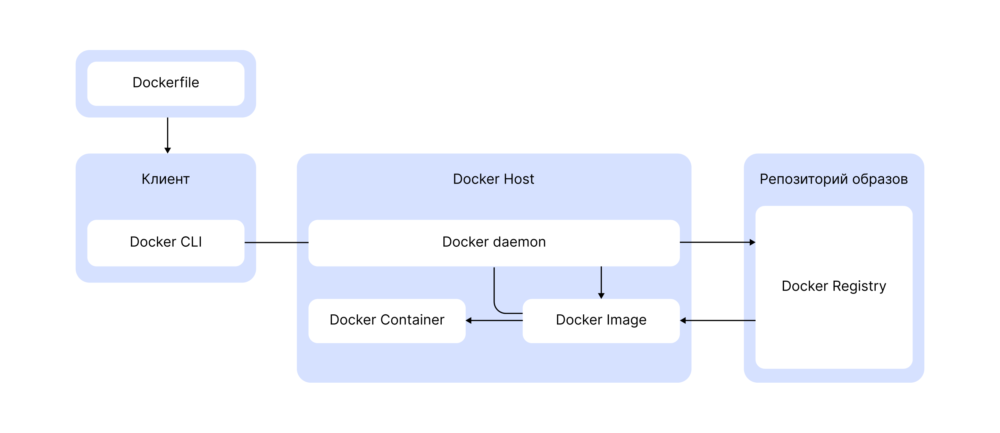
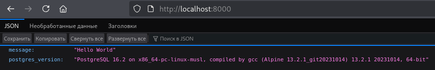
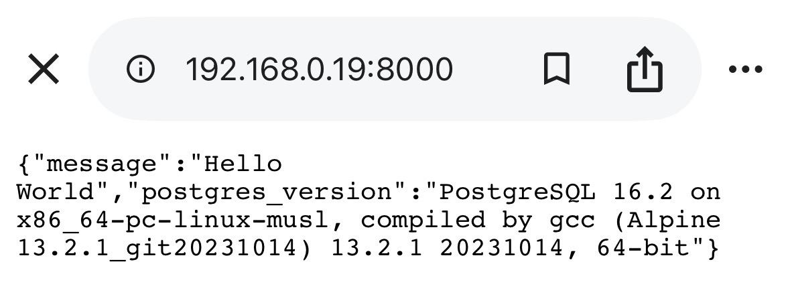

# Контейнеризация с Docker
Ссылка на курс https://practicum.yandex.ru/learn/yc-devops-container/

## Как работает Docker
### Pets VS Cattle
|Pets|Cattle|
|----|------|
|Каждый сервер или любое приложение рассматривается как уникальный и важный элемент|Сервер и приложения рассмаотриваются как взаимно заменяемые единицы|
|Глубокая настройка каждого элемента|Масштабируемость и эффективность|
### Архитектура Docker


Рассмотрим, что происходит после ввода команды ```docker run```:
1. Docker-CLI отправляет команду ```run``` и все ее аргументы dockerd посредством вызова REST API.
2. dockerd проверяет корректность запроса.
3. Далее он делегирует создание контейнера из образа containerd.
4. containerd настраивает окружение контейнера.
5. Далее runC создает и запускает контейнер.
6. Когда контейнер запущен, containerd наблюдает за его жизненным циклом.

## Namespaces и Cgroups
|Namespaces|Cgroups|
|----------|-------|
|Создание изолированного пространства имен|Ограничение системных ресурсов: CPU, память, дисковое пространство|

## Отличия образа от контейнера
Образ &mdash; упакованный набор файлов приложения или сервиса.

Контейнер &mdash; запущенный экземляр образа.

Dockerfile &mdash; файл с инструкциями для сборки образа и запуска контейнера.

OverlayFS &mdash; файловая система Linux. Объединяет несколько слоев в единую файловую систему. Каждый раз, когда происходят изменения в файле, OverlayFS создает новый слой.

|Образ|Контейнер|
|-----|---------|
|Потребляет только ресурсы файловой системы|Потребляет ресурсы процессора и оперативной памяти|
|Имеет имя и тег|Имеет имя, но не имеет тег|
|Состоит из слоев только для чтения|Содержит перезаписываемый слой для изменяемых файлов|

### Bind mounts, volumes и tmpfs
При использовании bind mounts передается существующая директория.
```bash
docker run -d \
  --name nginx-container \
  --mount type=bind,source="$(pwd)"/target,target=/app \
  nginx:latest
```
Volumes стоит использовать при создании директории для хранения персистентных данных &mdash; инфорации, которая сохраняет свое состояние и доступа после завершения программы или перезагрузки системы. 
```bash
docker run -d \
  --name nginx-container \
  --mount source=appdata,target=/app \
  nginx:latest
```
Здесь ```type``` можно не указывать, так как по умолчанию он имеет значение ```volume```, что означает монтирование тома.

Создаёт и удаляет volumes Docker Daemon, а для bind mounts созданием и удалением директорий вы занимаетесь самостоятельно.
При использовании драйвера томов по умолчанию ```local``` содержимое тома сохраняется на файловой системе хоста по пути ```/var/lib/docker/volumes/<имя_тома>/_data/```.

Tmpfs mounts отличается тем, что данные хранятся в оперативной памяти, подходит для быстрого доступа к временным маленьким файлам.

## Структура Dockerfile
Сборка образа выполняется при помощи команды ```docker build```
```bash
docker image build [OPTIONS] PATH | URL | -
```
где ```OPTIONS``` &mdash; необязательные опции и ```PATH | URL | -``` &mdash; контекст сборки образа. Чаще всего используется ```PATH``` для локального пути, можно указать ```URL```, например, для Git-репозитория или ```-``` для stdin. Если явно не указывать, то команда ```docker build``` будет пытаться найти Dockerfile в данной директории контекста.
### Важное замечание
Рассмотрим пример:
```bash
# tree .
├── app1
│   ├── Dockerfile
│   └── run.py
├── app2
│   ├── Dockerfile
│   └── run.py
└── Dockerfile.custom
```
Если запустить команду ```docker build``` с указанием папки app1 или app2, то файлы из других папок не будут доступны. Но если запустить Dockerfile.custom, лежащий в общей директории, то будут доступны все файлы. Используется опция ```-f <путь к Dockerfile>```.

### Часто используемые инструкции Dockerfile
- ```FROM``` Указывает базовый образ 

- ```RUN``` Выполняет команды сборки контейнера 

- ```COPY``` Копирует файлы в контейнер 

- ```ADD``` Добавляет локальные или удаленные файлы и каталоги 

- ```ENTRYPOINT``` Указывает исполняемую команду 

- ```CMD``` Указывает команды "аргументы" 

- ```WORKDIR``` Определяет рабочую директорию 

- ```ENV``` Определяет переменные окружения 

- ```ARG``` Определяет переменные на время сборки 

Для создания собственного базового образа используется ```FROM scratch```.

Если ```ENTYPOINT``` не задан, то командой запуска будет ```/bin/sh/ -c```. Рекомендуется указание абсолютных путей.

Переопределить параметры ```CMD``` можно двумя способами:
```bash
docker run --command run2.py my-container
или
docker run my-container run2.py
```

Инструкция ```WORKDIR``` может создать каталог, если его не существует.

Опция ```-t``` указывет tag, по умолчанию будет ```latest```.

## Практика: создайте собственный контейнер
Запуск контейнера с базой данных PostgreSQL в фоновом режиме
```bash
docker run --name postgres-db \
-e POSTGRES_PASSWORD=apipass \
-e POSTGRES_DB=api \
-e POSTGRES_USER=apiuser \
-p 5432:5432 \
-d postgres:16.2-alpine
```
Веб-приложение на FastAPI &mdash; современный фреймворк для создания API на Python, где фреймворк &mdash; каркас для разработки приложений &mdash;, которое подключается к базе данных PostgreSQL и возвращает информацию о ней.
```python
from fastapi import FastAPI
import psycopg2
import os

app = FastAPI()

# Чтение параметров переменных окружения. Если переменная не установлена, то берется второй аргумент.
DATABASE_HOST = os.getenv("API_DB_HOST", "localhost")
DATABASE_PORT = os.getenv("API_DB_PORT", "5432")
DATABASE_NAME = os.getenv("API_DB_NAME", "api")
DATABASE_USER = os.getenv("API_DB_USER", "apiuser")
DATABASE_PASS = os.getenv("API_DB_PASS", "apipass")

# Подключение в формате: postgresql://пользователь:пароль@хост:порт/база_данных
DATABASE_URL = f"postgresql://{DATABASE_USER}:{DATABASE_PASS}@{DATABASE_HOST}:{DATABASE_PORT}/{DATABASE_NAME}"

conn = psycopg2.connect(DATABASE_URL)
cursor = conn.cursor()

@app.get("/")
async def root():
    cursor.execute(
        "SELECT version();"
    )
    item = cursor.fetchone()
    return {"message": "Hello World",
            "postgres_version": item[0]}

@app.get("/hello/{name}")
async def say_hello(name: str):
    return {"message": f"Hello {name}"}
```
Создать файл ~/simple_python_app/requirements.dev.txt со следущим содержимым:
```python
fastapi==0.110.2
uvicorn[standard]==0.29.0
psycopg2-binary==2.9.9
```
И создать файл ~/simple_python_app/requirements.txt:
```python
fastapi==0.110.2
uvicorn[standard]==0.29.0
psycopg2==2.9.9
```
где ```uvicorn``` &mdash; веб-сервер для Python.
Создаем виртуальное окружение:
```bash
python3 -m venv venv
```
где ```-m``` &mdash; специальный флаг, запуск скрипта как модуля (встроенную библиотеку), ```venv```(первый) &mdash; название модуля, ```venv```(второй) &mdash; название папки, в которой будет создано окружение.
Активация виртуального окружения:
```bash
source ./venv/bin/activate
```
Установка зависимостей:
```bash
pip install -r requirements.dev.txt
```
Запускаем приложение:
```bash
uvicorn app:app --host 0.0.0.0 --port 8000
```
Теперь в браузере можем увидеть наше веб-приложение, перейдя по ```http://localhost:8000/```.


Кроме того, можно протестировать с другого устройства в той же сети. Узнаем внутренний IP компьютера:
```bash
hostname -I | awk '{print $1}'
```
Вводим в браузере на другом устройстве ```http://<внутреннийIP>:8000/```


Остановите приложение, нажав Ctrl + C.

## Рекомендации по работе с Dockerfile
Слои образа можно представить в виде стека, где каждый слой добавляет дополнительный контент поверх предыдущих слоев. Сборка проходит быстро в последующие разы, если ничего не изменить.
Но если изменить какой-то слой, то сбросится кэш его и последующих слоев, поэтому необходимо оптимизировать работу со слоями.
### Сортировка слоев сборки
Поместите часто изменяемые слои вниз, а редко изменяемые вверх.

### Уменьшите размер слоев
1. Копируйте только нужные файлы 
2. Устанавливайте только необходимые зависимости 
3. Минимизируйте количество слоев 
4. Используйте Alpine и Slim образы 
5. Используйте multi-stage builds.

### Общие рекомендации
1. Создавайте эфемерные контейнеры (stateless)
2. Один контейнер &mdash; один процесс
3. Указывайте версию базового образа
4. Прописывайте сервисы в ```$PATH```
5. Устанавливайте пользователя, отличного от ```root```
6. Используйте официальные базовые образы
7. Не храните чувствительную информацию образах

## Концепция Container Registry
### Как задать формат имени образа
Полное имя образа имеет следующий формат: ```[HOST[:PORT_NUMBER]/]PATH```.
HOST &MDASH; где искать образ. По умолчанию: ```registry-1.docker.io```.

Если указано имя хоста, то оно может быть дополнено номером порта.

### Самые популярные источники образов контейнеров
- Docker Hub
- GitHub Container Registry
- Harbor
- Sonatype Nexus Repository

### Авторизация в Container Registry
Для аутентификации в приватном или публичном Container Registry используется команда ```docker login```. Её синтаксис:
```bash
docker login [OPTIONS] [SERVER]
```
В качестве опций передается логин и пароль:
- ```-u``` или ```--username```
- ```-p``` или ```--password``` или ```--password-stdin```
Для последнего, например:
```bash
cat ~/my_docker_password.txt | docker login --username myusername --password-stdin
```
Но перед этим нужно инициализировать ```pass``` для сохранения настройки безопасности и использования шифрования. 

Генерация ключа:
```bash
gpg --generate-key
```
В выводе команды найти ID ключа (набор символов после pub).

Инициализруйте хранилище ```pass```, передав ему ID твоего ключа:
```bash
pass init <ТВОЙ_GPG_ID>
```
GPG (GNU Privacy Guard) &mdash; свободная реализация стандарта OpenPGP для шифрования данных и создания цифровых подписей.

### Основные команды при работе с Container Registry
```bash
docker image tag SOURCE_IMAGE[:TAG] TARGET_IMAGE[:TAG]
docker image pull [OPTIONS] NAME[:TAG|@DIGEST]
docker image push [OPTIONS] NAME[:TAG]
```

## Сборка образов под разные платформы
- Большинство образова собирается под архитектуру ```amd64```, также известную как ```x86_64```.
- Архитекутра ```arm64``` популярна прежде на базе процессоров Apple Sillicon.
- Запустить контейнер для другой архитектуры можно при помощи эмуляции, но это требует больших ресурсов.
- Можно собрать мультиплатформенные образы при помощи ```docker buildx```.

